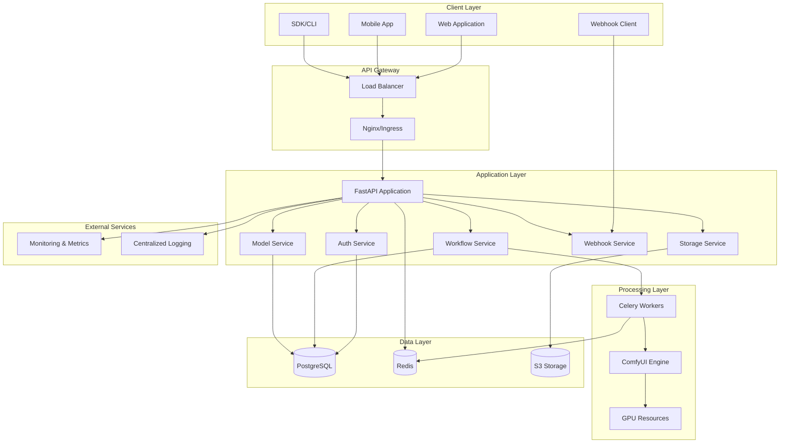
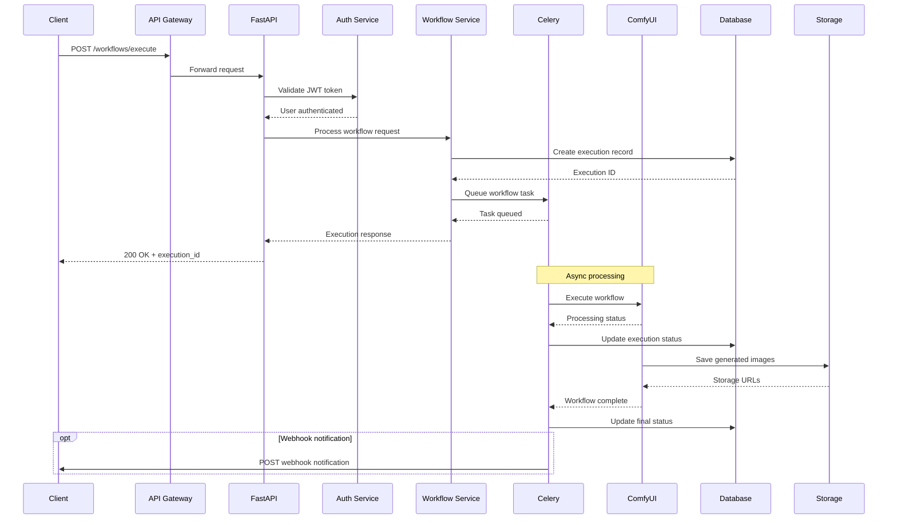
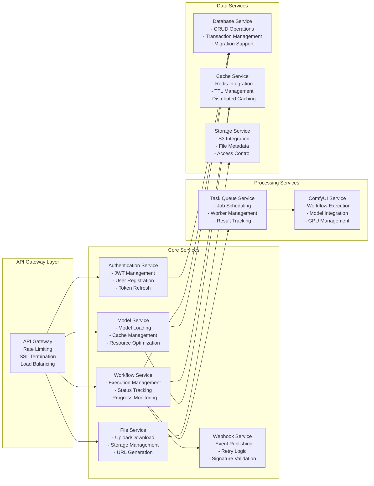
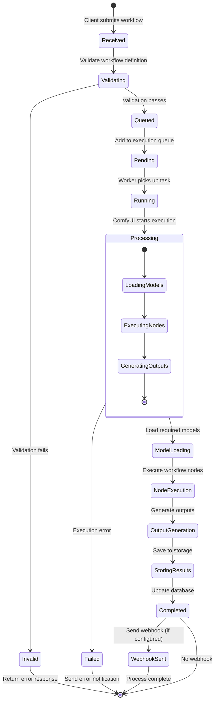

# Technical Architecture Documentation

This document provides a comprehensive overview of the ComfyUI Serverless API architecture, including system design, component interactions, data flow, and infrastructure patterns.

## Table of Contents

- [System Overview](#system-overview)
- [Architecture Diagrams](#architecture-diagrams)
- [Component Architecture](#component-architecture)
- [Data Flow and Processing](#data-flow-and-processing)
- [Security Architecture](#security-architecture)
- [Scalability and Performance](#scalability-and-performance)
- [Infrastructure Patterns](#infrastructure-patterns)
- [API Design Patterns](#api-design-patterns)

## System Overview

The ComfyUI Serverless API is designed as a modern, cloud-native application that provides AI image generation capabilities through a RESTful API. The system follows microservices principles with clear separation of concerns, high availability, and horizontal scalability.

### Core Principles

1. **Serverless-First**: Designed to run efficiently in serverless and containerized environments
2. **API-Driven**: RESTful API design with comprehensive OpenAPI documentation
3. **Async Processing**: Non-blocking workflow execution with real-time status updates
4. **Scalable**: Horizontal scaling with load balancing and auto-scaling capabilities
5. **Secure**: Comprehensive security model with JWT authentication and authorization
6. **Observable**: Full logging, metrics, and tracing for monitoring and debugging

### Technology Stack

| Layer | Technologies |
|-------|-------------|
| **API Framework** | FastAPI, Python 3.9+ |
| **Authentication** | JWT, OAuth2, bcrypt |
| **Database** | PostgreSQL, SQLAlchemy, Alembic |
| **Caching** | Redis, Application-level caching |
| **Message Queue** | Celery, Redis Broker |
| **Storage** | S3-compatible storage, Local filesystem |
| **Monitoring** | Prometheus, Grafana, Structured logging |
| **Containerization** | Docker, Kubernetes |
| **AI/ML Integration** | ComfyUI, Custom model management |

## Architecture Diagrams

### High-Level System Architecture



### Request Flow Architecture



### Microservices Component Diagram



## Component Architecture

### FastAPI Application Structure

```python
# api/main.py - Application entry point
from fastapi import FastAPI
from fastapi.middleware.cors import CORSMiddleware
from api.middleware import (
    AuthenticationMiddleware,
    RateLimitMiddleware,
    LoggingMiddleware,
    MetricsMiddleware
)
from api.routers import (
    auth_router,
    workflow_router,
    models_router,
    files_router,
    health_router
)

app = FastAPI(
    title="ComfyUI Serverless API",
    version="1.0.0",
    docs_url="/docs",
    redoc_url="/redoc"
)

# Middleware stack (order matters)
app.add_middleware(MetricsMiddleware)
app.add_middleware(LoggingMiddleware) 
app.add_middleware(RateLimitMiddleware)
app.add_middleware(AuthenticationMiddleware)
app.add_middleware(CORSMiddleware)

# Route registration
app.include_router(auth_router, prefix="/auth", tags=["authentication"])
app.include_router(workflow_router, prefix="/workflows", tags=["workflows"])
app.include_router(models_router, prefix="/models", tags=["models"])
app.include_router(files_router, prefix="/files", tags=["files"])
app.include_router(health_router, prefix="/health", tags=["health"])
```

### Service Layer Architecture

```python
# services/base.py - Base service pattern
from abc import ABC, abstractmethod
from sqlalchemy.orm import Session
from typing import Generic, TypeVar, Optional
import structlog

T = TypeVar('T')

class BaseService(Generic[T], ABC):
    """Base service class with common functionality."""
    
    def __init__(self, db: Session):
        self.db = db
        self.logger = structlog.get_logger(self.__class__.__name__)
    
    @abstractmethod
    def create(self, obj: T) -> T:
        """Create a new entity."""
        pass
    
    @abstractmethod
    def get(self, id: int) -> Optional[T]:
        """Get entity by ID."""
        pass
    
    @abstractmethod
    def update(self, id: int, obj: T) -> Optional[T]:
        """Update existing entity."""
        pass
    
    @abstractmethod
    def delete(self, id: int) -> bool:
        """Delete entity."""
        pass

# services/workflow.py - Workflow service implementation
from typing import List, Optional, Dict, Any
from models.database import WorkflowExecution, User
from models.schemas import WorkflowExecutionRequest, WorkflowStatus
from .base import BaseService
import uuid
from datetime import datetime, timedelta

class WorkflowService(BaseService[WorkflowExecution]):
    """Service for managing workflow executions."""
    
    async def execute_workflow(
        self,
        request: WorkflowExecutionRequest,
        user: User
    ) -> str:
        """Execute a workflow asynchronously."""
        try:
            # Generate execution ID
            execution_id = str(uuid.uuid4())
            
            # Validate workflow
            is_valid, errors = self.validate_workflow(request.workflow)
            if not is_valid:
                raise ValueError(f"Invalid workflow: {', '.join(errors)}")
            
            # Create execution record
            execution = WorkflowExecution(
                id=execution_id,
                user_id=user.id,
                workflow_definition=request.workflow.dict(),
                priority=request.priority,
                status=WorkflowStatus.PENDING,
                webhook_url=request.webhook_url,
                metadata=request.metadata,
                timeout_at=datetime.utcnow() + timedelta(minutes=request.timeout_minutes)
            )
            
            self.db.add(execution)
            self.db.commit()
            self.db.refresh(execution)
            
            # Queue for processing
            from services.celery_tasks import execute_workflow_task
            execute_workflow_task.delay(execution_id)
            
            self.logger.info(
                "Workflow queued for execution",
                execution_id=execution_id,
                user_id=user.id,
                priority=request.priority
            )
            
            return execution_id
            
        except Exception as e:
            self.db.rollback()
            self.logger.error(
                "Failed to execute workflow",
                error=str(e),
                user_id=user.id
            )
            raise
    
    def validate_workflow(self, workflow) -> tuple[bool, List[str]]:
        """Validate workflow definition."""
        errors = []
        
        if not workflow.nodes:
            errors.append("Workflow must contain at least one node")
        
        # Validate node connections
        for node_id, node in workflow.nodes.items():
            if not node.class_type:
                errors.append(f"Node {node_id} missing class_type")
            
            # Validate required inputs
            required_inputs = self.get_required_inputs(node.class_type)
            node_inputs = {inp.name for inp in node.inputs}
            
            missing_inputs = required_inputs - node_inputs
            if missing_inputs:
                errors.append(f"Node {node_id} missing required inputs: {missing_inputs}")
        
        return len(errors) == 0, errors
    
    def get_required_inputs(self, class_type: str) -> set[str]:
        """Get required inputs for a node class type."""
        # This would normally query ComfyUI's node registry
        node_definitions = {
            "CheckpointLoaderSimple": {"ckpt_name"},
            "CLIPTextEncode": {"text", "clip"},
            "KSampler": {"seed", "steps", "cfg", "sampler_name", "scheduler", "model", "positive", "negative", "latent_image"},
            "VAEDecode": {"samples", "vae"},
            "SaveImage": {"images"}
        }
        
        return node_definitions.get(class_type, set())
```

### Data Access Layer

```python
# models/database.py - SQLAlchemy models
from sqlalchemy import Column, Integer, String, Text, DateTime, Boolean, Float, ForeignKey, JSON, Enum as SQLEnum
from sqlalchemy.ext.declarative import declarative_base
from sqlalchemy.orm import relationship
from sqlalchemy.sql import func
from enum import Enum
import uuid

Base = declarative_base()

class TimestampMixin:
    """Mixin for created_at and updated_at timestamps."""
    created_at = Column(DateTime, server_default=func.now(), nullable=False)
    updated_at = Column(DateTime, onupdate=func.now())

class WorkflowStatus(Enum):
    PENDING = "pending"
    RUNNING = "running"
    COMPLETED = "completed"
    FAILED = "failed"
    CANCELLED = "cancelled"

class Priority(Enum):
    LOW = "low"
    NORMAL = "normal"
    HIGH = "high"

class User(Base, TimestampMixin):
    """User model."""
    __tablename__ = "users"
    
    id = Column(Integer, primary_key=True, index=True)
    email = Column(String(255), unique=True, index=True, nullable=False)
    username = Column(String(100), unique=True, index=True)
    hashed_password = Column(String(255), nullable=False)
    is_active = Column(Boolean, default=True)
    is_superuser = Column(Boolean, default=False)
    
    # Relationships
    workflow_executions = relationship("WorkflowExecution", back_populates="user")
    files = relationship("File", back_populates="user")

class WorkflowExecution(Base, TimestampMixin):
    """Workflow execution model."""
    __tablename__ = "workflow_executions"
    
    id = Column(String(36), primary_key=True, default=lambda: str(uuid.uuid4()))
    user_id = Column(Integer, ForeignKey("users.id"), nullable=False, index=True)
    workflow_definition = Column(JSON, nullable=False)
    priority = Column(SQLEnum(Priority), default=Priority.NORMAL)
    status = Column(SQLEnum(WorkflowStatus), default=WorkflowStatus.PENDING, index=True)
    
    # Execution details
    started_at = Column(DateTime)
    completed_at = Column(DateTime)
    duration_seconds = Column(Float)
    queue_position = Column(Integer)
    
    # Results and metadata
    outputs = Column(JSON)
    error_message = Column(Text)
    logs = Column(JSON)
    metadata = Column(JSON, default={})
    
    # Webhook configuration
    webhook_url = Column(String(500))
    webhook_sent = Column(Boolean, default=False)
    
    # Timeouts and limits
    timeout_at = Column(DateTime)
    
    # Relationships
    user = relationship("User", back_populates="workflow_executions")
    files = relationship("File", back_populates="workflow_execution")

class File(Base, TimestampMixin):
    """File storage model."""
    __tablename__ = "files"
    
    id = Column(String(36), primary_key=True, default=lambda: str(uuid.uuid4()))
    user_id = Column(Integer, ForeignKey("users.id"), nullable=False)
    workflow_execution_id = Column(String(36), ForeignKey("workflow_executions.id"))
    
    filename = Column(String(255), nullable=False)
    original_filename = Column(String(255), nullable=False)
    content_type = Column(String(100), nullable=False)
    size = Column(Integer, nullable=False)
    
    # Storage details
    storage_path = Column(String(500), nullable=False)
    storage_type = Column(String(50), default="s3")  # s3, local, etc.
    
    # File metadata
    metadata = Column(JSON, default={})
    
    # Access control
    is_public = Column(Boolean, default=False)
    expires_at = Column(DateTime)
    
    # Relationships
    user = relationship("User", back_populates="files")
    workflow_execution = relationship("WorkflowExecution", back_populates="files")

class APIKey(Base, TimestampMixin):
    """API key model for service-to-service authentication."""
    __tablename__ = "api_keys"
    
    id = Column(Integer, primary_key=True, index=True)
    name = Column(String(100), nullable=False)
    key_hash = Column(String(255), nullable=False, unique=True, index=True)
    user_id = Column(Integer, ForeignKey("users.id"), nullable=False)
    
    is_active = Column(Boolean, default=True)
    last_used = Column(DateTime)
    expires_at = Column(DateTime)
    
    # Permissions
    scopes = Column(JSON, default=[])  # List of allowed scopes
    
    # Rate limiting
    rate_limit_per_minute = Column(Integer, default=60)
    rate_limit_per_hour = Column(Integer, default=1000)
    
    # Relationships
    user = relationship("User")
```

### Middleware Architecture

```python
# api/middleware.py - Custom middleware components
from fastapi import Request, Response
from fastapi.responses import JSONResponse
from starlette.middleware.base import BaseHTTPMiddleware
import time
import structlog
import redis
from typing import Callable
import jwt
from datetime import datetime

logger = structlog.get_logger()

class LoggingMiddleware(BaseHTTPMiddleware):
    """Structured logging middleware."""
    
    async def dispatch(self, request: Request, call_next: Callable) -> Response:
        start_time = time.time()
        
        # Log request
        logger.info(
            "Request started",
            method=request.method,
            url=str(request.url),
            user_agent=request.headers.get("user-agent"),
            remote_addr=request.client.host if request.client else None
        )
        
        try:
            response = await call_next(request)
            
            # Log response
            duration = time.time() - start_time
            logger.info(
                "Request completed",
                method=request.method,
                url=str(request.url),
                status_code=response.status_code,
                duration_ms=round(duration * 1000, 2)
            )
            
            return response
            
        except Exception as e:
            duration = time.time() - start_time
            logger.error(
                "Request failed",
                method=request.method,
                url=str(request.url),
                error=str(e),
                duration_ms=round(duration * 1000, 2)
            )
            raise

class RateLimitMiddleware(BaseHTTPMiddleware):
    """Redis-based rate limiting middleware."""
    
    def __init__(self, app, redis_url: str):
        super().__init__(app)
        self.redis_client = redis.from_url(redis_url)
        self.rate_limits = {
            "/workflows/execute": {"requests": 10, "window": 60},  # 10 requests per minute
            "default": {"requests": 100, "window": 60}  # 100 requests per minute
        }
    
    async def dispatch(self, request: Request, call_next: Callable) -> Response:
        # Extract client identifier
        client_id = self.get_client_id(request)
        endpoint = self.get_endpoint_pattern(request.url.path)
        
        # Get rate limit for endpoint
        rate_limit = self.rate_limits.get(endpoint, self.rate_limits["default"])
        
        # Check rate limit
        if not await self.check_rate_limit(client_id, endpoint, rate_limit):
            return JSONResponse(
                status_code=429,
                content={
                    "error": "rate_limit_exceeded",
                    "message": f"Rate limit exceeded: {rate_limit['requests']} requests per {rate_limit['window']} seconds"
                },
                headers={
                    "X-RateLimit-Limit": str(rate_limit["requests"]),
                    "X-RateLimit-Window": str(rate_limit["window"])
                }
            )
        
        response = await call_next(request)
        
        # Add rate limit headers to response
        remaining = await self.get_remaining_requests(client_id, endpoint, rate_limit)
        response.headers["X-RateLimit-Limit"] = str(rate_limit["requests"])
        response.headers["X-RateLimit-Remaining"] = str(remaining)
        response.headers["X-RateLimit-Reset"] = str(int(time.time()) + rate_limit["window"])
        
        return response
    
    def get_client_id(self, request: Request) -> str:
        """Extract client identifier from request."""
        # Try to get user ID from JWT token
        auth_header = request.headers.get("authorization")
        if auth_header and auth_header.startswith("Bearer "):
            try:
                token = auth_header.split(" ")[1]
                payload = jwt.decode(token, options={"verify_signature": False})
                return f"user:{payload.get('user_id', 'unknown')}"
            except:
                pass
        
        # Fallback to IP address
        return f"ip:{request.client.host if request.client else 'unknown'}"
    
    def get_endpoint_pattern(self, path: str) -> str:
        """Map request path to rate limit pattern."""
        for pattern in self.rate_limits.keys():
            if pattern in path:
                return pattern
        return "default"
    
    async def check_rate_limit(self, client_id: str, endpoint: str, rate_limit: dict) -> bool:
        """Check if request is within rate limit."""
        key = f"rate_limit:{client_id}:{endpoint}"
        current_requests = await self.get_current_requests(key, rate_limit["window"])
        
        return current_requests < rate_limit["requests"]
    
    async def get_current_requests(self, key: str, window: int) -> int:
        """Get current request count for client/endpoint."""
        try:
            # Use sliding window rate limiting
            now = int(time.time())
            cutoff = now - window
            
            # Remove old entries and count current
            pipe = self.redis_client.pipeline()
            pipe.zremrangebyscore(key, 0, cutoff)
            pipe.zcard(key)
            pipe.zadd(key, {str(now): now})
            pipe.expire(key, window)
            
            results = pipe.execute()
            return results[1]  # Current count
            
        except Exception as e:
            logger.error("Rate limit check failed", error=str(e))
            return 0  # Allow request if rate limit check fails
    
    async def get_remaining_requests(self, client_id: str, endpoint: str, rate_limit: dict) -> int:
        """Get remaining requests for client/endpoint."""
        key = f"rate_limit:{client_id}:{endpoint}"
        current = await self.get_current_requests(key, rate_limit["window"])
        return max(0, rate_limit["requests"] - current)

class MetricsMiddleware(BaseHTTPMiddleware):
    """Prometheus metrics middleware."""
    
    def __init__(self, app):
        super().__init__(app)
        # Initialize Prometheus metrics
        from prometheus_client import Counter, Histogram
        
        self.request_count = Counter(
            'http_requests_total',
            'Total HTTP requests',
            ['method', 'endpoint', 'status']
        )
        
        self.request_duration = Histogram(
            'http_request_duration_seconds',
            'HTTP request duration',
            ['method', 'endpoint']
        )
    
    async def dispatch(self, request: Request, call_next: Callable) -> Response:
        start_time = time.time()
        endpoint = self.get_endpoint_pattern(request.url.path)
        
        try:
            response = await call_next(request)
            
            # Record metrics
            duration = time.time() - start_time
            self.request_count.labels(
                method=request.method,
                endpoint=endpoint,
                status=response.status_code
            ).inc()
            
            self.request_duration.labels(
                method=request.method,
                endpoint=endpoint
            ).observe(duration)
            
            return response
            
        except Exception as e:
            # Record error metrics
            self.request_count.labels(
                method=request.method,
                endpoint=endpoint,
                status=500
            ).inc()
            raise
    
    def get_endpoint_pattern(self, path: str) -> str:
        """Convert path to metric-friendly endpoint pattern."""
        # Replace UUIDs and IDs with placeholders
        import re
        path = re.sub(r'/[0-9a-f]{8}-[0-9a-f]{4}-[0-9a-f]{4}-[0-9a-f]{4}-[0-9a-f]{12}', '/{id}', path)
        path = re.sub(r'/\d+', '/{id}', path)
        return path
```

## Data Flow and Processing

### Workflow Execution Flow



### Data Processing Pipeline

```python
# services/celery_tasks.py - Async task processing
from celery import Celery
from celery.signals import task_prerun, task_postrun, task_failure
import structlog
from typing import Dict, Any
import time
from datetime import datetime

# Configure Celery
celery_app = Celery("comfyui_serverless")
celery_app.config_from_object({
    "broker_url": "redis://localhost:6379/1",
    "result_backend": "redis://localhost:6379/1",
    "task_serializer": "json",
    "accept_content": ["json"],
    "result_serializer": "json",
    "timezone": "UTC",
    "enable_utc": True,
    "task_track_started": True,
    "task_time_limit": 3600,  # 1 hour max
    "task_soft_time_limit": 3000,  # 50 minutes soft limit
    "worker_prefetch_multiplier": 1,
    "worker_max_tasks_per_child": 10,
})

logger = structlog.get_logger()

@task_prerun.connect
def task_prerun_handler(sender=None, task_id=None, task=None, args=None, kwargs=None, **kwds):
    """Log task start."""
    logger.info(
        "Task started",
        task_id=task_id,
        task_name=task.name if task else None,
        args=args,
        kwargs=kwargs
    )

@task_postrun.connect  
def task_postrun_handler(sender=None, task_id=None, task=None, args=None, kwargs=None, retval=None, state=None, **kwds):
    """Log task completion."""
    logger.info(
        "Task completed",
        task_id=task_id,
        task_name=task.name if task else None,
        state=state,
        return_value=retval
    )

@task_failure.connect
def task_failure_handler(sender=None, task_id=None, exception=None, traceback=None, einfo=None, **kwds):
    """Log task failure."""
    logger.error(
        "Task failed",
        task_id=task_id,
        exception=str(exception),
        traceback=traceback
    )

@celery_app.task(bind=True, max_retries=3)
def execute_workflow_task(self, execution_id: str):
    """Execute a ComfyUI workflow."""
    from core.database import SessionLocal
    from models.database import WorkflowExecution, WorkflowStatus
    from services.comfyui import ComfyUIService
    from services.storage import StorageService
    from services.webhook import WebhookService
    
    db = SessionLocal()
    
    try:
        # Get execution record
        execution = db.query(WorkflowExecution).filter(
            WorkflowExecution.id == execution_id
        ).first()
        
        if not execution:
            raise ValueError(f"Execution {execution_id} not found")
        
        # Update status to running
        execution.status = WorkflowStatus.RUNNING
        execution.started_at = datetime.utcnow()
        db.commit()
        
        logger.info(
            "Starting workflow execution",
            execution_id=execution_id,
            workflow_nodes=len(execution.workflow_definition.get("nodes", {}))
        )
        
        # Execute workflow
        comfyui_service = ComfyUIService()
        result = comfyui_service.execute_workflow_sync(
            workflow=execution.workflow_definition,
            execution_id=execution_id
        )
        
        # Process results
        if result["status"] == "completed":
            # Store output files
            storage_service = StorageService()
            processed_outputs = {}
            
            if "images" in result.get("outputs", {}):
                processed_outputs["images"] = []
                
                for image_data in result["outputs"]["images"]:
                    # Upload image to storage
                    file_url = storage_service.store_workflow_output(
                        execution_id=execution_id,
                        filename=image_data["filename"],
                        content=image_data["content"]
                    )
                    
                    processed_outputs["images"].append({
                        "filename": image_data["filename"],
                        "url": file_url,
                        "width": image_data.get("width"),
                        "height": image_data.get("height"),
                        "format": image_data.get("format", "PNG")
                    })
            
            # Update execution with results
            execution.status = WorkflowStatus.COMPLETED
            execution.completed_at = datetime.utcnow()
            execution.duration_seconds = (
                execution.completed_at - execution.started_at
            ).total_seconds()
            execution.outputs = processed_outputs
            execution.logs = result.get("logs", [])
            
        else:
            # Handle execution failure
            execution.status = WorkflowStatus.FAILED
            execution.completed_at = datetime.utcnow()
            execution.error_message = result.get("error", "Unknown error")
            execution.logs = result.get("logs", [])
        
        db.commit()
        
        logger.info(
            "Workflow execution completed",
            execution_id=execution_id,
            status=execution.status.value,
            duration_seconds=execution.duration_seconds
        )
        
        # Send webhook notification if configured
        if execution.webhook_url and not execution.webhook_sent:
            webhook_service = WebhookService()
            webhook_sent = webhook_service.send_completion_webhook(execution)
            
            execution.webhook_sent = webhook_sent
            db.commit()
        
        return {
            "execution_id": execution_id,
            "status": execution.status.value,
            "outputs": execution.outputs
        }
        
    except Exception as exc:
        logger.error(
            "Workflow execution failed",
            execution_id=execution_id,
            error=str(exc),
            retry_count=self.request.retries
        )
        
        # Update execution status
        execution = db.query(WorkflowExecution).filter(
            WorkflowExecution.id == execution_id
        ).first()
        
        if execution:
            execution.status = WorkflowStatus.FAILED
            execution.completed_at = datetime.utcnow()
            execution.error_message = str(exc)
            db.commit()
        
        # Retry with exponential backoff
        if self.request.retries < self.max_retries:
            countdown = 2 ** self.request.retries
            raise self.retry(countdown=countdown, exc=exc)
        
        raise
        
    finally:
        db.close()

@celery_app.task
def cleanup_expired_executions():
    """Clean up expired workflow executions."""
    from core.database import SessionLocal
    from models.database import WorkflowExecution, WorkflowStatus
    from datetime import datetime, timedelta
    
    db = SessionLocal()
    
    try:
        # Find executions that have been running too long
        cutoff_time = datetime.utcnow() - timedelta(hours=2)
        
        expired_executions = db.query(WorkflowExecution).filter(
            WorkflowExecution.status.in_([WorkflowStatus.PENDING, WorkflowStatus.RUNNING]),
            WorkflowExecution.created_at < cutoff_time
        ).all()
        
        for execution in expired_executions:
            execution.status = WorkflowStatus.FAILED
            execution.completed_at = datetime.utcnow()
            execution.error_message = "Execution timeout"
            
            logger.warning(
                "Workflow execution expired",
                execution_id=execution.id,
                created_at=execution.created_at
            )
        
        db.commit()
        
        return f"Cleaned up {len(expired_executions)} expired executions"
        
    except Exception as e:
        logger.error("Cleanup task failed", error=str(e))
        db.rollback()
        raise
    finally:
        db.close()

@celery_app.task
def model_maintenance_task():
    """Periodic model maintenance and optimization."""
    from services.model import ModelService
    
    try:
        model_service = ModelService()
        
        # Cleanup unused models
        cleanup_result = model_service.cleanup_unused_models(max_age_hours=4)
        
        # Update model cache statistics
        cache_stats = model_service.update_cache_statistics()
        
        logger.info(
            "Model maintenance completed",
            models_cleaned=len(cleanup_result.get("unloaded_models", [])),
            cache_stats=cache_stats
        )
        
        return {
            "models_cleaned": len(cleanup_result.get("unloaded_models", [])),
            "cache_stats": cache_stats
        }
        
    except Exception as e:
        logger.error("Model maintenance failed", error=str(e))
        raise

# Periodic task scheduling
from celery.schedules import crontab

celery_app.conf.beat_schedule = {
    "cleanup-expired-executions": {
        "task": "services.celery_tasks.cleanup_expired_executions",
        "schedule": crontab(minute=0),  # Every hour
    },
    "model-maintenance": {
        "task": "services.celery_tasks.model_maintenance_task", 
        "schedule": crontab(minute=0, hour="*/4"),  # Every 4 hours
    },
}
```

## Security Architecture

### Authentication and Authorization

```python
# services/auth.py - Authentication service
from passlib.context import CryptContext
from jose import JWTError, jwt
from datetime import datetime, timedelta
from typing import Optional
import secrets
import hashlib

pwd_context = CryptContext(schemes=["bcrypt"], deprecated="auto")

class AuthService:
    """Authentication and authorization service."""
    
    def __init__(self, secret_key: str, algorithm: str = "HS256"):
        self.secret_key = secret_key
        self.algorithm = algorithm
        self.access_token_expire_minutes = 30
        self.refresh_token_expire_days = 7
    
    def verify_password(self, plain_password: str, hashed_password: str) -> bool:
        """Verify password against hash."""
        return pwd_context.verify(plain_password, hashed_password)
    
    def get_password_hash(self, password: str) -> str:
        """Hash password."""
        return pwd_context.hash(password)
    
    def create_access_token(self, user_id: int, additional_claims: dict = None) -> str:
        """Create JWT access token."""
        to_encode = {
            "sub": str(user_id),
            "user_id": user_id,
            "type": "access",
            "exp": datetime.utcnow() + timedelta(minutes=self.access_token_expire_minutes),
            "iat": datetime.utcnow(),
            "jti": secrets.token_urlsafe(16)  # Unique token ID
        }
        
        if additional_claims:
            to_encode.update(additional_claims)
        
        return jwt.encode(to_encode, self.secret_key, algorithm=self.algorithm)
    
    def create_refresh_token(self, user_id: int) -> str:
        """Create JWT refresh token."""
        to_encode = {
            "sub": str(user_id),
            "user_id": user_id,
            "type": "refresh",
            "exp": datetime.utcnow() + timedelta(days=self.refresh_token_expire_days),
            "iat": datetime.utcnow(),
            "jti": secrets.token_urlsafe(16)
        }
        
        return jwt.encode(to_encode, self.secret_key, algorithm=self.algorithm)
    
    def verify_token(self, token: str, token_type: str = "access") -> Optional[dict]:
        """Verify and decode JWT token."""
        try:
            payload = jwt.decode(token, self.secret_key, algorithms=[self.algorithm])
            
            # Verify token type
            if payload.get("type") != token_type:
                return None
            
            # Verify expiration
            exp = payload.get("exp")
            if not exp or datetime.fromtimestamp(exp) < datetime.utcnow():
                return None
            
            return payload
            
        except JWTError:
            return None
    
    def create_api_key(self, user_id: int, name: str, scopes: list = None) -> tuple[str, str]:
        """Create API key for service authentication."""
        # Generate random key
        key = secrets.token_urlsafe(32)
        
        # Create hash for storage
        key_hash = hashlib.sha256(f"{key}:{user_id}".encode()).hexdigest()
        
        return key, key_hash
    
    def verify_api_key(self, api_key: str, stored_hash: str, user_id: int) -> bool:
        """Verify API key against stored hash."""
        expected_hash = hashlib.sha256(f"{api_key}:{user_id}".encode()).hexdigest()
        return secrets.compare_digest(expected_hash, stored_hash)

# Security middleware
class SecurityMiddleware(BaseHTTPMiddleware):
    """Security headers and validation middleware."""
    
    async def dispatch(self, request: Request, call_next: Callable) -> Response:
        # Add security headers
        response = await call_next(request)
        
        # Security headers
        response.headers["X-Content-Type-Options"] = "nosniff"
        response.headers["X-Frame-Options"] = "DENY"
        response.headers["X-XSS-Protection"] = "1; mode=block"
        response.headers["Strict-Transport-Security"] = "max-age=31536000; includeSubDomains"
        response.headers["Referrer-Policy"] = "strict-origin-when-cross-origin"
        
        # Remove sensitive headers
        response.headers.pop("Server", None)
        
        return response
```

### Input Validation and Sanitization

```python
# utils/validation.py - Input validation utilities
from typing import Dict, Any, List, Optional
import re
import bleach
from pydantic import validator
import json

class WorkflowValidator:
    """Validate and sanitize workflow definitions."""
    
    # Allowed node types (whitelist approach)
    ALLOWED_NODE_TYPES = {
        "CheckpointLoaderSimple",
        "CLIPTextEncode", 
        "KSampler",
        "VAEDecode",
        "VAEEncode",
        "SaveImage",
        "LoadImage",
        "EmptyLatentImage",
        "LoraLoader",
        "ControlNetLoader",
        "ControlNetApply",
        "UpscaleModelLoader",
        "ImageUpscaleWithModel"
    }
    
    # Input type validation rules
    INPUT_TYPE_RULES = {
        "STRING": {"max_length": 5000, "pattern": r"^[^<>\"'&]*$"},
        "INT": {"min_value": -2147483648, "max_value": 2147483647},
        "FLOAT": {"min_value": -1e10, "max_value": 1e10},
        "BOOLEAN": {"allowed_values": [True, False]}
    }
    
    def validate_workflow(self, workflow_data: Dict[str, Any]) -> tuple[bool, List[str]]:
        """Comprehensive workflow validation."""
        errors = []
        
        # Basic structure validation
        if not isinstance(workflow_data, dict):
            errors.append("Workflow must be a dictionary")
            return False, errors
        
        if "nodes" not in workflow_data:
            errors.append("Workflow must contain 'nodes' field")
            return False, errors
        
        nodes = workflow_data["nodes"]
        if not isinstance(nodes, dict) or not nodes:
            errors.append("Workflow must contain at least one node")
            return False, errors
        
        # Validate each node
        for node_id, node_data in nodes.items():
            node_errors = self.validate_node(node_id, node_data)
            errors.extend(node_errors)
        
        # Validate node connections
        connection_errors = self.validate_connections(nodes)
        errors.extend(connection_errors)
        
        # Check for circular dependencies
        if self.has_circular_dependencies(nodes):
            errors.append("Workflow contains circular dependencies")
        
        return len(errors) == 0, errors
    
    def validate_node(self, node_id: str, node_data: Dict[str, Any]) -> List[str]:
        """Validate individual node."""
        errors = []
        
        # Validate node ID
        if not re.match(r"^[a-zA-Z0-9_-]+$", node_id):
            errors.append(f"Invalid node ID: {node_id}")
        
        # Required fields
        if "class_type" not in node_data:
            errors.append(f"Node {node_id} missing 'class_type'")
            return errors
        
        class_type = node_data["class_type"]
        
        # Validate against whitelist
        if class_type not in self.ALLOWED_NODE_TYPES:
            errors.append(f"Node {node_id} has disallowed class_type: {class_type}")
        
        # Validate inputs
        if "inputs" in node_data:
            if not isinstance(node_data["inputs"], list):
                errors.append(f"Node {node_id} inputs must be a list")
            else:
                for i, input_data in enumerate(node_data["inputs"]):
                    input_errors = self.validate_input(node_id, i, input_data)
                    errors.extend(input_errors)
        
        return errors
    
    def validate_input(self, node_id: str, input_index: int, input_data: Dict[str, Any]) -> List[str]:
        """Validate node input."""
        errors = []
        
        required_fields = ["name", "type", "value"]
        for field in required_fields:
            if field not in input_data:
                errors.append(f"Node {node_id} input {input_index} missing '{field}'")
        
        if "type" not in input_data or "value" not in input_data:
            return errors
        
        input_type = input_data["type"]
        value = input_data["value"]
        
        # Validate based on input type
        if input_type in self.INPUT_TYPE_RULES:
            rules = self.INPUT_TYPE_RULES[input_type]
            
            if input_type == "STRING":
                if not isinstance(value, str):
                    errors.append(f"Node {node_id} input {input_index} must be string")
                elif len(value) > rules["max_length"]:
                    errors.append(f"Node {node_id} input {input_index} string too long")
                elif not re.match(rules["pattern"], value):
                    errors.append(f"Node {node_id} input {input_index} contains invalid characters")
                
                # Sanitize HTML/script content
                sanitized = bleach.clean(value, tags=[], strip=True)
                if sanitized != value:
                    errors.append(f"Node {node_id} input {input_index} contains potentially unsafe content")
            
            elif input_type == "INT":
                if not isinstance(value, int):
                    errors.append(f"Node {node_id} input {input_index} must be integer")
                elif value < rules["min_value"] or value > rules["max_value"]:
                    errors.append(f"Node {node_id} input {input_index} integer out of range")
            
            elif input_type == "FLOAT":
                if not isinstance(value, (int, float)):
                    errors.append(f"Node {node_id} input {input_index} must be numeric")
                elif value < rules["min_value"] or value > rules["max_value"]:
                    errors.append(f"Node {node_id} input {input_index} number out of range")
        
        return errors
    
    def validate_connections(self, nodes: Dict[str, Any]) -> List[str]:
        """Validate node connections."""
        errors = []
        
        for node_id, node_data in nodes.items():
            if "inputs" not in node_data:
                continue
                
            for input_data in node_data["inputs"]:
                if isinstance(input_data.get("value"), list) and len(input_data["value"]) == 2:
                    # This is a connection reference [node_id, output_index]
                    referenced_node_id = input_data["value"][0]
                    
                    if referenced_node_id not in nodes:
                        errors.append(f"Node {node_id} references non-existent node: {referenced_node_id}")
        
        return errors
    
    def has_circular_dependencies(self, nodes: Dict[str, Any]) -> bool:
        """Check for circular dependencies using topological sort."""
        # Build dependency graph
        dependencies = {}
        for node_id, node_data in nodes.items():
            dependencies[node_id] = set()
            
            if "inputs" in node_data:
                for input_data in node_data["inputs"]:
                    if isinstance(input_data.get("value"), list) and len(input_data["value"]) == 2:
                        referenced_node_id = input_data["value"][0]
                        dependencies[node_id].add(referenced_node_id)
        
        # Topological sort to detect cycles
        visited = set()
        rec_stack = set()
        
        def has_cycle(node):
            visited.add(node)
            rec_stack.add(node)
            
            for neighbor in dependencies.get(node, []):
                if neighbor not in visited:
                    if has_cycle(neighbor):
                        return True
                elif neighbor in rec_stack:
                    return True
            
            rec_stack.remove(node)
            return False
        
        for node in dependencies:
            if node not in visited:
                if has_cycle(node):
                    return True
        
        return False

def sanitize_user_input(text: str) -> str:
    """Sanitize user input to prevent injection attacks."""
    # Remove HTML tags and scripts
    sanitized = bleach.clean(text, tags=[], strip=True)
    
    # Remove potential SQL injection patterns
    sql_patterns = [
        r"(\b(SELECT|INSERT|UPDATE|DELETE|DROP|UNION|CREATE|ALTER|EXEC)\b)",
        r"(\b(OR|AND)\s+\d+\s*=\s*\d+)",
        r"(['\";])",
        r"(--|\#|/\*|\*/)"
    ]
    
    for pattern in sql_patterns:
        sanitized = re.sub(pattern, "", sanitized, flags=re.IGNORECASE)
    
    # Limit length
    if len(sanitized) > 5000:
        sanitized = sanitized[:5000]
    
    return sanitized.strip()
```

This technical architecture documentation provides a comprehensive overview of the system design, from high-level architecture to detailed implementation patterns. The modular design supports scalability, maintainability, and security while providing a robust foundation for AI image generation services.