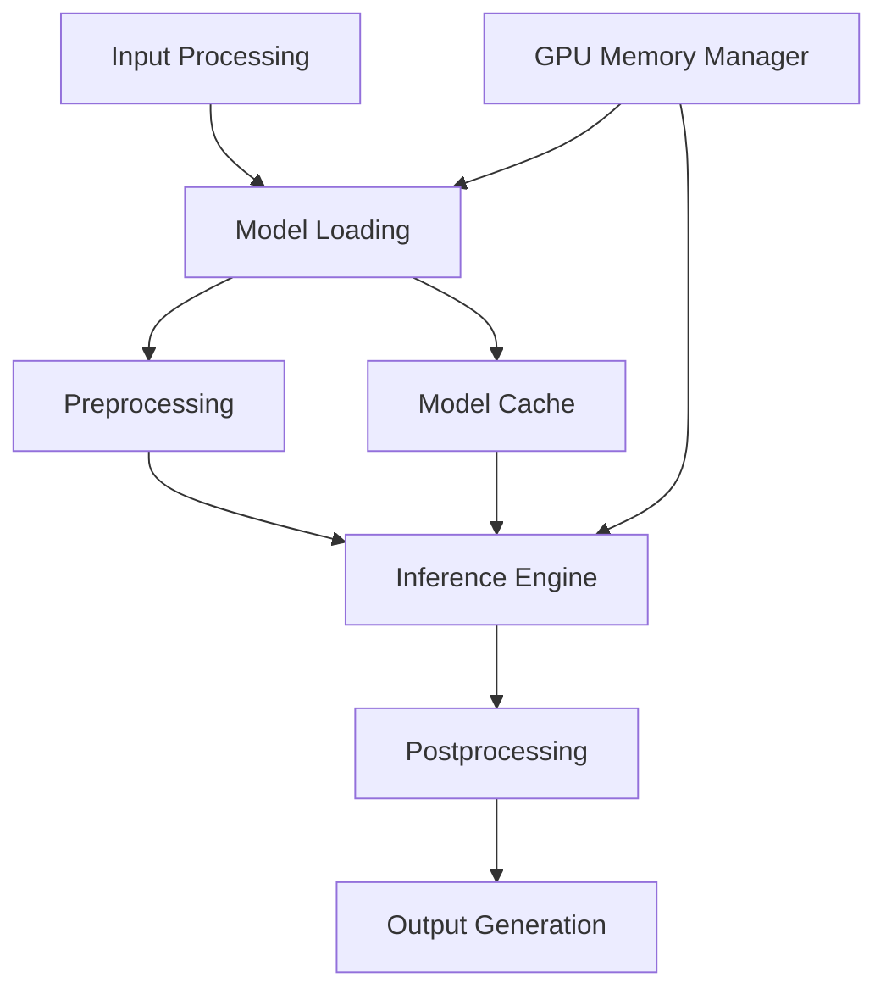

# ComfyUI Architecture Analysis for Serverless Deployment

## Executive Summary

This document provides a comprehensive analysis of ComfyUI's architecture and its implications for serverless deployment. ComfyUI is a powerful, node-based workflow system for AI image generation that can be successfully adapted for serverless environments with proper architectural considerations.

## 1. ComfyUI Core Architecture

### 1.1 Node-Based Workflow System

ComfyUI's architecture is built around a modular, node-based design where:

- **Nodes**: Individual program objects representing specific functions or models
- **Graph Network**: Interconnected nodes forming a directed acyclic graph (DAG)
- **Workflow**: A collection of connected nodes that define the execution pipeline

#### Key Architectural Characteristics:

1. **Modular Design**: Each node encapsulates specific functionality (model loading, image processing, etc.)
2. **Declarative Workflows**: Workflows are defined as JSON structures describing node connections
3. **Dynamic Execution**: Only changed parts of the workflow are re-executed between runs
4. **Memory Optimization**: Smart memory management with automatic GPU offloading

### 1.2 Workflow Execution Model

ComfyUI implements sophisticated optimization techniques:

#### Smart Execution Optimization:
- **Lazy Recomputation**: Only re-executes workflow parts that have changed
- **Dependency Resolution**: Automatic execution order based on node dependencies
- **Conditional Execution**: Only executes nodes with valid inputs and outputs
- **Performance Gains**: Up to 47% speed improvement for large-scale projects

#### Execution Flow:
```
Workflow Submission → Validation → Dependency Resolution → Execution Planning → Node Execution → Result Collection
```

### 1.3 Node System Architecture

#### Node Types:
1. **Input Nodes**: Handle data ingestion (LoadImage, LoadModel, etc.)
2. **Processing Nodes**: Perform computations (Generate, Transform, etc.)
3. **Output Nodes**: Handle result storage and formatting
4. **Custom Nodes**: Community-developed extensions

#### Node Characteristics:
- **Input/Output Typed**: Strict type checking between connections
- **Configurable Parameters**: Runtime parameter modification
- **Resource Management**: GPU/CPU resource allocation per node
- **Error Handling**: Individual node failure isolation

## 2. Model Loading and Inference Pipelines

### 2.1 Model Loading Patterns

ComfyUI uses several model loading strategies:

#### Cold Loading:
- Models loaded on-demand from storage
- Initial load time: 30-120 seconds depending on model size
- Memory allocation: Full model loaded into GPU memory

#### Smart Memory Management:
- **Automatic Offloading**: Models moved between GPU/CPU based on usage
- **Memory Pooling**: Shared memory allocation for similar models
- **Low VRAM Support**: Can run large models on GPUs with as low as 1GB VRAM
- **Progressive Loading**: Streaming model loading for large files

### 2.2 Inference Pipeline Architecture



#### Performance Characteristics:
- **First Inference**: ~60-120 seconds (includes model loading)
- **Subsequent Inferences**: 2-10 seconds on warm containers
- **Memory Usage**: 2-24GB GPU memory depending on model
- **CPU Requirements**: 4-16 cores for optimal performance

### 2.3 Dependency Management

ComfyUI handles dependencies through:
- **Node Registry**: Central registry of available nodes
- **Custom Node Manager**: Dynamic loading of community extensions
- **Version Control**: Model and node version compatibility checking
- **Security Validation**: Sandboxing for custom nodes

## 3. Input/Output Handling Mechanisms

### 3.1 Input Processing

ComfyUI supports multiple input types:

#### Supported Input Formats:
- **Images**: PNG, JPEG, WebP, TIFF, BMP
- **Models**: Safetensors, Checkpoint, LoRA, Embeddings
- **Text**: Prompts, parameters, configuration
- **Data**: JSON workflow definitions, metadata

#### Input Sources:
- **Local Files**: Direct file system access
- **URLs**: HTTP/HTTPS remote file fetching
- **Base64**: Embedded data in API calls
- **Storage**: S3-compatible object storage

### 3.2 Output Handling

#### Output Formats:
- **Images**: Multiple formats with quality settings
- **Metadata**: Workflow information embedded in outputs
- **Batch Results**: Multiple outputs from single workflow
- **Progress Updates**: Real-time execution status

#### Storage Integration:
- **Workflow Metadata**: Automatically saved in generated images
- **JSON Export**: Human-readable workflow definitions
- **Version Control**: Small file sizes for efficient versioning
- **Cloud Storage**: Direct upload to S3-compatible services

### 3.3 API Interface

ComfyUI provides RESTful API access:

#### Core Endpoints:
- `/api/v1/queue` - Workflow submission and management
- `/api/v1/history` - Execution history and results
- `/api/v1/workflow` - Workflow validation and management
- `/websocket` - Real-time progress updates

## 4. Serverless Deployment Challenges and Solutions

### 4.1 Identified Challenges

#### Cold Start Issues:
- **Model Loading Time**: 30-120 seconds for initial model load
- **Container Initialization**: Additional 10-30 seconds for environment setup
- **Memory Allocation**: Large GPU memory requirements (2-24GB)
- **Network I/O**: Model downloading from remote storage

#### Resource Management:
- **GPU Availability**: Limited GPU instances in serverless environments
- **Memory Constraints**: Large model memory requirements
- **Execution Time**: Long-running inference jobs (minutes to hours)
- **Concurrency**: Multiple concurrent requests sharing resources

### 4.2 Mitigation Strategies

#### Pre-warming Solutions:
1. **Container Pre-warming**: Keep containers warm with loaded models
2. **Model Caching**: Local SSD caching of frequently used models
3. **Progressive Loading**: Stream models during container startup
4. **Predictive Scaling**: Scale based on usage patterns

#### Memory Optimization:
1. **Model Quantization**: Reduce model size using AWQ/GPTQ techniques
2. **Memory Sharing**: Share models between concurrent executions
3. **Dynamic Offloading**: Move models between GPU/CPU as needed
4. **Batch Processing**: Group multiple requests for efficient processing

## 5. Optimal Deployment Patterns

### 5.1 Recommended Architecture


### 5.2 Deployment Strategies

#### Strategy 1: Hybrid Serverless-Container
- **API Layer**: Serverless functions for request handling
- **Execution Layer**: Long-running GPU containers
- **Benefits**: Cost-effective scaling with consistent performance

#### Strategy 2: Full Serverless
- **Pre-warmed Functions**: Keep GPU instances warm
- **Event-Driven**: Scale based on queue depth
- **Benefits**: True pay-per-use pricing

#### Strategy 3: Kubernetes-based
- **HPA Scaling**: Horizontal pod autoscaling
- **GPU Node Pools**: Dedicated GPU nodes
- **Benefits**: Fine-grained resource control

## 6. Container and Packaging Requirements

### 6.1 Base Container Requirements

#### System Dependencies:
```dockerfile
# Base requirements
FROM nvidia/cuda:11.8-runtime-ubuntu20.04

# Python environment
RUN apt-get update && apt-get install -y \
    python3.10 \
    python3-pip \
    git \
    wget \
    && rm -rf /var/lib/apt/lists/*

# ComfyUI dependencies
COPY requirements.txt .
RUN pip install -r requirements.txt

# ComfyUI installation
RUN git clone https://github.com/comfyanonymous/ComfyUI.git
WORKDIR /ComfyUI
```

#### Size Optimization:
- **Base Image**: 2-4GB for CUDA runtime
- **Python Dependencies**: 1-2GB for ML libraries
- **ComfyUI Core**: 500MB-1GB
- **Models**: 2-20GB depending on included models
- **Total**: 5-25GB per container

### 6.2 Model Packaging Strategies

#### Option 1: Models in Container
```dockerfile
# Include models in container
COPY models/ /ComfyUI/models/
# Pros: Fast startup, no network I/O
# Cons: Large container size, inflexible
```

#### Option 2: Dynamic Model Loading
```dockerfile
# Download models on startup
COPY scripts/download_models.sh /
RUN chmod +x /download_models.sh
# Pros: Smaller containers, flexible
# Cons: Slower startup, network dependency
```

#### Option 3: Volume Mounting
```dockerfile
# Mount model storage as volume
VOLUME ["/ComfyUI/models"]
# Pros: Shared models, fast access
# Cons: Complex infrastructure
```

### 6.3 Performance Optimizations

#### Multi-stage Builds:
```dockerfile
FROM nvidia/cuda:11.8-devel-ubuntu20.04 AS builder
# Build dependencies

FROM nvidia/cuda:11.8-runtime-ubuntu20.04 AS runtime
COPY --from=builder /compiled /app/
# Smaller runtime image
```

#### Layer Caching:
- Order dependencies by change frequency
- Use `.dockerignore` to exclude unnecessary files
- Leverage build cache for faster iterations

## 7. Memory and Storage Considerations

### 7.1 Memory Requirements

#### GPU Memory:
- **Small Models (1-4B params)**: 2-8GB VRAM
- **Medium Models (7-13B params)**: 8-16GB VRAM  
- **Large Models (20B+ params)**: 16-48GB VRAM
- **SDXL/Flux Models**: 6-12GB VRAM

#### System Memory:
- **Base System**: 4-8GB RAM
- **Model Loading**: 1-2x model size in RAM during loading
- **Inference**: 2-8GB RAM for processing
- **Recommended**: 16-64GB total system RAM

### 7.2 Storage Architecture

#### Model Storage:
- **S3-Compatible**: Primary model repository
- **Local Cache**: SSD cache for frequently used models
- **CDN**: Global distribution for model files
- **Compression**: Model compression techniques

#### Input/Output Storage:
- **Temporary Storage**: Local SSD for processing
- **Result Storage**: S3-compatible for outputs
- **Database**: Metadata and execution history
- **Caching**: Redis/Memcached for API responses

### 7.3 Caching Strategies

#### Multi-level Caching:
1. **L1 - GPU Memory**: Active models in VRAM
2. **L2 - System RAM**: Recently used models
3. **L3 - Local SSD**: Frequently accessed models
4. **L4 - Network Storage**: Full model repository

#### Cache Eviction Policies:
- **LRU**: Least recently used models evicted first
- **Size-aware**: Consider model size in eviction decisions
- **Usage-based**: Prioritize frequently requested models
- **Time-based**: Expire old cached models

## 8. Monitoring and Logging Requirements

### 8.1 Key Metrics to Track

#### Performance Metrics:
- **Request Latency**: End-to-end execution time
- **Model Load Time**: Time to load models into memory
- **Inference Time**: Pure inference execution time
- **Queue Depth**: Number of pending requests
- **Throughput**: Requests processed per minute
- **Error Rate**: Failed requests percentage

#### Resource Metrics:
- **GPU Utilization**: GPU usage percentage
- **GPU Memory**: VRAM consumption
- **CPU Usage**: Processing utilization
- **Memory Usage**: System RAM consumption
- **Disk I/O**: Storage access patterns
- **Network I/O**: Data transfer rates

#### Business Metrics:
- **Cost per Request**: Economic efficiency
- **User Satisfaction**: Response quality metrics
- **Model Usage**: Popular models and workflows
- **Regional Distribution**: Geographic usage patterns

### 8.2 Logging Strategy

#### Structured Logging:
```json
{
  "timestamp": "2024-01-01T12:00:00Z",
  "level": "INFO",
  "service": "comfyui-worker",
  "execution_id": "exec_abc123",
  "event": "workflow_started",
  "metadata": {
    "workflow_nodes": 15,
    "estimated_duration": 45,
    "gpu_assigned": "gpu-1",
    "model_loaded": "sdxl-base-1.0"
  }
}
```

#### Log Categories:
1. **Request Logs**: API calls and responses
2. **Execution Logs**: Workflow processing events
3. **Performance Logs**: Timing and resource usage
4. **Error Logs**: Failures and exceptions
5. **Security Logs**: Authentication and authorization events

### 8.3 Alerting and Monitoring

#### Critical Alerts:
- **High Error Rate**: >5% failed requests
- **High Latency**: >300s execution time
- **Resource Exhaustion**: >90% GPU/Memory usage
- **Queue Backlog**: >100 pending requests
- **Model Load Failures**: Unable to load required models

#### Monitoring Tools:
- **Prometheus**: Metrics collection
- **Grafana**: Visualization dashboards
- **ELK Stack**: Log aggregation and search
- **Jaeger**: Distributed tracing
- **PagerDuty**: Incident management

## 9. Implementation Recommendations

### 9.1 Development Phase Approach

#### Phase 1: Core API Development
1. Basic workflow validation and execution
2. Simple model management
3. Synchronous execution model
4. Local storage integration

#### Phase 2: Scalability Enhancements
1. Asynchronous execution with webhooks
2. Queue-based processing
3. Model caching implementation
4. Basic monitoring and logging

#### Phase 3: Production Optimization
1. Advanced caching strategies
2. Multi-region deployment
3. Cost optimization features
4. Comprehensive monitoring

### 9.2 Technology Stack Recommendations

#### Core Technologies:
- **Backend**: Python/FastAPI or Node.js/Express
- **Queue**: Redis or AWS SQS
- **Database**: PostgreSQL or MongoDB
- **Storage**: MinIO (S3-compatible) or AWS S3
- **Cache**: Redis or Memcached
- **Monitoring**: Prometheus + Grafana

#### Serverless Platforms:
1. **RunPod Serverless**: <200ms cold starts, GPU-optimized
2. **Modal**: 2-4 second cold starts, Python-focused
3. **AWS Lambda + ECS**: Hybrid approach
4. **Google Cloud Run**: Container-based serverless

### 9.3 Security Considerations

#### Workflow Security:
- **Node Validation**: Restrict allowed node types
- **Input Sanitization**: Validate all user inputs
- **Resource Limits**: Prevent resource exhaustion
- **Sandboxing**: Isolate custom node execution

#### API Security:
- **Authentication**: API keys or OAuth2
- **Rate Limiting**: Prevent abuse
- **Input Validation**: Schema-based validation
- **Encryption**: TLS for all communications

## 10. Conclusion

ComfyUI's node-based architecture is well-suited for serverless deployment with proper architectural considerations. The key success factors are:

1. **Intelligent Caching**: Multi-level model and result caching
2. **Asynchronous Processing**: Queue-based execution with webhooks
3. **Resource Optimization**: Efficient GPU memory management
4. **Scalable Architecture**: Container-based execution with auto-scaling
5. **Comprehensive Monitoring**: Real-time performance tracking

The recommended approach is a hybrid serverless architecture that combines lightweight API functions with GPU-optimized container workers, providing the best balance of cost-effectiveness, performance, and scalability.

## References

- ComfyUI Official Repository: https://github.com/comfyanonymous/ComfyUI
- ComfyUI Documentation: https://docs.comfy.org/
- AWS ComfyUI Deployment Guide: AWS Architecture Blog
- RunPod Serverless Documentation: https://docs.runpod.io/
- Modal ComfyUI Examples: https://modal.com/docs/examples/comfyapp