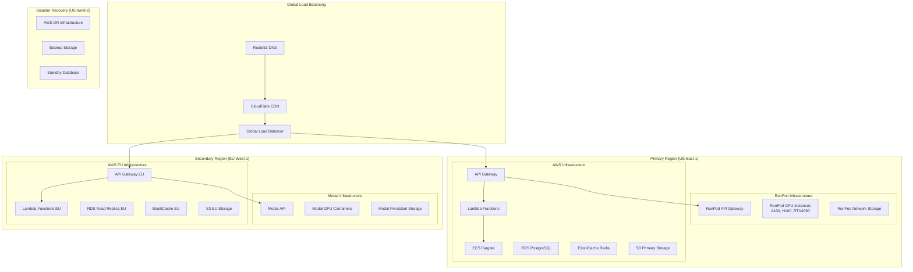
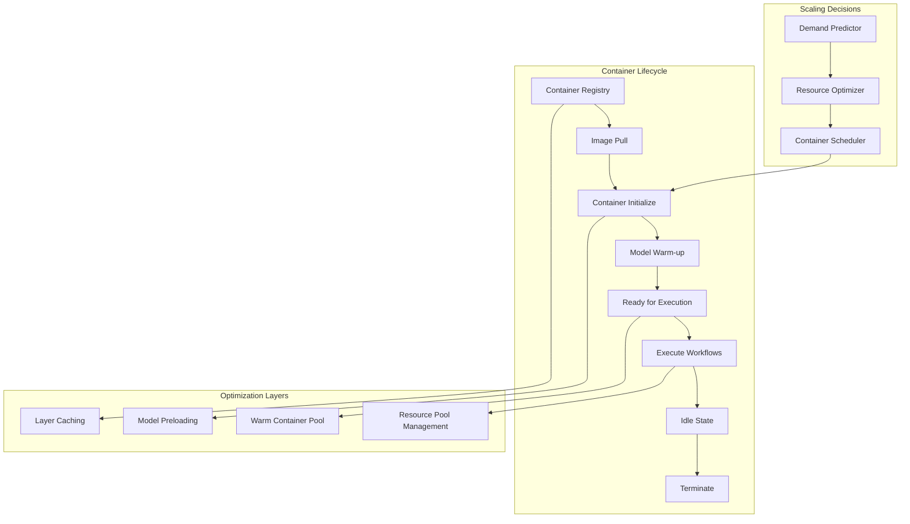
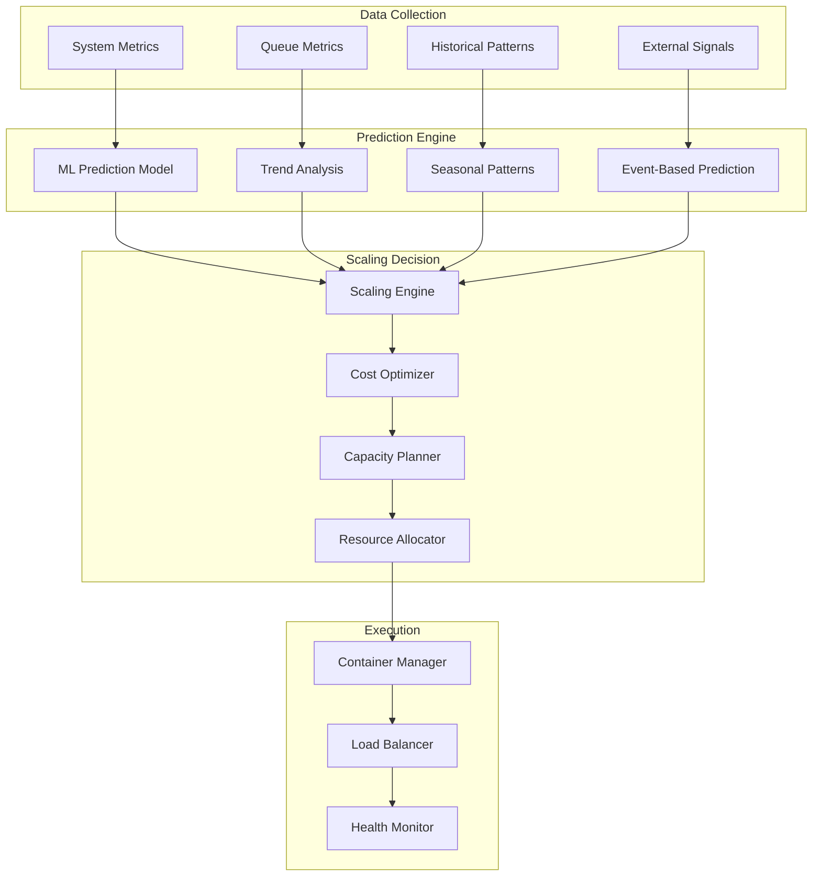

# ComfyUI Serverless Deployment Architecture

## Overview

This document provides comprehensive deployment architecture specifications for ComfyUI serverless platform, covering infrastructure design, container orchestration, scaling strategies, and operational requirements.

## 1. Infrastructure Architecture

### 1.1 Multi-Cloud Deployment Strategy



### 1.2 Regional Deployment Configuration

**Primary Region Configuration (US-East-1):**
```yaml
primary_region:
  name: us-east-1
  purpose: Primary processing and API serving
  
  compute_infrastructure:
    runpod_serverless:
      gpu_types: [A100-80GB, H100-80GB, RTX4090-24GB]
      max_concurrent_containers: 100
      auto_scaling: enabled
      spot_instances: 70%
      on_demand_instances: 30%
      
    aws_ecs:
      cluster_name: comfyui-fallback
      service_type: fargate
      cpu_architectures: [x86_64, arm64]
      max_tasks: 50
      
  storage_infrastructure:
    model_storage:
      provider: minio_on_aws
      storage_class: standard_ia
      replication: 3x
      encryption: aes256
      
    result_storage:
      provider: s3
      storage_classes:
        hot: standard
        warm: standard_ia
        cold: glacier_instant_retrieval
      lifecycle_policies: enabled
      
  networking:
    vpc_cidr: 10.0.0.0/16
    availability_zones: 3
    nat_gateways: 3
    load_balancer_type: application
    
  database:
    primary_db:
      engine: postgresql-14
      instance_class: db.r6g.xlarge
      multi_az: true
      backup_retention: 30
      
    cache_layer:
      engine: redis-7
      instance_class: cache.r6g.large
      cluster_mode: enabled
      backup_enabled: true
```

**Secondary Region Configuration (EU-West-1):**
```yaml
secondary_region:
  name: eu-west-1
  purpose: Regional processing and disaster recovery
  
  compute_infrastructure:
    modal_serverless:
      gpu_types: [A100-40GB, A10G-24GB]
      max_concurrent_containers: 50
      auto_scaling: enabled
      preemptible_ratio: 60%
      
    aws_ecs_eu:
      cluster_name: comfyui-eu
      service_type: fargate
      max_tasks: 25
      
  storage_infrastructure:
    model_storage:
      provider: s3_eu
      cross_region_replication: from_us_east_1
      storage_class: standard_ia
      
  database:
    read_replica:
      source_region: us-east-1
      lag_tolerance: 30s
      automatic_failover: true
```

## 2. Container Orchestration

### 2.1 Container Management Strategy



### 2.2 Container Image Strategy

**Multi-Tier Container Design:**

**Base Runtime Container (2.1GB):**
```dockerfile
FROM nvidia/cuda:11.8-runtime-ubuntu22.04 as base

# System dependencies
RUN apt-get update && apt-get install -y \
    python3.10 python3-pip wget curl git \
    libgl1-mesa-glx libglib2.0-0 libsm6 libxext6 libfontconfig1 libxrender1 \
    && rm -rf /var/lib/apt/lists/*

# Python dependencies
COPY requirements-base.txt /tmp/
RUN pip install --no-cache-dir -r /tmp/requirements-base.txt

# ComfyUI core installation
WORKDIR /app
COPY ComfyUI/ ./ComfyUI/
COPY serverless_runner/ ./serverless_runner/

# Runtime configuration
ENV PYTHONPATH=/app
ENV COMFYUI_PATH=/app/ComfyUI
EXPOSE 8080

ENTRYPOINT ["python", "-m", "serverless_runner"]
```

**Quick Start Container (5.8GB):**
```dockerfile
FROM comfyui-base:latest as quickstart

# Pre-install common models
COPY models/checkpoints/sdxl_base_1.0.safetensors /app/ComfyUI/models/checkpoints/
COPY models/vae/sdxl_vae.safetensors /app/ComfyUI/models/vae/
COPY models/clip/clip_l.safetensors /app/ComfyUI/models/clip/

# Model manifest for cache management
COPY model_manifest.json /app/models/
```

**Specialized Containers (12-18GB):**
```dockerfile
FROM comfyui-base:latest as specialized-video

# Video generation models
COPY models/video/ /app/ComfyUI/models/
COPY models/controlnet/video/ /app/ComfyUI/models/controlnet/

# Specialized nodes for video processing
COPY custom_nodes/video_nodes/ /app/ComfyUI/custom_nodes/
```

### 2.3 Container Orchestration Patterns

**RunPod Serverless Integration:**
```python
class RunPodOrchestrator:
    def __init__(self):
        self.runpod_client = RunPodClient()
        self.container_manager = ContainerManager()
        self.model_cache_manager = ModelCacheManager()
    
    async def deploy_execution_container(self, job: ExecutionJob) -> ContainerInstance:
        """Deploy optimized container for job execution"""
        
        # Select optimal container image
        container_image = await self.select_optimal_image(job)
        
        # Determine GPU requirements
        gpu_config = await self.determine_gpu_config(job)
        
        # Configure environment
        env_vars = await self.prepare_environment(job)
        
        # Deploy container
        container_config = {
            "image": container_image,
            "gpu_type": gpu_config.gpu_type,
            "gpu_count": gpu_config.gpu_count,
            "memory_gb": gpu_config.memory_gb,
            "cpu_count": gpu_config.cpu_count,
            "disk_gb": gpu_config.disk_gb,
            "environment": env_vars,
            "ports": {"8080": "HTTP"},
            "timeout_seconds": job.max_execution_time,
            "auto_shutdown": {
                "idle_timeout": 300,
                "max_runtime": job.max_execution_time + 300
            }
        }
        
        # Launch with retry logic
        container = await self.runpod_client.create_serverless_endpoint(container_config)
        
        # Wait for container ready state
        await self.wait_for_container_ready(container.id, timeout=120)
        
        # Validate model availability
        await self.validate_model_cache(container, job.required_models)
        
        return ContainerInstance(
            container_id=container.id,
            endpoint_url=container.endpoint_url,
            gpu_allocation=gpu_config,
            ready_at=datetime.utcnow(),
            cost_per_second=container.cost_per_second
        )
    
    async def select_optimal_image(self, job: ExecutionJob) -> str:
        """Select optimal container image based on job requirements"""
        
        required_models = job.required_models
        workflow_complexity = job.workflow_complexity
        
        # Check if specialized container exists
        if self.has_specialized_container(required_models):
            return self.get_specialized_container_tag(required_models)
        
        # Estimate cache hit rate for different images
        cache_scores = {}
        for image_tag in self.available_images:
            cache_score = await self.model_cache_manager.calculate_cache_score(
                image_tag, required_models
            )
            cache_scores[image_tag] = cache_score
        
        # Select image with highest cache score
        best_image = max(cache_scores.items(), key=lambda x: x[1])
        
        return best_image[0]
```

## 3. Auto-Scaling and Capacity Management

### 3.1 Predictive Scaling Architecture



### 3.2 Intelligent Auto-Scaling

**Predictive Scaling Algorithm:**
```python
class PredictiveScaler:
    def __init__(self):
        self.ml_predictor = DemandPredictor()
        self.cost_optimizer = CostOptimizer()
        self.capacity_manager = CapacityManager()
    
    async def calculate_optimal_capacity(self, forecast_horizon: timedelta = timedelta(minutes=30)) -> CapacityPlan:
        """Calculate optimal capacity based on predicted demand"""
        
        # Gather current metrics
        current_metrics = await self.gather_current_metrics()
        
        # Predict demand for forecast horizon
        demand_forecast = await self.ml_predictor.predict_demand(
            current_metrics=current_metrics,
            forecast_horizon=forecast_horizon,
            confidence_level=0.85
        )
        
        # Calculate capacity requirements
        capacity_requirements = await self.calculate_capacity_requirements(
            demand_forecast,
            current_metrics.system_performance
        )
        
        # Optimize for cost and performance
        optimal_plan = await self.cost_optimizer.optimize_capacity_plan(
            requirements=capacity_requirements,
            current_capacity=current_metrics.current_capacity,
            cost_constraints=await self.get_cost_constraints()
        )
        
        return optimal_plan
    
    async def predict_demand(self, current_metrics, forecast_horizon, confidence_level):
        """ML-based demand prediction"""
        
        # Prepare feature vector
        features = self.prepare_features(current_metrics)
        
        # Time-based features
        features.update({
            "hour_of_day": datetime.now().hour,
            "day_of_week": datetime.now().weekday(),
            "month": datetime.now().month,
            "is_weekend": datetime.now().weekday() >= 5,
            "is_holiday": await self.check_holiday()
        })
        
        # Historical patterns
        historical_features = await self.extract_historical_features(
            current_time=datetime.now(),
            lookback_hours=168  # 1 week
        )
        features.update(historical_features)
        
        # Make prediction
        prediction = await self.ml_predictor.predict(features)
        
        # Apply confidence intervals
        confidence_interval = await self.calculate_confidence_interval(
            prediction, confidence_level
        )
        
        return DemandForecast(
            predicted_requests_per_minute=prediction.requests_per_minute,
            predicted_gpu_hours=prediction.gpu_hours,
            confidence_interval=confidence_interval,
            forecast_accuracy=prediction.model_accuracy
        )
```

### 3.3 Multi-Platform Resource Management

**Cross-Platform Abstraction:**
```python
class MultiPlatformResourceManager:
    def __init__(self):
        self.runpod_manager = RunPodManager()
        self.modal_manager = ModalManager()
        self.aws_ecs_manager = ECSManager()
        self.cost_calculator = CrossPlatformCostCalculator()
    
    async def allocate_optimal_resources(self, resource_request: ResourceRequest) -> ResourceAllocation:
        """Allocate resources across multiple platforms optimally"""
        
        # Get current availability across platforms
        availability = await self.get_cross_platform_availability()
        
        # Calculate cost for each platform option
        platform_costs = {}
        for platform in ["runpod", "modal", "aws_ecs"]:
            if availability[platform].can_fulfill(resource_request):
                cost = await self.cost_calculator.calculate_cost(
                    platform, resource_request, availability[platform]
                )
                platform_costs[platform] = cost
        
        if not platform_costs:
            raise InsufficientCapacityError("No platform can fulfill resource request")
        
        # Select optimal platform (lowest cost with acceptable performance)
        optimal_platform = min(platform_costs.items(), key=lambda x: x[1].total_cost)
        
        # Allocate resources on selected platform
        if optimal_platform[0] == "runpod":
            allocation = await self.runpod_manager.allocate_resources(resource_request)
        elif optimal_platform[0] == "modal":
            allocation = await self.modal_manager.allocate_resources(resource_request)
        else:
            allocation = await self.aws_ecs_manager.allocate_resources(resource_request)
        
        return ResourceAllocation(
            platform=optimal_platform[0],
            allocation_details=allocation,
            estimated_cost=optimal_platform[1],
            allocation_time=datetime.utcnow()
        )
    
    async def get_cross_platform_availability(self) -> Dict[str, PlatformAvailability]:
        """Get real-time availability across all platforms"""
        
        availability_tasks = [
            self.runpod_manager.get_availability(),
            self.modal_manager.get_availability(),
            self.aws_ecs_manager.get_availability()
        ]
        
        runpod_avail, modal_avail, aws_avail = await asyncio.gather(*availability_tasks)
        
        return {
            "runpod": runpod_avail,
            "modal": modal_avail,
            "aws_ecs": aws_avail
        }
```

## 4. Container Runtime and Packaging

### 4.1 Optimized Container Runtime

**Container Runtime Configuration:**
```yaml
container_runtime:
  base_image: nvidia/cuda:11.8-runtime-ubuntu22.04
  
  optimization:
    layer_caching:
      enabled: true
      cache_duration: 24h
      cache_size_limit: 100GB
      
    multi_stage_builds:
      stages:
        - base_system
        - python_environment  
        - comfyui_installation
        - model_cache_layer
        - runtime_layer
        
    compression:
      algorithm: zstd
      level: 3
      parallel: true
      
  runtime_optimizations:
    init_system: tini
    pid_limit: 1024
    memory_swappiness: 10
    cpu_scheduler: cfs
    
    security:
      user: comfyui:comfyui
      read_only_root: true
      no_new_privileges: true
      seccomp_profile: runtime/default
      
  resource_management:
    cgroups_v2: enabled
    memory_limit_enforcement: true
    cpu_quota_enforcement: true
    gpu_memory_isolation: true
```

### 4.2 Dynamic Model Loading Strategy

**Smart Model Management:**
```python
class DynamicModelLoader:
    def __init__(self):
        self.storage_client = StorageClient()
        self.cache_manager = ModelCacheManager()
        self.download_optimizer = DownloadOptimizer()
    
    async def load_models_for_workflow(self, workflow: Workflow, container: ContainerInstance) -> ModelLoadResult:
        """Optimally load models for workflow execution"""
        
        required_models = self.extract_required_models(workflow)
        
        # Check cache availability
        cache_status = await self.cache_manager.check_cache_status(
            container.id, required_models
        )
        
        # Plan loading strategy
        loading_plan = await self.create_loading_plan(required_models, cache_status)
        
        # Execute loading plan
        loading_tasks = []
        for model_id, load_strategy in loading_plan.items():
            task = asyncio.create_task(
                self.load_model_with_strategy(model_id, load_strategy, container)
            )
            loading_tasks.append(task)
        
        # Load models in parallel with progress tracking
        results = await asyncio.gather(*loading_tasks, return_exceptions=True)
        
        # Validate all models loaded successfully
        for i, result in enumerate(results):
            if isinstance(result, Exception):
                model_id = list(loading_plan.keys())[i]
                raise ModelLoadingError(f"Failed to load model {model_id}: {str(result)}")
        
        return ModelLoadResult(
            loaded_models=required_models,
            cache_hits=len([r for r in results if r.cache_hit]),
            total_load_time=sum(r.load_time for r in results),
            memory_usage=sum(r.memory_usage for r in results)
        )
    
    async def create_loading_plan(self, models: List[str], cache_status: CacheStatus) -> Dict[str, LoadStrategy]:
        """Create optimal model loading plan"""
        
        loading_plan = {}
        
        for model_id in models:
            if model_id in cache_status.cached_models:
                # Model already cached
                loading_plan[model_id] = LoadStrategy(
                    method="cache_hit",
                    priority=1,
                    estimated_time=0.1
                )
            elif model_id in cache_status.warm_cache:
                # Model in warm cache (RAM/SSD)
                loading_plan[model_id] = LoadStrategy(
                    method="warm_cache",
                    priority=2,
                    estimated_time=2.5
                )
            else:
                # Need to download from storage
                model_size = await self.get_model_size(model_id)
                estimated_download_time = self.estimate_download_time(model_size)
                
                loading_plan[model_id] = LoadStrategy(
                    method="network_download",
                    priority=3,
                    estimated_time=estimated_download_time,
                    parallel_streams=min(4, max(1, model_size // (500 * 1024 * 1024)))  # 500MB chunks
                )
        
        # Optimize loading order
        sorted_plan = self.optimize_loading_order(loading_plan)
        
        return sorted_plan
```

## 5. Scaling and Performance Architecture

### 5.1 Horizontal Scaling Strategy

**Auto-Scaling Configuration:**
```python
class HorizontalScaler:
    def __init__(self):
        self.metrics_collector = MetricsCollector()
        self.scaling_policies = ScalingPolicies()
        self.resource_manager = ResourceManager()
    
    async def evaluate_scaling_decision(self) -> ScalingDecision:
        """Evaluate whether to scale up, down, or maintain current capacity"""
        
        # Collect scaling metrics
        metrics = await self.metrics_collector.collect_scaling_metrics()
        
        # Evaluate scaling triggers
        scale_up_signals = self.evaluate_scale_up_triggers(metrics)
        scale_down_signals = self.evaluate_scale_down_triggers(metrics)
        
        # Make scaling decision
        if scale_up_signals.should_scale:
            return await self.plan_scale_up(scale_up_signals, metrics)
        elif scale_down_signals.should_scale:
            return await self.plan_scale_down(scale_down_signals, metrics)
        else:
            return ScalingDecision(action="maintain", reason="metrics_within_thresholds")
    
    def evaluate_scale_up_triggers(self, metrics: ScalingMetrics) -> ScaleUpSignal:
        """Evaluate signals that indicate need to scale up"""
        
        triggers = []
        
        # Queue depth trigger
        if metrics.queue_depth > self.scaling_policies.queue_depth_threshold:
            triggers.append(ScaleTrigger(
                metric="queue_depth",
                current_value=metrics.queue_depth,
                threshold=self.scaling_policies.queue_depth_threshold,
                severity=min(1.0, metrics.queue_depth / self.scaling_policies.queue_depth_threshold)
            ))
        
        # Wait time trigger
        if metrics.avg_wait_time > self.scaling_policies.wait_time_threshold:
            triggers.append(ScaleTrigger(
                metric="wait_time",
                current_value=metrics.avg_wait_time,
                threshold=self.scaling_policies.wait_time_threshold,
                severity=min(1.0, metrics.avg_wait_time / self.scaling_policies.wait_time_threshold)
            ))
        
        # GPU utilization trigger
        if metrics.gpu_utilization > self.scaling_policies.gpu_utilization_threshold:
            triggers.append(ScaleTrigger(
                metric="gpu_utilization",
                current_value=metrics.gpu_utilization,
                threshold=self.scaling_policies.gpu_utilization_threshold,
                severity=min(1.0, metrics.gpu_utilization / self.scaling_policies.gpu_utilization_threshold)
            ))
        
        # Request rate trigger
        request_rate_trend = self.calculate_request_rate_trend(metrics.request_history)
        if request_rate_trend.slope > self.scaling_policies.request_rate_slope_threshold:
            triggers.append(ScaleTrigger(
                metric="request_rate_trend",
                current_value=request_rate_trend.slope,
                threshold=self.scaling_policies.request_rate_slope_threshold,
                severity=min(1.0, request_rate_trend.slope / self.scaling_policies.request_rate_slope_threshold)
            ))
        
        should_scale = len(triggers) > 0
        urgency = max(t.severity for t in triggers) if triggers else 0
        
        return ScaleUpSignal(
            should_scale=should_scale,
            urgency=urgency,
            triggers=triggers,
            recommended_additional_capacity=self.calculate_additional_capacity_needed(triggers)
        )
```

### 5.2 Resource Optimization Engine

**Cost-Performance Optimization:**
```python
class ResourceOptimizer:
    def __init__(self):
        self.cost_model = CostModel()
        self.performance_model = PerformanceModel()
        self.constraint_solver = ConstraintSolver()
    
    async def optimize_resource_allocation(self, demand_forecast: DemandForecast) -> OptimizedAllocation:
        """Optimize resource allocation for predicted demand"""
        
        # Define optimization objectives
        objectives = {
            "minimize_cost": 0.6,
            "minimize_latency": 0.3,
            "maximize_availability": 0.1
        }
        
        # Define constraints
        constraints = {
            "max_budget_per_hour": 50.0,
            "max_latency_p99": 120.0,
            "min_availability": 0.999,
            "max_gpu_instances": 100
        }
        
        # Generate allocation options
        allocation_options = await self.generate_allocation_options(demand_forecast)
        
        # Evaluate each option
        evaluated_options = []
        for option in allocation_options:
            cost = await self.cost_model.calculate_cost(option)
            performance = await self.performance_model.predict_performance(option)
            
            # Check constraint satisfaction
            if self.satisfies_constraints(option, cost, performance, constraints):
                score = self.calculate_objective_score(option, cost, performance, objectives)
                evaluated_options.append((option, score, cost, performance))
        
        if not evaluated_options:
            raise OptimizationError("No allocation satisfies all constraints")
        
        # Select best option
        best_option = max(evaluated_options, key=lambda x: x[1])
        
        return OptimizedAllocation(
            allocation=best_option[0],
            score=best_option[1],
            estimated_cost=best_option[2],
            predicted_performance=best_option[3]
        )
```

## 6. Deployment Pipelines

### 6.1 CI/CD Pipeline Architecture

```mermaid
graph LR
    subgraph "Source Control"
        GitHub[GitHub Repository]
        Webhook[GitHub Webhooks]
    end

    subgraph "CI Pipeline"
        Build[Build & Test]
        Security[Security Scan]
        Package[Container Build]
        Push[Registry Push]
    end

    subgraph "CD Pipeline"
        Deploy[Deploy to Staging]
        Integration[Integration Tests]
        Performance[Performance Tests]
        Production[Production Deploy]
    end

    subgraph "Monitoring"
        Metrics[Deployment Metrics]
        Alerts[Deployment Alerts]
        Rollback[Automated Rollback]
    end

    GitHub --> Webhook
    Webhook --> Build
    Build --> Security
    Security --> Package
    Package --> Push

    Push --> Deploy
    Deploy --> Integration
    Integration --> Performance
    Performance --> Production

    Production --> Metrics
    Metrics --> Alerts
    Alerts --> Rollback
```



### 6.2 Blue-Green Deployment Strategy

**Zero-Downtime Deployment:**
```python
class BlueGreenDeployment:
    def __init__(self):
        self.load_balancer = LoadBalancerManager()
        self.health_checker = HealthChecker()
        self.rollback_manager = RollbackManager()
    
    async def deploy_new_version(self, deployment_config: DeploymentConfig) -> DeploymentResult:
        """Execute blue-green deployment with health validation"""
        
        current_environment = await self.get_current_environment()  # Blue or Green
        target_environment = "green" if current_environment == "blue" else "blue"
        
        try:
            # Deploy to target environment
            deployment = await self.deploy_to_environment(
                target_environment, deployment_config
            )
            
            # Health check new deployment
            health_result = await self.health_checker.comprehensive_health_check(
                target_environment, timeout=300
            )
            
            if not health_result.healthy:
                raise DeploymentError(f"Health check failed: {health_result.error}")
            
            # Performance validation
            performance_result = await self.validate_performance(
                target_environment, duration=300
            )
            
            if not performance_result.acceptable:
                raise DeploymentError(f"Performance validation failed: {performance_result.error}")
            
            # Gradual traffic shift
            await self.gradual_traffic_shift(
                from_environment=current_environment,
                to_environment=target_environment,
                shift_schedule=[10, 25, 50, 75, 100]  # Percentage stages
            )
            
            # Final validation
            final_health = await self.health_checker.comprehensive_health_check(
                target_environment, timeout=60
            )
            
            if final_health.healthy:
                # Mark old environment as standby
                await self.mark_environment_standby(current_environment)
                
                return DeploymentResult(
                    success=True,
                    active_environment=target_environment,
                    deployment_time=deployment.total_time,
                    health_status=final_health
                )
            else:
                # Rollback
                await self.execute_rollback(current_environment, target_environment)
                raise DeploymentError("Final health check failed, rolled back")
                
        except Exception as e:
            # Automatic rollback on any failure
            await self.execute_rollback(current_environment, target_environment)
            raise DeploymentError(f"Deployment failed: {str(e)}")
```

## 7. Monitoring and Observability

### 7.1 Comprehensive Monitoring Stack

```yaml
monitoring_stack:
  metrics:
    prometheus:
      retention: 15d
      scrape_interval: 15s
      evaluation_interval: 15s
      
    custom_metrics:
      - workflow_execution_duration_histogram
      - gpu_utilization_gauge
      - queue_depth_gauge
      - model_cache_hit_rate_counter
      - api_request_latency_histogram
      - container_startup_time_histogram
      
  logging:
    fluentd:
      buffer_size: 256MB
      flush_interval: 10s
      retry_max_times: 3
      
    log_levels:
      application: INFO
      container_runtime: WARN
      gpu_drivers: ERROR
      
    structured_logging:
      format: json
      fields:
        - timestamp
        - level
        - service
        - execution_id
        - container_id
        - gpu_id
        - user_id
        
  tracing:
    jaeger:
      sampling_rate: 0.1
      max_traces_per_second: 100
      
    trace_correlation:
      - execution_id
      - user_session_id
      - workflow_signature
      
  alerting:
    alert_manager:
      group_wait: 30s
      group_interval: 5m
      repeat_interval: 4h
      
    alert_rules:
      critical:
        - api_error_rate > 0.05 for 2m
        - avg_execution_time > 300s for 5m
        - gpu_utilization < 0.3 for 10m
        - queue_wait_time > 600s for 5m
        
      warning:
        - container_restart_rate > 0.1 for 5m
        - cache_hit_rate < 0.7 for 10m
        - memory_usage > 0.9 for 5m
```

### 7.2 Performance Monitoring

**Real-Time Performance Dashboard:**
```python
class PerformanceMonitor:
    def __init__(self):
        self.metrics_collector = MetricsCollector()
        self.anomaly_detector = AnomalyDetector()
        self.performance_analyzer = PerformanceAnalyzer()
    
    async def collect_performance_metrics(self) -> PerformanceMetrics:
        """Collect comprehensive performance metrics"""
        
        # API performance metrics
        api_metrics = await self.metrics_collector.collect_api_metrics()
        
        # GPU performance metrics
        gpu_metrics = await self.metrics_collector.collect_gpu_metrics()
        
        # Queue performance metrics
        queue_metrics = await self.metrics_collector.collect_queue_metrics()
        
        # Container performance metrics
        container_metrics = await self.metrics_collector.collect_container_metrics()
        
        # Combine and analyze
        combined_metrics = PerformanceMetrics(
            api=api_metrics,
            gpu=gpu_metrics,
            queue=queue_metrics,
            containers=container_metrics,
            timestamp=datetime.utcnow()
        )
        
        # Detect anomalies
        anomalies = await self.anomaly_detector.detect_anomalies(combined_metrics)
        
        # Analyze performance trends
        trends = await self.performance_analyzer.analyze_trends(combined_metrics)
        
        combined_metrics.anomalies = anomalies
        combined_metrics.trends = trends
        
        return combined_metrics
    
    async def generate_performance_report(self, timeframe: timedelta = timedelta(hours=24)) -> PerformanceReport:
        """Generate comprehensive performance report"""
        
        end_time = datetime.utcnow()
        start_time = end_time - timeframe
        
        # Collect historical metrics
        historical_metrics = await self.metrics_collector.collect_historical_metrics(
            start_time, end_time
        )
        
        # Calculate KPIs
        kpis = self.calculate_kpis(historical_metrics)
        
        # Identify bottlenecks
        bottlenecks = await self.identify_bottlenecks(historical_metrics)
        
        # Generate recommendations
        recommendations = await self.generate_optimization_recommendations(
            kpis, bottlenecks
        )
        
        return PerformanceReport(
            timeframe=(start_time, end_time),
            kpis=kpis,
            bottlenecks=bottlenecks,
            recommendations=recommendations,
            detailed_metrics=historical_metrics
        )
```

This deployment architecture provides a robust, scalable, and cost-effective foundation for ComfyUI serverless deployment with comprehensive automation, monitoring, and optimization capabilities.