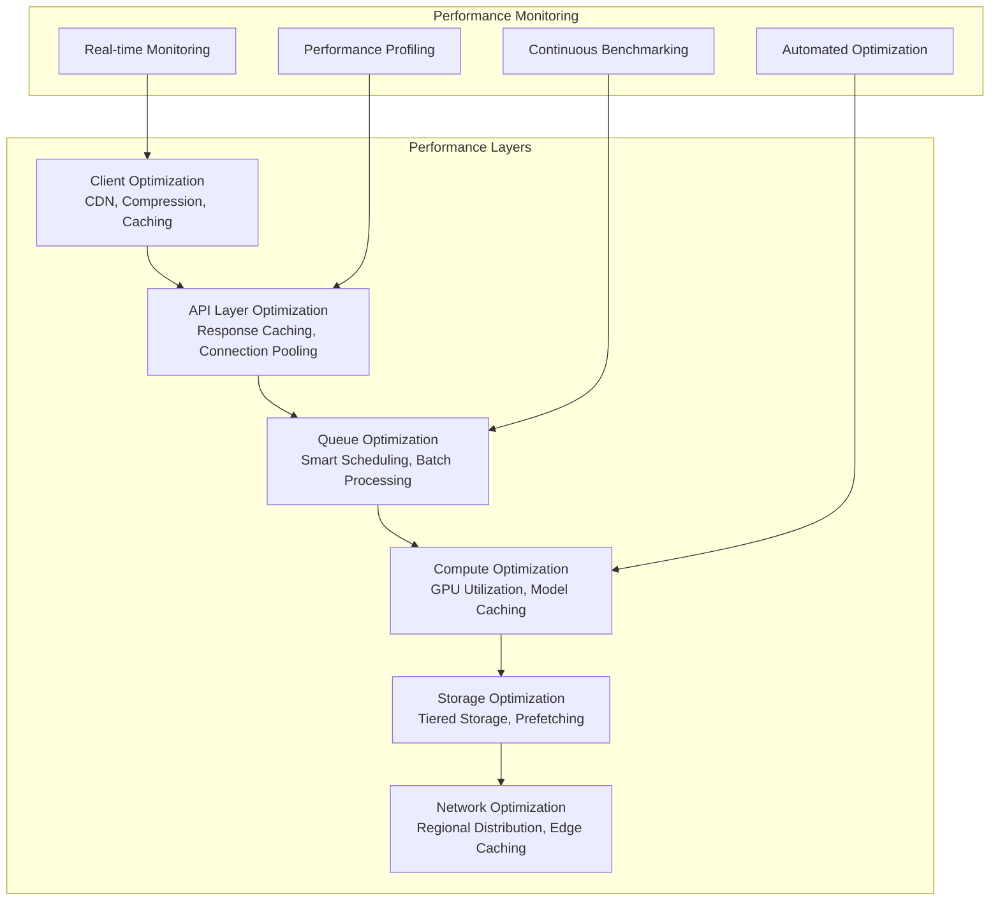
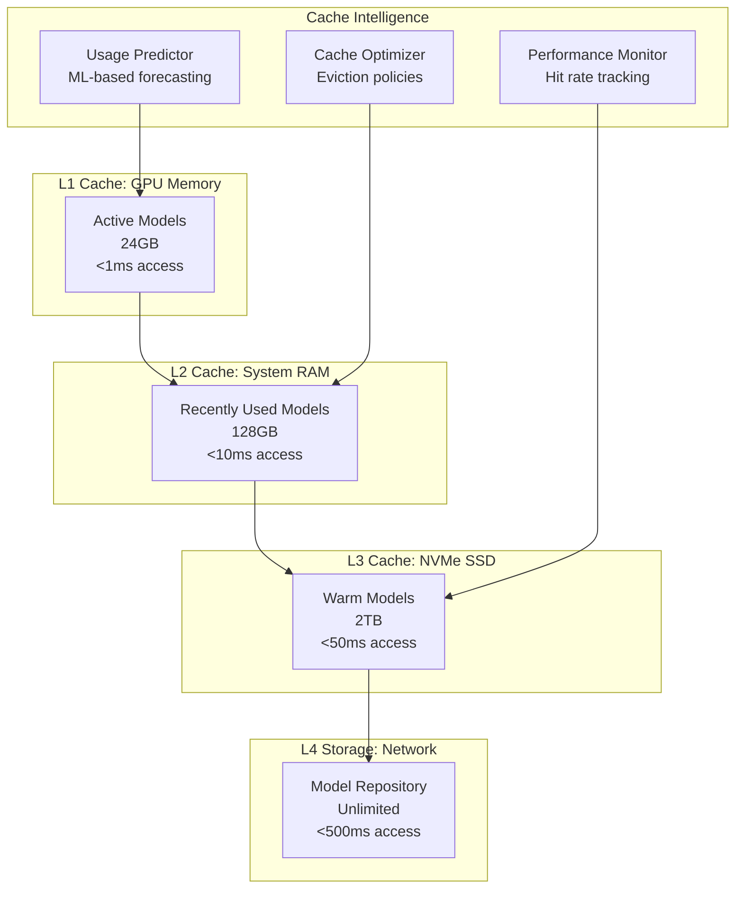
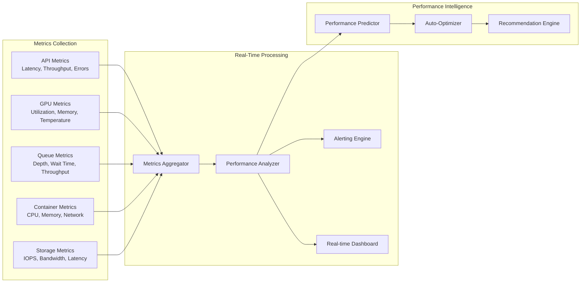

# ComfyUI Serverless Performance Architecture

## Overview

This document defines the performance architecture for ComfyUI serverless deployment, covering optimization strategies, caching systems, resource management, and performance monitoring.

## 1. Performance Architecture Overview

### 1.1 Performance Optimization Stack



### 1.2 Performance Targets and SLAs

**Service Level Objectives (SLOs):**
```yaml
performance_targets:
  api_performance:
    request_acceptance: 
      target: 95ms
      slo: <100ms (99.9%)
    response_time:
      target: 50ms
      slo: <100ms (99.5%)
    
  execution_performance:
    cold_start:
      target: 45s
      slo: <60s (95%)
    warm_start:
      target: 2s  
      slo: <5s (99%)
    model_loading:
      target: 15s
      slo: <30s (95%)
    
  queue_performance:
    wait_time:
      target: 30s
      slo: <60s (90%)
    throughput:
      target: 1000 workflows/hour
      slo: >800 workflows/hour (95%)
    
  availability:
    uptime:
      target: 99.95%
      slo: >99.9%
    error_rate:
      target: 0.1%
      slo: <0.5%

  resource_efficiency:
    gpu_utilization:
      target: 85%
      slo: >75%
    cache_hit_rate:
      target: 80%
      slo: >70%
    memory_efficiency:
      target: 90%
      slo: >80%
```

## 2. GPU Performance Optimization

### 2.1 GPU Resource Management

**Intelligent GPU Allocation:**
```python
class GPUPerformanceManager:
    def __init__(self):
        self.gpu_monitor = GPUMonitor()
        self.memory_optimizer = GPUMemoryOptimizer()
        self.utilization_tracker = GPUUtilizationTracker()
        self.performance_predictor = PerformancePredictor()
    
    async def optimize_gpu_allocation(self, workflow: Workflow) -> GPUAllocation:
        """Optimize GPU allocation for maximum performance"""
        
        # Analyze workflow requirements
        requirements = await self.analyze_workflow_requirements(workflow)
        
        # Get current GPU status
        gpu_status = await self.gpu_monitor.get_gpu_status()
        
        # Predict performance for different allocation strategies
        allocation_strategies = [
            self.create_memory_optimized_allocation(requirements, gpu_status),
            self.create_throughput_optimized_allocation(requirements, gpu_status),
            self.create_cost_optimized_allocation(requirements, gpu_status)
        ]
        
        performance_predictions = []
        for strategy in allocation_strategies:
            prediction = await self.performance_predictor.predict_performance(
                workflow, strategy
            )
            performance_predictions.append((strategy, prediction))
        
        # Select optimal strategy based on objectives
        optimal_allocation = self.select_optimal_allocation(
            performance_predictions,
            objectives=requirements.optimization_objectives
        )
        
        return optimal_allocation
    
    async def manage_gpu_memory(self, container_id: str, workflow: Workflow) -> MemoryManagementPlan:
        """Create GPU memory management plan for workflow"""
        
        # Analyze memory requirements
        memory_analysis = await self.analyze_memory_requirements(workflow)
        
        # Get current memory state
        current_memory = await self.gpu_monitor.get_memory_usage(container_id)
        
        # Create memory allocation plan
        allocation_plan = await self.create_memory_allocation_plan(
            memory_analysis, current_memory
        )
        
        # Implement memory optimization strategies
        optimization_strategies = []
        
        if allocation_plan.requires_optimization:
            # Model quantization
            if memory_analysis.supports_quantization:
                optimization_strategies.append(
                    QuantizationStrategy(
                        models=memory_analysis.large_models,
                        quantization_level="8bit",
                        expected_memory_saving="40%"
                    )
                )
            
            # Sequential model loading
            if len(memory_analysis.required_models) > 1:
                optimization_strategies.append(
                    SequentialLoadingStrategy(
                        loading_order=self.optimize_loading_order(memory_analysis.required_models),
                        unload_after_use=True
                    )
                )
            
            # CPU offloading for non-critical operations
            optimization_strategies.append(
                CPUOffloadingStrategy(
                    offload_candidates=memory_analysis.cpu_offload_candidates,
                    memory_threshold=0.9
                )
            )
        
        return MemoryManagementPlan(
            total_memory_required=memory_analysis.total_memory,
            available_memory=current_memory.available,
            allocation_plan=allocation_plan,
            optimization_strategies=optimization_strategies,
            estimated_peak_usage=allocation_plan.estimated_peak
        )
```

### 2.2 Model Loading Optimization

**Smart Model Caching:**
```python
class ModelLoadingOptimizer:
    def __init__(self):
        self.cache_manager = ModelCacheManager()
        self.preloader = ModelPreloader()
        self.usage_predictor = ModelUsagePredictor()
        self.compression_engine = ModelCompressionEngine()
    
    async def optimize_model_loading(self, workflow: Workflow, container: ContainerInstance) -> LoadingPlan:
        """Create optimized model loading plan"""
        
        required_models = self.extract_required_models(workflow)
        
        # Check cache status
        cache_status = await self.cache_manager.get_cache_status(container.id)
        
        # Predict future model usage
        usage_prediction = await self.usage_predictor.predict_usage(
            current_workflow=workflow,
            time_horizon=timedelta(minutes=30),
            container_id=container.id
        )
        
        # Create loading plan
        loading_plan = LoadingPlan()
        
        for model_id in required_models:
            model_strategy = await self.determine_loading_strategy(
                model_id, cache_status, usage_prediction
            )
            loading_plan.add_model_strategy(model_id, model_strategy)
        
        # Optimize loading order for parallel execution
        optimized_order = await self.optimize_loading_order(loading_plan)
        loading_plan.set_execution_order(optimized_order)
        
        # Add preloading recommendations
        preload_candidates = await self.identify_preload_candidates(usage_prediction)
        loading_plan.add_preload_recommendations(preload_candidates)
        
        return loading_plan
    
    async def implement_smart_prefetching(self, container_id: str):
        """Implement predictive model prefetching"""
        
        # Analyze historical usage patterns
        usage_patterns = await self.analyze_usage_patterns(container_id)
        
        # Predict next likely models
        predictions = await self.usage_predictor.predict_next_models(
            usage_patterns,
            confidence_threshold=0.7
        )
        
        # Calculate prefetch value
        for prediction in predictions:
            prefetch_value = await self.calculate_prefetch_value(
                model_id=prediction.model_id,
                probability=prediction.probability,
                model_size=prediction.model_size,
                available_cache=await self.get_available_cache_space(container_id)
            )
            
            if prefetch_value > 0.5:  # Prefetch threshold
                await self.preloader.prefetch_model(
                    container_id=container_id,
                    model_id=prediction.model_id,
                    priority=prediction.probability,
                    background=True
                )
    
    async def optimize_model_compression(self, model_id: str, target_memory: int) -> CompressionResult:
        """Optimize model compression for memory constraints"""
        
        model_metadata = await self.get_model_metadata(model_id)
        
        if model_metadata.size_bytes <= target_memory:
            return CompressionResult(
                compression_needed=False,
                original_size=model_metadata.size_bytes
            )
        
        # Determine optimal compression strategy
        compression_strategies = [
            QuantizationStrategy(level="int8", expected_reduction=0.5),
            QuantizationStrategy(level="int4", expected_reduction=0.75),
            PruningStrategy(level="structured", expected_reduction=0.3),
            DistillationStrategy(target_size=target_memory)
        ]
        
        best_strategy = None
        best_quality_loss = float('inf')
        
        for strategy in compression_strategies:
            expected_size = model_metadata.size_bytes * (1 - strategy.expected_reduction)
            
            if expected_size <= target_memory:
                quality_loss = await self.estimate_quality_loss(model_id, strategy)
                
                if quality_loss < best_quality_loss:
                    best_quality_loss = quality_loss
                    best_strategy = strategy
        
        if best_strategy:
            compressed_model = await self.compression_engine.compress_model(
                model_id, best_strategy
            )
            
            return CompressionResult(
                compression_needed=True,
                original_size=model_metadata.size_bytes,
                compressed_size=compressed_model.size_bytes,
                compression_ratio=compressed_model.size_bytes / model_metadata.size_bytes,
                quality_loss=best_quality_loss,
                strategy=best_strategy
            )
        
        return CompressionResult(
            compression_needed=True,
            compression_possible=False,
            reason="No strategy achieves target size with acceptable quality loss"
        )
```

## 3. Caching Architecture

### 3.1 Multi-Level Caching System



### 3.2 Intelligent Cache Management

**Cache Management Engine:**
```python
class IntelligentCacheManager:
    def __init__(self):
        self.usage_analyzer = ModelUsageAnalyzer()
        self.eviction_policy = SmartEvictionPolicy()
        self.prefetch_engine = PrefetchEngine()
        self.performance_tracker = CachePerformanceTracker()
    
    async def manage_cache_levels(self, container_id: str) -> CacheManagementResult:
        """Manage all cache levels for optimal performance"""
        
        # Get current cache state
        cache_state = await self.get_cache_state(container_id)
        
        # Analyze usage patterns
        usage_patterns = await self.usage_analyzer.analyze_patterns(
            container_id, lookback_hours=24
        )
        
        # L1 Cache (GPU Memory) Management
        l1_management = await self.manage_l1_cache(cache_state.l1, usage_patterns)
        
        # L2 Cache (RAM) Management  
        l2_management = await self.manage_l2_cache(cache_state.l2, usage_patterns)
        
        # L3 Cache (SSD) Management
        l3_management = await self.manage_l3_cache(cache_state.l3, usage_patterns)
        
        # Coordinate cache levels
        coordination_result = await self.coordinate_cache_levels(
            l1_management, l2_management, l3_management
        )
        
        return CacheManagementResult(
            l1_actions=l1_management.actions,
            l2_actions=l2_management.actions,
            l3_actions=l3_management.actions,
            coordination_actions=coordination_result.actions,
            predicted_performance_improvement=coordination_result.performance_gain
        )
    
    async def manage_l1_cache(self, l1_state: L1CacheState, usage_patterns: UsagePatterns) -> L1ManagementResult:
        """Manage GPU memory cache for optimal performance"""
        
        current_usage = l1_state.memory_used / l1_state.memory_total
        target_usage = 0.85  # Target 85% utilization
        
        actions = []
        
        if current_usage > target_usage:
            # Need to free memory
            eviction_candidates = await self.eviction_policy.select_eviction_candidates(
                l1_state.cached_models,
                usage_patterns,
                memory_needed=l1_state.memory_used - (target_usage * l1_state.memory_total)
            )
            
            for candidate in eviction_candidates:
                actions.append(CacheAction(
                    action_type="evict",
                    model_id=candidate.model_id,
                    source_level="l1",
                    target_level="l2",
                    memory_freed=candidate.memory_usage
                ))
        
        elif current_usage < 0.6:
            # Underutilized, can preload models
            preload_candidates = await self.prefetch_engine.identify_preload_candidates(
                usage_patterns,
                available_memory=l1_state.memory_total - l1_state.memory_used
            )
            
            for candidate in preload_candidates:
                if candidate.prefetch_value > 0.7:
                    actions.append(CacheAction(
                        action_type="preload",
                        model_id=candidate.model_id,
                        source_level="l2",
                        target_level="l1",
                        memory_required=candidate.memory_usage,
                        confidence=candidate.prefetch_value
                    ))
        
        return L1ManagementResult(
            actions=actions,
            target_utilization=target_usage,
            predicted_hit_rate_improvement=self.calculate_hit_rate_improvement(actions)
        )
```

### 3.3 Advanced Caching Strategies

**Predictive Caching Engine:**
```python
class PredictiveCachingEngine:
    def __init__(self):
        self.ml_predictor = ModelUsagePredictor()
        self.pattern_analyzer = UsagePatternAnalyzer()
        self.cost_benefit_analyzer = CostBenefitAnalyzer()
    
    async def predict_and_cache(self, current_context: CachingContext) -> PredictiveCachingResult:
        """Use ML to predict and preload models"""
        
        # Analyze current context
        context_features = await self.extract_context_features(current_context)
        
        # Predict next likely models
        predictions = await self.ml_predictor.predict_next_models(
            context_features,
            prediction_horizon=timedelta(minutes=15),
            confidence_threshold=0.6
        )
        
        # Analyze cost-benefit for each prediction
        caching_decisions = []
        
        for prediction in predictions:
            cost_benefit = await self.cost_benefit_analyzer.analyze(
                model_id=prediction.model_id,
                probability=prediction.confidence,
                model_size=prediction.model_size,
                load_time=prediction.estimated_load_time,
                cache_cost=prediction.cache_cost_per_hour
            )
            
            if cost_benefit.net_benefit > 0:
                caching_decisions.append(CachingDecision(
                    model_id=prediction.model_id,
                    action="preload",
                    priority=prediction.confidence,
                    net_benefit=cost_benefit.net_benefit,
                    cache_level=self.determine_optimal_cache_level(prediction)
                ))
        
        # Execute caching decisions
        execution_results = await self.execute_caching_decisions(caching_decisions)
        
        return PredictiveCachingResult(
            predictions_made=len(predictions),
            caching_decisions=len(caching_decisions),
            execution_results=execution_results,
            expected_performance_gain=sum(d.net_benefit for d in caching_decisions)
        )
    
    async def train_usage_prediction_model(self, training_data: CacheTrainingData):
        """Train ML model for usage prediction"""
        
        # Feature engineering
        features = await self.extract_training_features(training_data)
        
        # Model architecture for time series prediction
        model_config = {
            "architecture": "transformer",
            "layers": [
                {"type": "embedding", "dim": 256},
                {"type": "transformer", "heads": 8, "dim": 512},
                {"type": "lstm", "units": 256},
                {"type": "dense", "units": 128, "activation": "relu"},
                {"type": "output", "units": len(self.model_vocabulary), "activation": "softmax"}
            ],
            "optimizer": "adam",
            "learning_rate": 0.001,
            "batch_size": 32,
            "epochs": 50
        }
        
        # Train model
        training_result = await self.ml_predictor.train(
            features=features,
            targets=training_data.targets,
            config=model_config,
            validation_split=0.2
        )
        
        # Evaluate model performance
        evaluation_metrics = await self.evaluate_prediction_accuracy(
            training_result.model,
            training_data.test_set
        )
        
        # Deploy model if performance is acceptable
        if evaluation_metrics.accuracy > 0.75:
            await self.ml_predictor.deploy_model(training_result.model)
            
        return training_result
```

## 4. Queue Performance Optimization

### 4.1 Advanced Queue Management

**Smart Queue Scheduler:**
```python
class SmartQueueScheduler:
    def __init__(self):
        self.performance_analyzer = QueuePerformanceAnalyzer()
        self.resource_predictor = ResourcePredictor()
        self.batch_optimizer = BatchOptimizer()
        self.priority_calculator = DynamicPriorityCalculator()
    
    async def optimize_queue_performance(self) -> QueueOptimizationResult:
        """Optimize queue performance using advanced algorithms"""
        
        # Get current queue state
        queue_state = await self.get_queue_state()
        
        # Analyze performance bottlenecks
        bottlenecks = await self.performance_analyzer.identify_bottlenecks(queue_state)
        
        # Predict resource availability
        resource_forecast = await self.resource_predictor.forecast_availability(
            forecast_horizon=timedelta(minutes=30)
        )
        
        optimization_actions = []
        
        # Batch optimization
        if bottlenecks.low_gpu_utilization:
            batch_plan = await self.batch_optimizer.create_batch_plan(
                queue_state.pending_jobs,
                resource_forecast
            )
            optimization_actions.extend(batch_plan.actions)
        
        # Priority rebalancing
        if bottlenecks.priority_imbalance:
            priority_adjustments = await self.priority_calculator.rebalance_priorities(
                queue_state.pending_jobs,
                target_wait_time_distribution=self.get_target_wait_time_distribution()
            )
            optimization_actions.extend(priority_adjustments)
        
        # Resource preallocation
        if bottlenecks.resource_allocation_delays:
            preallocation_plan = await self.create_preallocation_plan(
                resource_forecast,
                queue_state.job_arrival_rate
            )
            optimization_actions.extend(preallocation_plan.actions)
        
        # Execute optimization actions
        execution_result = await self.execute_optimization_actions(optimization_actions)
        
        return QueueOptimizationResult(
            bottlenecks_identified=bottlenecks,
            actions_taken=optimization_actions,
            execution_result=execution_result,
            expected_performance_improvement=execution_result.predicted_improvement
        )
    
    async def implement_dynamic_batching(self, queue_items: List[QueueItem]) -> BatchingResult:
        """Implement intelligent dynamic batching"""
        
        # Analyze workflow similarities
        similarity_matrix = await self.calculate_workflow_similarities(queue_items)
        
        # Group similar workflows
        workflow_groups = self.cluster_similar_workflows(
            queue_items, 
            similarity_matrix,
            max_group_size=8,
            min_similarity=0.7
        )
        
        # Optimize each group for batching
        optimized_batches = []
        
        for group in workflow_groups:
            # Calculate optimal batch configuration
            batch_config = await self.calculate_optimal_batch_config(group)
            
            # Estimate performance improvement
            performance_gain = await self.estimate_batch_performance_gain(
                group, batch_config
            )
            
            if performance_gain.throughput_improvement > 0.2:  # 20% improvement threshold
                optimized_batches.append(OptimizedBatch(
                    workflows=group,
                    batch_config=batch_config,
                    performance_gain=performance_gain
                ))
        
        return BatchingResult(
            total_workflows=len(queue_items),
            batches_created=len(optimized_batches),
            batching_efficiency=self.calculate_batching_efficiency(optimized_batches),
            expected_throughput_improvement=sum(b.performance_gain.throughput_improvement for b in optimized_batches)
        )
```

## 5. Performance Monitoring and Analytics

### 5.1 Real-Time Performance Monitoring



### 5.2 Performance Analytics Engine

**Advanced Performance Analytics:**
```python
class PerformanceAnalyticsEngine:
    def __init__(self):
        self.metrics_collector = MetricsCollector()
        self.statistical_analyzer = StatisticalAnalyzer()
        self.anomaly_detector = AnomalyDetector()
        self.bottleneck_analyzer = BottleneckAnalyzer()
    
    async def analyze_system_performance(self, timeframe: timedelta = timedelta(hours=1)) -> PerformanceAnalysis:
        """Comprehensive performance analysis"""
        
        # Collect performance metrics
        metrics = await self.metrics_collector.collect_metrics(timeframe)
        
        # Statistical analysis
        statistics = await self.statistical_analyzer.analyze(metrics)
        
        # Detect performance anomalies
        anomalies = await self.anomaly_detector.detect_anomalies(metrics, statistics)
        
        # Identify bottlenecks
        bottlenecks = await self.bottleneck_analyzer.identify_bottlenecks(metrics)
        
        # Calculate performance scores
        performance_scores = await self.calculate_performance_scores(metrics, statistics)
        
        # Generate optimization recommendations
        recommendations = await self.generate_optimization_recommendations(
            bottlenecks, anomalies, performance_scores
        )
        
        return PerformanceAnalysis(
            timeframe=timeframe,
            metrics_summary=statistics,
            anomalies=anomalies,
            bottlenecks=bottlenecks,
            performance_scores=performance_scores,
            optimization_recommendations=recommendations,
            overall_health_score=self.calculate_overall_health_score(performance_scores)
        )
    
    async def detect_performance_regressions(self, current_metrics: PerformanceMetrics) -> RegressionAnalysis:
        """Detect performance regressions using statistical analysis"""
        
        # Get baseline metrics (last 7 days)
        baseline_metrics = await self.get_baseline_metrics(timedelta(days=7))
        
        # Statistical comparison
        regression_tests = [
            await self.test_api_latency_regression(current_metrics, baseline_metrics),
            await self.test_throughput_regression(current_metrics, baseline_metrics),
            await self.test_error_rate_regression(current_metrics, baseline_metrics),
            await self.test_resource_efficiency_regression(current_metrics, baseline_metrics)
        ]
        
        significant_regressions = [test for test in regression_tests if test.significant]
        
        if significant_regressions:
            # Generate regression report
            regression_report = await self.generate_regression_report(significant_regressions)
            
            # Trigger alerts for significant regressions
            await self.trigger_regression_alerts(significant_regressions)
            
            # Auto-rollback if critical regression detected
            critical_regressions = [r for r in significant_regressions if r.severity == "critical"]
            if critical_regressions:
                await self.trigger_auto_rollback(critical_regressions)
        
        return RegressionAnalysis(
            regressions_detected=len(significant_regressions),
            regression_details=significant_regressions,
            baseline_period=timedelta(days=7),
            confidence_level=0.95
        )
```

## 6. Latency Optimization

### 6.1 End-to-End Latency Optimization

**Latency Optimization Stack:**
```python
class LatencyOptimizer:
    def __init__(self):
        self.network_optimizer = NetworkLatencyOptimizer()
        self.cache_optimizer = CacheLatencyOptimizer()
        self.compute_optimizer = ComputeLatencyOptimizer()
        self.storage_optimizer = StorageLatencyOptimizer()
    
    async def optimize_end_to_end_latency(self, workflow: Workflow) -> LatencyOptimizationPlan:
        """Create comprehensive latency optimization plan"""
        
        # Analyze latency sources
        latency_profile = await self.profile_workflow_latency(workflow)
        
        # Network latency optimization
        network_optimizations = await self.network_optimizer.optimize(
            workflow, latency_profile.network_latency
        )
        
        # Cache latency optimization
        cache_optimizations = await self.cache_optimizer.optimize(
            workflow, latency_profile.cache_latency
        )
        
        # Compute latency optimization
        compute_optimizations = await self.compute_optimizer.optimize(
            workflow, latency_profile.compute_latency
        )
        
        # Storage latency optimization
        storage_optimizations = await self.storage_optimizer.optimize(
            workflow, latency_profile.storage_latency
        )
        
        # Combine optimizations
        combined_plan = LatencyOptimizationPlan(
            network_optimizations=network_optimizations,
            cache_optimizations=cache_optimizations,
            compute_optimizations=compute_optimizations,
            storage_optimizations=storage_optimizations,
            expected_latency_reduction=self.calculate_total_latency_reduction([
                network_optimizations,
                cache_optimizations,
                compute_optimizations,
                storage_optimizations
            ])
        )
        
        return combined_plan
    
    async def implement_request_pipelining(self, workflow: Workflow) -> PipeliningResult:
        """Implement request pipelining for reduced latency"""
        
        # Analyze workflow for pipelining opportunities
        pipeline_analysis = await self.analyze_pipeline_opportunities(workflow)
        
        if not pipeline_analysis.pipelinable:
            return PipeliningResult(
                implemented=False,
                reason="Workflow not suitable for pipelining"
            )
        
        # Create pipeline stages
        pipeline_stages = []
        
        # Stage 1: Input preprocessing and validation
        stage_1 = PipelineStage(
            name="input_preprocessing",
            operations=["input_validation", "format_conversion", "metadata_extraction"],
            can_start_immediately=True,
            estimated_duration=2.5
        )
        
        # Stage 2: Model loading and preparation
        stage_2 = PipelineStage(
            name="model_preparation",
            operations=["model_loading", "gpu_allocation", "cache_warming"],
            dependencies=[stage_1],
            can_start_early=True,
            estimated_duration=15.0
        )
        
        # Stage 3: Workflow execution
        stage_3 = PipelineStage(
            name="workflow_execution",
            operations=["node_execution", "result_generation"],
            dependencies=[stage_1, stage_2],
            estimated_duration=pipeline_analysis.execution_time
        )
        
        # Stage 4: Result processing and delivery
        stage_4 = PipelineStage(
            name="result_processing",
            operations=["result_optimization", "storage_upload", "notification_delivery"],
            dependencies=[stage_3],
            can_overlap_with_execution=True,
            estimated_duration=5.0
        )
        
        pipeline_stages = [stage_1, stage_2, stage_3, stage_4]
        
        # Calculate latency improvement
        sequential_time = sum(stage.estimated_duration for stage in pipeline_stages)
        pipelined_time = await self.calculate_pipelined_execution_time(pipeline_stages)
        
        latency_improvement = sequential_time - pipelined_time
        
        return PipeliningResult(
            implemented=True,
            pipeline_stages=pipeline_stages,
            sequential_time=sequential_time,
            pipelined_time=pipelined_time,
            latency_improvement=latency_improvement,
            improvement_percentage=latency_improvement / sequential_time
        )
```

## 7. Auto-Performance Tuning

### 7.1 Continuous Performance Optimization

**Auto-Tuning Engine:**
```python
class AutoPerformanceTuner:
    def __init__(self):
        self.performance_monitor = PerformanceMonitor()
        self.optimizer = PerformanceOptimizer()
        self.validator = OptimizationValidator()
        self.rollback_manager = RollbackManager()
    
    async def continuous_performance_tuning(self):
        """Continuously optimize system performance"""
        
        while True:
            try:
                # Monitor current performance
                current_performance = await self.performance_monitor.get_current_performance()
                
                # Identify optimization opportunities
                opportunities = await self.identify_optimization_opportunities(current_performance)
                
                if opportunities:
                    # Create optimization plan
                    optimization_plan = await self.create_optimization_plan(opportunities)
                    
                    # Validate optimization safety
                    safety_check = await self.validator.validate_optimization_safety(optimization_plan)
                    
                    if safety_check.safe:
                        # Create checkpoint for rollback
                        checkpoint = await self.create_performance_checkpoint()
                        
                        # Apply optimizations
                        optimization_result = await self.optimizer.apply_optimizations(optimization_plan)
                        
                        # Monitor optimization impact
                        impact_assessment = await self.assess_optimization_impact(
                            optimization_result,
                            monitoring_duration=timedelta(minutes=10)
                        )
                        
                        if impact_assessment.beneficial:
                            # Keep optimizations
                            await self.commit_optimizations(optimization_result)
                        else:
                            # Rollback optimizations
                            await self.rollback_manager.rollback_to_checkpoint(checkpoint)
                
                # Wait before next optimization cycle
                await asyncio.sleep(300)  # 5 minutes between cycles
                
            except Exception as e:
                # Log optimization errors
                await self.log_optimization_error(e)
                await asyncio.sleep(600)  # Wait longer after errors
    
    async def create_optimization_plan(self, opportunities: List[OptimizationOpportunity]) -> OptimizationPlan:
        """Create comprehensive optimization plan"""
        
        plan_actions = []
        
        for opportunity in opportunities:
            if opportunity.type == OptimizationType.CACHE_OPTIMIZATION:
                actions = await self.create_cache_optimization_actions(opportunity)
                plan_actions.extend(actions)
                
            elif opportunity.type == OptimizationType.RESOURCE_ALLOCATION:
                actions = await self.create_resource_optimization_actions(opportunity)
                plan_actions.extend(actions)
                
            elif opportunity.type == OptimizationType.QUEUE_SCHEDULING:
                actions = await self.create_scheduling_optimization_actions(opportunity)
                plan_actions.extend(actions)
                
            elif opportunity.type == OptimizationType.MODEL_LOADING:
                actions = await self.create_model_loading_optimization_actions(opportunity)
                plan_actions.extend(actions)
        
        # Prioritize actions by impact and safety
        prioritized_actions = self.prioritize_optimization_actions(plan_actions)
        
        return OptimizationPlan(
            actions=prioritized_actions,
            estimated_improvement=self.calculate_estimated_improvement(prioritized_actions),
            risk_level=self.assess_optimization_risk(prioritized_actions),
            rollback_plan=await self.create_rollback_plan(prioritized_actions)
        )
```

### 7.2 Benchmark-Driven Optimization

**Performance Benchmarking System:**
```python
class PerformanceBenchmarking:
    def __init__(self):
        self.benchmark_suites = BenchmarkSuites()
        self.performance_tracker = PerformanceTracker()
        self.regression_detector = RegressionDetector()
    
    async def run_continuous_benchmarks(self):
        """Run performance benchmarks continuously"""
        
        benchmark_schedule = {
            "quick_api_benchmark": timedelta(minutes=15),
            "workflow_performance_benchmark": timedelta(hours=1),
            "resource_efficiency_benchmark": timedelta(hours=6),
            "end_to_end_benchmark": timedelta(hours=24)
        }
        
        for benchmark_name, interval in benchmark_schedule.items():
            asyncio.create_task(
                self.run_scheduled_benchmark(benchmark_name, interval)
            )
    
    async def run_scheduled_benchmark(self, benchmark_name: str, interval: timedelta):
        """Run specific benchmark on schedule"""
        
        while True:
            try:
                # Run benchmark
                benchmark_result = await self.benchmark_suites.run_benchmark(benchmark_name)
                
                # Record results
                await self.performance_tracker.record_benchmark_result(
                    benchmark_name,
                    benchmark_result,
                    timestamp=datetime.utcnow()
                )
                
                # Check for regressions
                regression_check = await self.regression_detector.check_for_regression(
                    benchmark_name,
                    benchmark_result
                )
                
                if regression_check.regression_detected:
                    await self.handle_performance_regression(
                        benchmark_name,
                        regression_check
                    )
                
                # Wait for next run
                await asyncio.sleep(interval.total_seconds())
                
            except Exception as e:
                await self.log_benchmark_error(benchmark_name, e)
                await asyncio.sleep(interval.total_seconds() * 2)  # Wait longer after errors
    
    async def generate_performance_report(self, timeframe: timedelta) -> PerformanceReport:
        """Generate comprehensive performance report"""
        
        end_time = datetime.utcnow()
        start_time = end_time - timeframe
        
        # Collect benchmark results
        benchmark_results = await self.performance_tracker.get_benchmark_results(
            start_time, end_time
        )
        
        # Calculate performance trends
        trends = await self.calculate_performance_trends(benchmark_results)
        
        # Identify performance issues
        issues = await self.identify_performance_issues(benchmark_results, trends)
        
        # Generate optimization recommendations
        recommendations = await self.generate_performance_recommendations(issues, trends)
        
        return PerformanceReport(
            timeframe=(start_time, end_time),
            benchmark_summary=self.summarize_benchmark_results(benchmark_results),
            performance_trends=trends,
            issues_identified=issues,
            optimization_recommendations=recommendations,
            overall_performance_score=self.calculate_overall_performance_score(benchmark_results)
        )
```

This performance architecture provides comprehensive optimization strategies, intelligent caching, advanced monitoring, and automated tuning capabilities for optimal ComfyUI serverless performance.