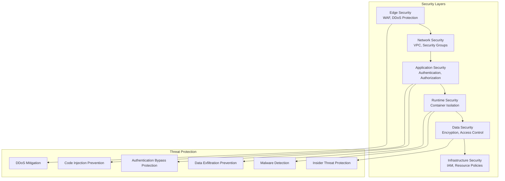
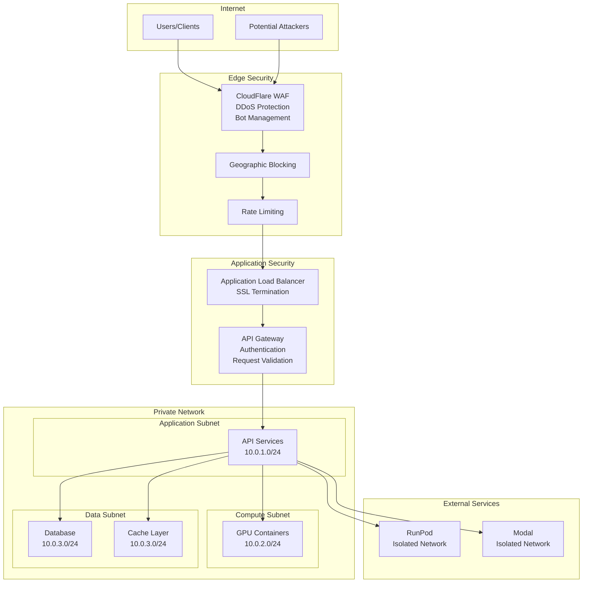
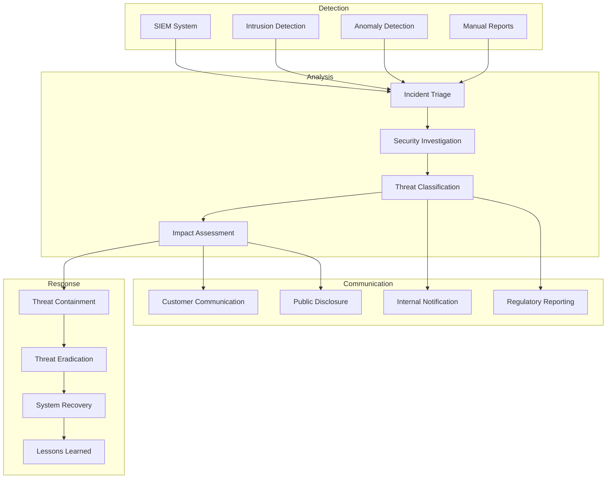

# ComfyUI Serverless Security Architecture

## Overview

This document defines the comprehensive security architecture for ComfyUI serverless deployment, covering authentication, authorization, data protection, network security, and compliance requirements.

## 1. Security Architecture Overview

### 1.1 Defense-in-Depth Security Model



### 1.2 Security Principles

**Core Security Principles:**
1. **Zero Trust Architecture**: Never trust, always verify
2. **Least Privilege Access**: Minimal necessary permissions
3. **Defense in Depth**: Multiple security layers
4. **Secure by Default**: Security controls enabled by default
5. **Continuous Monitoring**: Real-time threat detection
6. **Data Minimization**: Collect and store only necessary data

## 2. Authentication and Authorization

### 2.1 Multi-Factor Authentication System

**Authentication Methods:**
```python
class AuthenticationManager:
    def __init__(self):
        self.jwt_handler = JWTHandler()
        self.api_key_manager = APIKeyManager()
        self.oauth_provider = OAuthProvider()
        self.mfa_handler = MFAHandler()
    
    async def authenticate_request(self, request: HTTPRequest) -> AuthenticationResult:
        """Multi-method authentication with security validation"""
        
        auth_header = request.headers.get("Authorization")
        
        if not auth_header:
            return AuthenticationResult(
                authenticated=False,
                error="MISSING_AUTHENTICATION",
                required_methods=["Bearer", "API-Key"]
            )
        
        # Determine authentication method
        if auth_header.startswith("Bearer "):
            token = auth_header[7:]
            
            # Check if JWT or API key
            if self.is_jwt_token(token):
                return await self.authenticate_jwt(token, request)
            else:
                return await self.authenticate_api_key(token, request)
                
        elif auth_header.startswith("API-Key "):
            api_key = auth_header[8:]
            return await self.authenticate_api_key(api_key, request)
        
        return AuthenticationResult(
            authenticated=False,
            error="INVALID_AUTH_FORMAT",
            message="Authorization header must start with 'Bearer ' or 'API-Key '"
        )
    
    async def authenticate_jwt(self, token: str, request: HTTPRequest) -> AuthenticationResult:
        """JWT authentication with validation"""
        
        try:
            # Validate JWT signature and claims
            payload = await self.jwt_handler.validate_token(token)
            
            # Check token expiration
            if payload.exp < datetime.utcnow().timestamp():
                return AuthenticationResult(
                    authenticated=False,
                    error="TOKEN_EXPIRED",
                    expires_at=datetime.fromtimestamp(payload.exp)
                )
            
            # Validate user status
            user = await self.get_user(payload.sub)
            if not user or not user.active:
                return AuthenticationResult(
                    authenticated=False,
                    error="USER_INACTIVE"
                )
            
            # Check MFA requirements for sensitive operations
            if self.requires_mfa(request.path, request.method):
                mfa_result = await self.validate_mfa(payload.sub, request)
                if not mfa_result.valid:
                    return AuthenticationResult(
                        authenticated=False,
                        error="MFA_REQUIRED",
                        mfa_challenge=mfa_result.challenge
                    )
            
            return AuthenticationResult(
                authenticated=True,
                user_id=payload.sub,
                permissions=user.permissions,
                auth_method="jwt",
                expires_at=datetime.fromtimestamp(payload.exp)
            )
            
        except JWTValidationError as e:
            return AuthenticationResult(
                authenticated=False,
                error="INVALID_TOKEN",
                message=str(e)
            )
    
    async def authenticate_api_key(self, api_key: str, request: HTTPRequest) -> AuthenticationResult:
        """API key authentication with rate limiting"""
        
        # Validate API key format
        if not self.is_valid_api_key_format(api_key):
            return AuthenticationResult(
                authenticated=False,
                error="INVALID_API_KEY_FORMAT"
            )
        
        # Check rate limiting
        rate_limit_result = await self.check_rate_limit(api_key, request.remote_addr)
        if not rate_limit_result.allowed:
            return AuthenticationResult(
                authenticated=False,
                error="RATE_LIMIT_EXCEEDED",
                retry_after=rate_limit_result.retry_after
            )
        
        # Validate API key
        api_key_data = await self.api_key_manager.validate_key(api_key)
        
        if not api_key_data:
            return AuthenticationResult(
                authenticated=False,
                error="INVALID_API_KEY"
            )
        
        # Check API key permissions and quotas
        if not api_key_data.active:
            return AuthenticationResult(
                authenticated=False,
                error="API_KEY_DISABLED"
            )
        
        # Check usage quotas
        quota_result = await self.check_usage_quotas(api_key_data)
        if not quota_result.within_limits:
            return AuthenticationResult(
                authenticated=False,
                error="QUOTA_EXCEEDED",
                quota_info=quota_result
            )
        
        return AuthenticationResult(
            authenticated=True,
            user_id=api_key_data.user_id,
            permissions=api_key_data.permissions,
            auth_method="api_key",
            quota_remaining=quota_result.remaining
        )
```

### 2.2 Role-Based Access Control (RBAC)

**Permission System:**
```python
class PermissionSystem:
    def __init__(self):
        self.role_definitions = self.load_role_definitions()
        self.permission_cache = PermissionCache()
    
    async def check_permission(self, user_id: str, resource: str, action: str) -> PermissionResult:
        """Check if user has permission for specific action on resource"""
        
        # Get user permissions (cached)
        user_permissions = await self.permission_cache.get_user_permissions(user_id)
        
        if not user_permissions:
            user_permissions = await self.load_user_permissions(user_id)
            await self.permission_cache.cache_user_permissions(user_id, user_permissions)
        
        # Check direct permissions
        if self.has_direct_permission(user_permissions, resource, action):
            return PermissionResult(allowed=True, source="direct")
        
        # Check role-based permissions
        for role in user_permissions.roles:
            if self.role_has_permission(role, resource, action):
                return PermissionResult(allowed=True, source=f"role:{role}")
        
        # Check conditional permissions
        conditional_result = await self.check_conditional_permissions(
            user_id, resource, action, user_permissions
        )
        
        if conditional_result.allowed:
            return conditional_result
        
        # Log permission denial for audit
        await self.log_permission_denial(user_id, resource, action)
        
        return PermissionResult(
            allowed=False,
            reason="INSUFFICIENT_PERMISSIONS",
            required_permissions=[f"{resource}:{action}"]
        )

# Role definitions
role_definitions = {
    "basic_user": {
        "permissions": [
            "workflows:execute",
            "workflows:status",
            "workflows:cancel",
            "results:read",
            "models:list"
        ],
        "resource_limits": {
            "max_concurrent_executions": 3,
            "max_execution_time": 300,
            "max_gpu_memory": "12GB",
            "allowed_gpu_types": ["T4", "RTX3060"]
        }
    },
    "pro_user": {
        "inherits": ["basic_user"],
        "permissions": [
            "workflows:priority",
            "models:upload",
            "webhooks:manage",
            "analytics:view"
        ],
        "resource_limits": {
            "max_concurrent_executions": 10,
            "max_execution_time": 1800,
            "max_gpu_memory": "24GB",
            "allowed_gpu_types": ["T4", "RTX3060", "RTX4090", "A10G"]
        }
    },
    "enterprise_user": {
        "inherits": ["pro_user"],
        "permissions": [
            "admin:users",
            "admin:quotas",
            "custom_nodes:upload",
            "dedicated_resources:manage"
        ],
        "resource_limits": {
            "max_concurrent_executions": 100,
            "max_execution_time": 3600,
            "max_gpu_memory": "80GB",
            "allowed_gpu_types": ["all"]
        }
    }
}
```

### 2.3 API Key Management

**Secure API Key System:**
```python
class APIKeyManager:
    def __init__(self):
        self.encryption = AESEncryption()
        self.hash_function = PBKDF2()
        self.rate_limiter = RateLimiter()
    
    async def create_api_key(self, user_id: str, key_config: APIKeyConfig) -> APIKeyResponse:
        """Create new API key with secure generation"""
        
        # Generate cryptographically secure key
        raw_key = self.generate_secure_key()
        key_prefix = self.determine_key_prefix(key_config.permissions)
        formatted_key = f"{key_prefix}_{raw_key}"
        
        # Hash key for storage (never store plain text)
        key_hash = await self.hash_function.hash(formatted_key)
        
        # Create key metadata
        api_key_record = APIKeyRecord(
            key_id=str(uuid.uuid4()),
            user_id=user_id,
            key_hash=key_hash,
            permissions=key_config.permissions,
            rate_limits=key_config.rate_limits,
            created_at=datetime.utcnow(),
            expires_at=key_config.expires_at,
            active=True,
            last_used=None,
            usage_count=0
        )
        
        # Store encrypted metadata
        await self.store_api_key_record(api_key_record)
        
        # Return key only once (never stored or logged)
        return APIKeyResponse(
            key_id=api_key_record.key_id,
            api_key=formatted_key,  # Only returned here
            permissions=key_config.permissions,
            rate_limits=key_config.rate_limits,
            expires_at=key_config.expires_at,
            warning="Store this key securely. It will not be shown again."
        )
    
    def generate_secure_key(self, length: int = 32) -> str:
        """Generate cryptographically secure API key"""
        
        # Use OS random for cryptographic security
        random_bytes = os.urandom(length)
        
        # Encode using URL-safe base64
        key = base64.urlsafe_b64encode(random_bytes).decode('ascii').rstrip('=')
        
        return key
    
    def determine_key_prefix(self, permissions: List[str]) -> str:
        """Determine key prefix based on permission level"""
        
        if "admin:" in str(permissions):
            return "comfyui_admin"
        elif "pro_" in str(permissions):
            return "comfyui_pro"
        else:
            return "comfyui_basic"
```

## 3. Network Security

### 3.1 Network Architecture Security



### 3.2 Network Security Configuration

**VPC Security Configuration:**
```yaml
vpc_security:
  vpc_configuration:
    cidr_block: 10.0.0.0/16
    enable_dns_hostnames: true
    enable_dns_support: true
    
  subnet_configuration:
    public_subnets:
      - cidr: 10.0.1.0/24
        az: us-east-1a
        purpose: Load balancers
      - cidr: 10.0.2.0/24
        az: us-east-1b  
        purpose: NAT gateways
        
    private_subnets:
      - cidr: 10.0.10.0/24
        az: us-east-1a
        purpose: Application services
      - cidr: 10.0.11.0/24
        az: us-east-1b
        purpose: Application services
      - cidr: 10.0.20.0/24
        az: us-east-1a
        purpose: Database tier
      - cidr: 10.0.21.0/24
        az: us-east-1b
        purpose: Database tier

  security_groups:
    alb_security_group:
      ingress:
        - protocol: tcp
          port: 443
          source: 0.0.0.0/0
          description: HTTPS from internet
        - protocol: tcp
          port: 80
          source: 0.0.0.0/0
          description: HTTP redirect to HTTPS
      egress:
        - protocol: tcp
          port: 8080
          destination: sg-api-services
          
    api_services_sg:
      ingress:
        - protocol: tcp
          port: 8080
          source: sg-alb
          description: Traffic from load balancer
      egress:
        - protocol: tcp
          port: 5432
          destination: sg-database
        - protocol: tcp
          port: 6379
          destination: sg-cache
        - protocol: tcp
          port: 443
          destination: 0.0.0.0/0
          description: External API calls
          
    database_sg:
      ingress:
        - protocol: tcp
          port: 5432
          source: sg-api-services
          description: Database connections from API
      egress: []  # No outbound connections
      
  nacl_rules:
    application_nacl:
      ingress:
        - rule_number: 100
          protocol: tcp
          port_range: 8080-8080
          source: 10.0.1.0/23
          action: allow
      egress:
        - rule_number: 100
          protocol: tcp
          port_range: 443-443
          destination: 0.0.0.0/0
          action: allow
```

### 3.3 Web Application Firewall (WAF)

**CloudFlare WAF Configuration:**
```yaml
waf_configuration:
  managed_rules:
    owasp_core_rule_set:
      enabled: true
      paranoia_level: 2
      anomaly_threshold: 5
      
    rate_limiting:
      rules:
        - name: api_rate_limit
          expression: '(http.request.uri.path contains "/v1/workflows")'
          action: challenge
          characteristics: [ip.src]
          period: 60
          requests_per_period: 100
          
        - name: auth_rate_limit
          expression: '(http.request.uri.path contains "/auth")'
          action: block
          characteristics: [ip.src]
          period: 300
          requests_per_period: 5
          
    bot_management:
      enabled: true
      challenge_javascript: true
      challenge_captcha: true
      machine_learning: true
      
  custom_rules:
    - name: block_known_bad_actors
      expression: '(ip.geoip.country in {"CN" "RU" "KP"} and not cf.threat_score lt 10)'
      action: block
      
    - name: challenge_automation_tools
      expression: '(http.user_agent contains "curl" or http.user_agent contains "wget")'
      action: challenge
      
    - name: protect_admin_endpoints
      expression: '(http.request.uri.path contains "/admin")'
      action: challenge
      enabled: true
      
  security_headers:
    strict_transport_security:
      enabled: true
      max_age: 31536000
      include_subdomains: true
      preload: true
      
    content_security_policy:
      enabled: true
      policy: "default-src 'self'; script-src 'self' 'unsafe-inline'; style-src 'self' 'unsafe-inline'"
      
    x_frame_options: DENY
    x_content_type_options: nosniff
    referrer_policy: strict-origin-when-cross-origin
```

## 4. Container and Runtime Security

### 4.1 Container Security Hardening

**Container Security Configuration:**
```yaml
container_security:
  base_image_security:
    base_image: nvidia/cuda:11.8-runtime-ubuntu22.04
    vulnerability_scanning: enabled
    signature_verification: required
    
  runtime_security:
    user_configuration:
      run_as_user: 1000
      run_as_group: 1000
      fs_group: 1000
      run_as_non_root: true
      
    capabilities:
      drop: ["ALL"]
      add: ["CHOWN", "SETUID", "SETGID"]
      
    security_context:
      read_only_root_filesystem: true
      allow_privilege_escalation: false
      privileged: false
      
    resource_limits:
      memory: 24Gi
      cpu: 8
      ephemeral_storage: 100Gi
      nvidia.com/gpu: 1
      
  network_security:
    network_policies:
      - name: deny-all-default
        policy_types: [Ingress, Egress]
        pod_selector: {}
        
      - name: allow-api-to-gpu
        policy_types: [Egress]
        pod_selector:
          matchLabels:
            app: api-service
        egress:
          - to:
              - pod_selector:
                  matchLabels:
                    app: gpu-container
            ports:
              - protocol: TCP
                port: 8080
                
      - name: allow-gpu-to-storage
        policy_types: [Egress]
        pod_selector:
          matchLabels:
            app: gpu-container
        egress:
          - to: []
            ports:
              - protocol: TCP
                port: 443
            namespaceSelector: {}
```

### 4.2 Runtime Security Monitoring

**Security Monitoring System:**
```python
class RuntimeSecurityMonitor:
    def __init__(self):
        self.falco_client = FalcoClient()
        self.audit_logger = AuditLogger()
        self.incident_responder = IncidentResponder()
    
    async def monitor_container_security(self, container_id: str):
        """Real-time security monitoring for containers"""
        
        # Set up security event monitoring
        security_rules = [
            "shell_spawned_in_container",
            "file_below_root_modified",
            "network_connection_to_unexpected_host",
            "privilege_escalation_attempt",
            "suspicious_process_execution",
            "unauthorized_file_access"
        ]
        
        async for event in self.falco_client.stream_events(container_id, security_rules):
            # Analyze security event
            threat_level = await self.analyze_threat_level(event)
            
            # Log security event
            await self.audit_logger.log_security_event(
                container_id=container_id,
                event_type=event.rule,
                threat_level=threat_level,
                event_data=event.output_fields,
                timestamp=event.time
            )
            
            # Respond to high-threat events
            if threat_level >= ThreatLevel.HIGH:
                await self.incident_responder.handle_security_incident(
                    container_id=container_id,
                    event=event,
                    threat_level=threat_level
                )
    
    async def analyze_threat_level(self, event: SecurityEvent) -> ThreatLevel:
        """Analyze security event to determine threat level"""
        
        # Rule-based threat assessment
        threat_scores = {
            "shell_spawned_in_container": 0.7,
            "file_below_root_modified": 0.9,
            "network_connection_to_unexpected_host": 0.6,
            "privilege_escalation_attempt": 0.95,
            "suspicious_process_execution": 0.8,
            "unauthorized_file_access": 0.4
        }
        
        base_score = threat_scores.get(event.rule, 0.5)
        
        # Context-aware adjustments
        adjustments = 0
        
        # Check if process is expected
        if not await self.is_expected_process(event.output_fields.get("proc.name")):
            adjustments += 0.2
        
        # Check if file access is in allowed paths
        if not await self.is_allowed_file_path(event.output_fields.get("fd.name")):
            adjustments += 0.3
        
        # Check if network destination is whitelisted
        if not await self.is_whitelisted_destination(event.output_fields.get("fd.rip")):
            adjustments += 0.2
        
        final_score = min(1.0, base_score + adjustments)
        
        if final_score >= 0.9:
            return ThreatLevel.CRITICAL
        elif final_score >= 0.7:
            return ThreatLevel.HIGH
        elif final_score >= 0.4:
            return ThreatLevel.MEDIUM
        else:
            return ThreatLevel.LOW
```

## 5. Data Protection and Encryption

### 5.1 Data Classification and Protection

```mermaid
graph TB
    subgraph "Data Classification"
        Public[Public Data<br/>Model metadata, API docs]
        Internal[Internal Data<br/>System metrics, logs]
        Confidential[Confidential Data<br/>User workflows, results]
        Restricted[Restricted Data<br/>API keys, personal data]
    end

    subgraph "Protection Mechanisms"
        Encryption[Encryption at Rest/Transit]
        AccessControl[Access Control Lists]
        Anonymization[Data Anonymization]
        Retention[Data Retention Policies]
    end

    subgraph "Compliance Controls"
        GDPR[GDPR Compliance]
        SOC2[SOC2 Type II]
        ISO27001[ISO 27001]
        HIPAA[HIPAA (if applicable)]
    end

    Public --> AccessControl
    Internal --> Encryption
    Confidential --> Encryption
    Confidential --> AccessControl
    Restricted --> Encryption
    Restricted --> AccessControl
    Restricted --> Anonymization

    Encryption --> GDPR
    AccessControl --> SOC2
    Retention --> GDPR
    Anonymization --> HIPAA
```

### 5.2 Encryption Implementation

**Comprehensive Encryption Strategy:**
```python
class DataEncryptionManager:
    def __init__(self):
        self.kms_client = KMSClient()
        self.encryption_keys = EncryptionKeyManager()
        self.field_encryption = FieldLevelEncryption()
    
    async def encrypt_sensitive_data(self, data: Dict[str, Any], classification: DataClassification) -> EncryptedData:
        """Encrypt data based on classification level"""
        
        if classification == DataClassification.PUBLIC:
            # No encryption needed for public data
            return EncryptedData(data=data, encrypted=False)
        
        # Get appropriate encryption key
        encryption_key = await self.encryption_keys.get_key_for_classification(classification)
        
        if classification == DataClassification.RESTRICTED:
            # Field-level encryption for restricted data
            encrypted_fields = {}
            
            for field_name, field_value in data.items():
                if self.is_sensitive_field(field_name):
                    encrypted_value = await self.field_encryption.encrypt_field(
                        field_value, encryption_key, field_name
                    )
                    encrypted_fields[field_name] = encrypted_value
                else:
                    encrypted_fields[field_name] = field_value
            
            return EncryptedData(
                data=encrypted_fields,
                encrypted=True,
                encryption_method="field_level_aes256",
                key_id=encryption_key.key_id
            )
        
        else:
            # Full document encryption for confidential data
            encrypted_data = await self.encrypt_document(data, encryption_key)
            
            return EncryptedData(
                data=encrypted_data,
                encrypted=True,
                encryption_method="document_level_aes256",
                key_id=encryption_key.key_id
            )
    
    async def setup_encryption_keys(self):
        """Initialize encryption keys for different data classifications"""
        
        key_configurations = {
            DataClassification.CONFIDENTIAL: {
                "key_spec": "AES_256",
                "key_usage": "ENCRYPT_DECRYPT",
                "rotation_period": timedelta(days=90),
                "multi_region": True
            },
            DataClassification.RESTRICTED: {
                "key_spec": "AES_256", 
                "key_usage": "ENCRYPT_DECRYPT",
                "rotation_period": timedelta(days=30),
                "multi_region": True,
                "hsm_required": True
            }
        }
        
        for classification, config in key_configurations.items():
            key = await self.kms_client.create_key(
                description=f"Encryption key for {classification.value} data",
                key_spec=config["key_spec"],
                key_usage=config["key_usage"],
                multi_region=config["multi_region"],
                customer_master_key_spec=config.get("hsm_required", False)
            )
            
            # Set up automatic rotation
            await self.kms_client.enable_key_rotation(
                key_id=key.key_id,
                rotation_period=config["rotation_period"]
            )
            
            await self.encryption_keys.store_key_mapping(classification, key)
```

## 6. Input Validation and Sanitization

### 6.1 Comprehensive Input Validation

**Input Validation Engine:**
```python
class InputValidationEngine:
    def __init__(self):
        self.schema_validator = SchemaValidator()
        self.content_scanner = ContentScanner()
        self.url_validator = URLValidator()
        self.code_analyzer = CodeAnalyzer()
    
    async def validate_workflow_input(self, workflow_data: Dict[str, Any]) -> ValidationResult:
        """Comprehensive validation of workflow input"""
        
        validation_steps = [
            await self.validate_schema(workflow_data),
            await self.validate_content_safety(workflow_data),
            await self.validate_external_references(workflow_data),
            await self.validate_code_safety(workflow_data),
            await self.validate_resource_requirements(workflow_data)
        ]
        
        # Collect all validation results
        validation_errors = []
        for step_result in validation_steps:
            if not step_result.valid:
                validation_errors.extend(step_result.errors)
        
        if validation_errors:
            return ValidationResult(
                valid=False,
                errors=validation_errors,
                security_risk_level=self.calculate_risk_level(validation_errors)
            )
        
        return ValidationResult(valid=True)
    
    async def validate_content_safety(self, workflow_data: Dict[str, Any]) -> ValidationResult:
        """Scan for malicious content and policy violations"""
        
        content_checks = []
        
        # Extract all text content from workflow
        text_content = self.extract_text_content(workflow_data)
        
        # Check for malicious patterns
        malicious_patterns = await self.content_scanner.scan_for_malicious_patterns(text_content)
        if malicious_patterns:
            content_checks.append(ValidationError(
                error_code="MALICIOUS_CONTENT_DETECTED",
                message="Potentially malicious content detected",
                details={"patterns": malicious_patterns}
            ))
        
        # Check content policy compliance
        policy_violations = await self.content_scanner.check_content_policy(text_content)
        if policy_violations:
            content_checks.append(ValidationError(
                error_code="CONTENT_POLICY_VIOLATION",
                message="Content violates usage policy",
                details={"violations": policy_violations}
            ))
        
        # Check for sensitive information exposure
        sensitive_data = await self.content_scanner.detect_sensitive_data(text_content)
        if sensitive_data:
            content_checks.append(ValidationError(
                error_code="SENSITIVE_DATA_EXPOSURE",
                message="Potentially sensitive data detected",
                details={"sensitive_patterns": sensitive_data}
            ))
        
        return ValidationResult(
            valid=len(content_checks) == 0,
            errors=content_checks
        )
    
    async def validate_external_references(self, workflow_data: Dict[str, Any]) -> ValidationResult:
        """Validate external URLs and file references"""
        
        external_refs = self.extract_external_references(workflow_data)
        validation_errors = []
        
        for ref in external_refs:
            # Validate URL format and scheme
            if not self.url_validator.is_valid_url(ref.url):
                validation_errors.append(ValidationError(
                    error_code="INVALID_URL_FORMAT",
                    message=f"Invalid URL format: {ref.url}",
                    field_path=ref.field_path
                ))
                continue
            
            # Check domain whitelist
            domain = self.url_validator.extract_domain(ref.url)
            if not await self.is_whitelisted_domain(domain):
                validation_errors.append(ValidationError(
                    error_code="UNAUTHORIZED_DOMAIN",
                    message=f"Domain not in whitelist: {domain}",
                    field_path=ref.field_path,
                    details={"allowed_domains": await self.get_allowed_domains()}
                ))
                continue
            
            # Validate resource accessibility and content type
            try:
                resource_info = await self.url_validator.validate_resource(ref.url)
                
                if not self.is_allowed_content_type(resource_info.content_type):
                    validation_errors.append(ValidationError(
                        error_code="UNSUPPORTED_CONTENT_TYPE",
                        message=f"Content type not supported: {resource_info.content_type}",
                        field_path=ref.field_path
                    ))
                
                if resource_info.size_bytes > self.get_max_file_size():
                    validation_errors.append(ValidationError(
                        error_code="FILE_TOO_LARGE",
                        message=f"File size exceeds limit: {resource_info.size_bytes} bytes",
                        field_path=ref.field_path,
                        details={"max_size": self.get_max_file_size()}
                    ))
                    
            except Exception as e:
                validation_errors.append(ValidationError(
                    error_code="URL_VALIDATION_FAILED",
                    message=f"Failed to validate URL: {str(e)}",
                    field_path=ref.field_path
                ))
        
        return ValidationResult(
            valid=len(validation_errors) == 0,
            errors=validation_errors
        )
```

## 7. Audit and Compliance

### 7.1 Comprehensive Audit Logging

**Audit Logging System:**
```python
class AuditLogger:
    def __init__(self):
        self.log_storage = SecureLogStorage()
        self.encryption = LogEncryption()
        self.integrity_checker = LogIntegrityChecker()
    
    async def log_security_event(self, event: SecurityEvent):
        """Log security-relevant events with integrity protection"""
        
        # Create audit log entry
        audit_entry = AuditLogEntry(
            event_id=str(uuid.uuid4()),
            timestamp=datetime.utcnow(),
            event_type=event.event_type,
            severity=event.severity,
            user_id=event.user_id,
            source_ip=event.source_ip,
            user_agent=event.user_agent,
            resource_accessed=event.resource,
            action_performed=event.action,
            result=event.result,
            additional_data=event.additional_data,
            session_id=event.session_id,
            request_id=event.request_id
        )
        
        # Add integrity hash
        audit_entry.integrity_hash = await self.integrity_checker.calculate_hash(audit_entry)
        
        # Encrypt sensitive fields
        encrypted_entry = await self.encryption.encrypt_audit_entry(audit_entry)
        
        # Store with tamper protection
        await self.log_storage.store_audit_entry(
            encrypted_entry,
            retention_policy=self.determine_retention_policy(event.event_type)
        )
        
        # Real-time alerting for critical events
        if event.severity >= EventSeverity.HIGH:
            await self.send_security_alert(audit_entry)
    
    async def generate_compliance_report(self, report_type: ComplianceType, timeframe: timedelta) -> ComplianceReport:
        """Generate compliance reports for audits"""
        
        end_time = datetime.utcnow()
        start_time = end_time - timeframe
        
        # Retrieve audit logs for timeframe
        audit_logs = await self.log_storage.retrieve_logs(
            start_time=start_time,
            end_time=end_time,
            decrypt=True
        )
        
        # Verify log integrity
        integrity_results = await self.integrity_checker.verify_log_integrity(audit_logs)
        if not integrity_results.all_valid:
            raise ComplianceError("Log integrity verification failed")
        
        # Generate report based on type
        if report_type == ComplianceType.SOC2:
            return await self.generate_soc2_report(audit_logs, timeframe)
        elif report_type == ComplianceType.GDPR:
            return await self.generate_gdpr_report(audit_logs, timeframe)
        elif report_type == ComplianceType.ISO27001:
            return await self.generate_iso27001_report(audit_logs, timeframe)
        
        raise ValueError(f"Unsupported compliance report type: {report_type}")
```

### 7.2 GDPR Compliance Implementation

**Data Privacy Controls:**
```python
class GDPRComplianceManager:
    def __init__(self):
        self.data_inventory = DataInventoryManager()
        self.consent_manager = ConsentManager()
        self.deletion_manager = DeletionManager()
    
    async def handle_data_subject_request(self, request: DataSubjectRequest) -> DSRResponse:
        """Handle GDPR data subject requests (access, rectification, erasure)"""
        
        # Verify identity
        identity_verification = await self.verify_data_subject_identity(
            request.subject_identifier,
            request.verification_data
        )
        
        if not identity_verification.verified:
            return DSRResponse(
                status="verification_failed",
                message="Identity verification failed",
                next_steps=identity_verification.required_steps
            )
        
        user_id = identity_verification.user_id
        
        if request.request_type == DSRType.ACCESS:
            return await self.handle_access_request(user_id)
        elif request.request_type == DSRType.RECTIFICATION:
            return await self.handle_rectification_request(user_id, request.rectification_data)
        elif request.request_type == DSRType.ERASURE:
            return await self.handle_erasure_request(user_id)
        elif request.request_type == DSRType.PORTABILITY:
            return await self.handle_portability_request(user_id)
        
        raise ValueError(f"Unsupported DSR type: {request.request_type}")
    
    async def handle_erasure_request(self, user_id: str) -> DSRResponse:
        """Handle right to erasure (right to be forgotten)"""
        
        # Inventory all user data
        user_data_inventory = await self.data_inventory.find_all_user_data(user_id)
        
        # Check for legal basis to retain data
        retention_requirements = await self.check_retention_requirements(user_id)
        
        # Plan deletion
        deletion_plan = await self.deletion_manager.create_deletion_plan(
            user_data_inventory,
            retention_requirements
        )
        
        # Execute deletion
        deletion_result = await self.deletion_manager.execute_deletion_plan(deletion_plan)
        
        # Verify deletion completeness
        verification_result = await self.verify_data_deletion(user_id, deletion_plan)
        
        return DSRResponse(
            status="completed",
            request_type="erasure",
            completion_time=datetime.utcnow(),
            deleted_items=deletion_result.deleted_items,
            retained_items=deletion_result.retained_items,
            retention_reasons=retention_requirements,
            verification_status=verification_result
        )
```

## 8. Incident Response and Security Operations

### 8.1 Security Incident Response



### 8.2 Automated Incident Response

**Incident Response Automation:**
```python
class IncidentResponseSystem:
    def __init__(self):
        self.threat_detector = ThreatDetector()
        self.response_orchestrator = ResponseOrchestrator()
        self.communication_manager = CommunicationManager()
        self.forensics_collector = ForensicsCollector()
    
    async def handle_security_incident(self, incident: SecurityIncident) -> IncidentResponse:
        """Automated security incident response"""
        
        # Classify incident severity
        severity = await self.classify_incident_severity(incident)
        
        # Initiate immediate response based on severity
        if severity >= IncidentSeverity.HIGH:
            # Immediate containment for high-severity incidents
            await self.execute_immediate_containment(incident)
        
        # Start incident investigation
        investigation = await self.start_investigation(incident)
        
        # Collect forensic evidence
        forensics = await self.forensics_collector.collect_evidence(incident)
        
        # Determine response strategy
        response_plan = await self.create_response_plan(incident, investigation, forensics)
        
        # Execute response plan
        response_result = await self.response_orchestrator.execute_plan(response_plan)
        
        # Communicate incident based on severity and type
        await self.handle_incident_communication(incident, severity, response_result)
        
        return IncidentResponse(
            incident_id=incident.incident_id,
            severity=severity,
            response_plan=response_plan,
            response_result=response_result,
            forensics_collected=forensics,
            communication_sent=True
        )
    
    async def execute_immediate_containment(self, incident: SecurityIncident):
        """Execute immediate containment measures"""
        
        containment_actions = []
        
        if incident.incident_type == IncidentType.CONTAINER_COMPROMISE:
            # Isolate compromised container
            containment_actions.append(
                self.isolate_container(incident.affected_resources.container_id)
            )
            
            # Terminate any active executions
            containment_actions.append(
                self.terminate_container_executions(incident.affected_resources.container_id)
            )
        
        elif incident.incident_type == IncidentType.API_ABUSE:
            # Block abusive IP addresses
            containment_actions.append(
                self.block_ip_addresses(incident.source_ips)
            )
            
            # Temporarily disable affected API keys
            containment_actions.append(
                self.disable_api_keys(incident.affected_resources.api_keys)
            )
        
        elif incident.incident_type == IncidentType.DATA_BREACH:
            # Revoke all sessions for affected users
            containment_actions.append(
                self.revoke_user_sessions(incident.affected_resources.user_ids)
            )
            
            # Enable enhanced monitoring
            containment_actions.append(
                self.enable_enhanced_monitoring(incident.affected_resources)
            )
        
        # Execute all containment actions in parallel
        await asyncio.gather(*containment_actions)
        
        # Log containment actions
        await self.log_containment_actions(incident, containment_actions)
```

This security architecture provides comprehensive protection for ComfyUI serverless deployment with defense-in-depth security, robust authentication and authorization, data protection, and automated incident response capabilities.