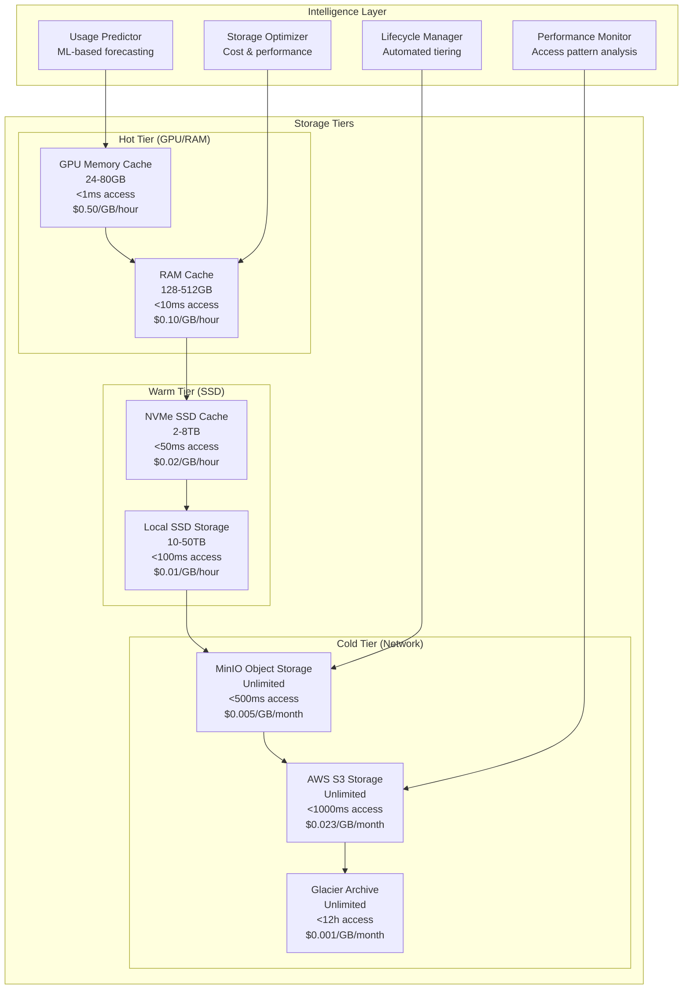
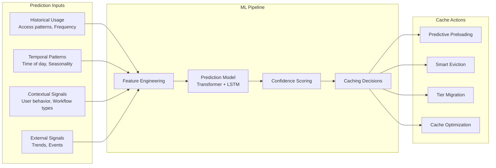
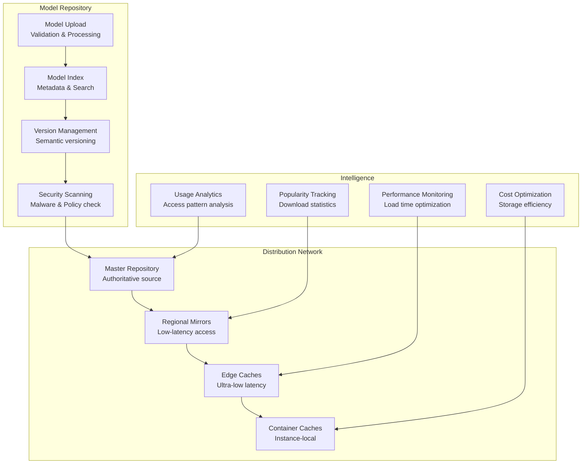
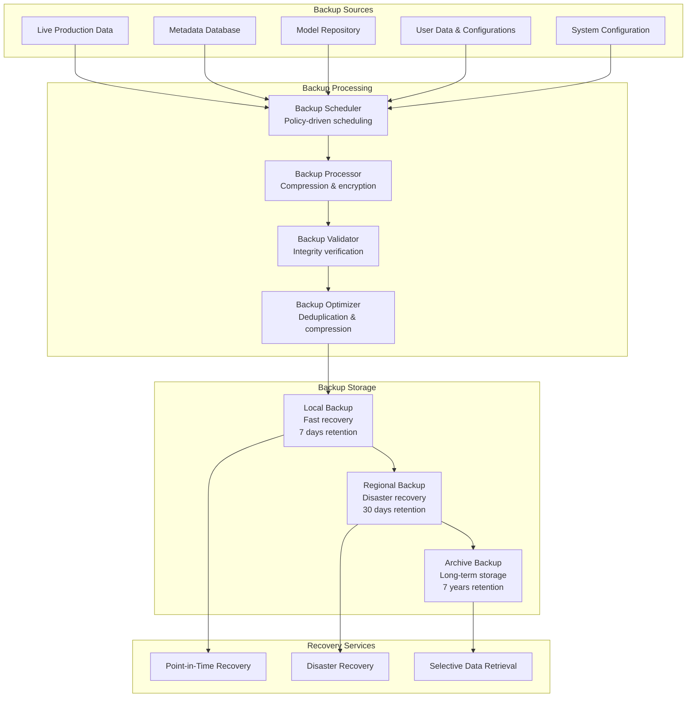

# ComfyUI Storage and Caching Architecture

## Overview

This document defines the comprehensive storage and caching architecture for ComfyUI serverless deployment, optimized for AI/ML workloads with intelligent tiering, cost optimization, and performance management.

## 1. Storage Architecture Overview

### 1.1 Multi-Tier Storage Strategy



### 1.2 Storage Service Architecture

**Storage Service Implementation:**
```python
class StorageServiceManager:
    def __init__(self):
        self.tier_managers = {
            "gpu": GPUStorageManager(),
            "ram": RAMStorageManager(), 
            "ssd": SSDStorageManager(),
            "object": ObjectStorageManager(),
            "archive": ArchiveStorageManager()
        }
        self.intelligent_tiering = IntelligentTieringEngine()
        self.cost_optimizer = StorageCostOptimizer()
    
    async def store_model(self, model_data: ModelData, storage_policy: StoragePolicy) -> StorageResult:
        """Store model with intelligent tiering"""
        
        # Analyze model characteristics
        model_analysis = await self.analyze_model_characteristics(model_data)
        
        # Determine optimal initial tier
        initial_tier = await self.determine_initial_tier(model_analysis, storage_policy)
        
        # Store in initial tier
        primary_storage = await self.tier_managers[initial_tier].store(
            model_data,
            storage_config=storage_policy.tier_configs[initial_tier]
        )
        
        # Set up intelligent tiering rules
        tiering_rules = await self.intelligent_tiering.create_tiering_rules(
            model_analysis,
            storage_policy,
            access_patterns=await self.predict_access_patterns(model_data)
        )
        
        # Configure lifecycle policies
        lifecycle_policy = await self.create_lifecycle_policy(
            model_analysis,
            storage_policy,
            tiering_rules
        )
        
        return StorageResult(
            model_id=model_data.model_id,
            primary_storage=primary_storage,
            tiering_rules=tiering_rules,
            lifecycle_policy=lifecycle_policy,
            estimated_monthly_cost=await self.cost_optimizer.estimate_monthly_cost(
                model_analysis, storage_policy
            )
        )
    
    async def intelligent_data_movement(self) -> DataMovementResult:
        """Automatically move data between tiers based on access patterns"""
        
        # Analyze access patterns across all tiers
        access_patterns = await self.analyze_global_access_patterns()
        
        # Identify movement opportunities
        movement_opportunities = await self.identify_movement_opportunities(access_patterns)
        
        movement_actions = []
        
        for opportunity in movement_opportunities:
            # Calculate cost-benefit of movement
            cost_benefit = await self.calculate_movement_cost_benefit(opportunity)
            
            if cost_benefit.net_benefit > 0:
                movement_action = DataMovementAction(
                    object_id=opportunity.object_id,
                    from_tier=opportunity.current_tier,
                    to_tier=opportunity.target_tier,
                    reason=opportunity.reason,
                    expected_benefit=cost_benefit.net_benefit
                )
                movement_actions.append(movement_action)
        
        # Execute movements in parallel
        movement_results = await asyncio.gather(*[
            self.execute_data_movement(action) for action in movement_actions
        ])
        
        return DataMovementResult(
            movements_executed=len(movement_results),
            total_cost_savings=sum(r.cost_savings for r in movement_results),
            performance_impact=self.calculate_performance_impact(movement_results)
        )
```

## 2. Advanced Caching Strategies

### 2.1 Predictive Caching Engine



### 2.2 Cache Performance Engine

**Advanced Cache Management:**
```python
class AdvancedCacheManager:
    def __init__(self):
        self.ml_predictor = CacheUsagePredictor()
        self.performance_optimizer = CachePerformanceOptimizer()
        self.cost_analyzer = CacheCostAnalyzer()
        self.pattern_analyzer = AccessPatternAnalyzer()
    
    async def optimize_cache_strategy(self, container_cluster: ContainerCluster) -> CacheOptimizationResult:
        """Optimize caching strategy across container cluster"""
        
        # Analyze access patterns across all containers
        access_patterns = await self.pattern_analyzer.analyze_cluster_patterns(container_cluster)
        
        # Predict future cache needs
        cache_predictions = await self.ml_predictor.predict_cache_needs(
            access_patterns,
            prediction_horizon=timedelta(hours=2)
        )
        
        # Optimize cache distribution
        distribution_plan = await self.optimize_cache_distribution(
            cache_predictions,
            container_cluster.available_cache_capacity
        )
        
        # Implement cross-container cache sharing
        sharing_strategy = await self.implement_cache_sharing(
            distribution_plan,
            container_cluster
        )
        
        return CacheOptimizationResult(
            distribution_plan=distribution_plan,
            sharing_strategy=sharing_strategy,
            expected_hit_rate_improvement=distribution_plan.hit_rate_improvement,
            cost_impact=await self.cost_analyzer.analyze_cost_impact(distribution_plan)
        )
    
    async def implement_adaptive_caching(self, cache_level: CacheLevel) -> AdaptiveCachingResult:
        """Implement adaptive caching based on real-time performance"""
        
        # Monitor cache performance metrics
        performance_metrics = await self.monitor_cache_performance(cache_level)
        
        # Detect performance issues
        issues = await self.detect_cache_performance_issues(performance_metrics)
        
        adaptation_actions = []
        
        for issue in issues:
            if issue.issue_type == CacheIssueType.LOW_HIT_RATE:
                # Increase cache size or improve prediction
                if issue.cache_utilization < 0.8:
                    adaptation_actions.append(CacheAdaptationAction(
                        action_type="increase_cache_size",
                        target_cache=cache_level,
                        parameter_changes={"size_multiplier": 1.5}
                    ))
                else:
                    adaptation_actions.append(CacheAdaptationAction(
                        action_type="improve_prediction_model",
                        target_cache=cache_level,
                        parameter_changes={"learning_rate": 0.001, "retrain": True}
                    ))
            
            elif issue.issue_type == CacheIssueType.HIGH_EVICTION_RATE:
                # Optimize eviction policy
                adaptation_actions.append(CacheAdaptationAction(
                    action_type="optimize_eviction_policy",
                    target_cache=cache_level,
                    parameter_changes={
                        "policy": "lru_with_frequency_bias",
                        "frequency_weight": 0.3
                    }
                ))
            
            elif issue.issue_type == CacheIssueType.MEMORY_PRESSURE:
                # Implement smart compression
                adaptation_actions.append(CacheAdaptationAction(
                    action_type="enable_cache_compression",
                    target_cache=cache_level,
                    parameter_changes={
                        "compression_algorithm": "lz4",
                        "compression_threshold": "1GB"
                    }
                ))
        
        # Execute adaptation actions
        adaptation_results = await self.execute_adaptation_actions(adaptation_actions)
        
        return AdaptiveCachingResult(
            adaptations_made=len(adaptation_actions),
            performance_improvement=await self.measure_adaptation_impact(adaptation_results),
            new_performance_baseline=await self.establish_new_baseline(cache_level)
        )
```

## 3. Distributed Storage Coordination

### 3.1 Multi-Region Storage Synchronization

**Global Storage Coordination:**
```python
class GlobalStorageCoordinator:
    def __init__(self):
        self.region_managers = {}  # Regional storage managers
        self.sync_coordinator = SyncCoordinator()
        self.consistency_manager = ConsistencyManager()
        self.conflict_resolver = ConflictResolver()
    
    async def coordinate_global_storage(self) -> GlobalCoordinationResult:
        """Coordinate storage across multiple regions"""
        
        # Get storage state from all regions
        regional_states = {}
        for region, manager in self.region_managers.items():
            regional_states[region] = await manager.get_storage_state()
        
        # Detect synchronization needs
        sync_needs = await self.detect_synchronization_needs(regional_states)
        
        # Plan synchronization strategy
        sync_plan = await self.create_synchronization_plan(sync_needs)
        
        # Execute synchronization
        sync_results = await self.execute_synchronization_plan(sync_plan)
        
        # Validate consistency
        consistency_check = await self.consistency_manager.validate_global_consistency(
            regional_states, sync_results
        )
        
        return GlobalCoordinationResult(
            regions_synchronized=len(self.region_managers),
            sync_operations=len(sync_results),
            consistency_achieved=consistency_check.consistent,
            data_transferred=sum(r.bytes_transferred for r in sync_results)
        )
    
    async def implement_smart_replication(self, model_id: str, access_patterns: AccessPatterns) -> ReplicationStrategy:
        """Implement intelligent data replication based on access patterns"""
        
        # Analyze geographic access distribution
        geo_distribution = await self.analyze_geographic_distribution(access_patterns)
        
        # Calculate optimal replication factor per region
        optimal_replicas = {}
        
        for region, access_stats in geo_distribution.items():
            # Calculate replication value score
            value_score = self.calculate_replication_value(
                access_frequency=access_stats.requests_per_hour,
                user_count=access_stats.unique_users,
                latency_benefit=access_stats.cross_region_latency,
                storage_cost=access_stats.regional_storage_cost
            )
            
            if value_score > 0.6:  # Replication threshold
                optimal_replicas[region] = ReplicationConfig(
                    replica_count=min(3, max(1, int(value_score * 3))),
                    consistency_level="eventual",
                    sync_frequency=self.calculate_sync_frequency(access_stats)
                )
        
        return ReplicationStrategy(
            model_id=model_id,
            regional_replicas=optimal_replicas,
            estimated_cost_impact=await self.calculate_replication_cost(optimal_replicas),
            expected_performance_improvement=await self.estimate_performance_improvement(
                geo_distribution, optimal_replicas
            )
        )
```

### 3.2 Content Delivery Network (CDN) Integration

**CDN Architecture:**
```yaml
cdn_configuration:
  provider: cloudflare
  
  edge_locations:
    primary_regions: [us-east-1, eu-west-1, ap-southeast-1]
    secondary_regions: [us-west-2, eu-central-1, ap-northeast-1]
    
  caching_policies:
    model_files:
      cache_ttl: 86400  # 24 hours
      edge_cache_size: 500GB
      cache_key_include: [model_id, version, format]
      compression: brotli
      
    result_files:
      cache_ttl: 3600   # 1 hour
      edge_cache_size: 100GB
      cache_key_include: [execution_id, format]
      signed_urls: true
      
    api_responses:
      cache_ttl: 300    # 5 minutes
      cache_control: public
      vary_headers: [Authorization, Accept-Encoding]
      
  optimization:
    smart_routing:
      enabled: true
      latency_optimization: true
      bandwidth_optimization: true
      
    prefetching:
      enabled: true
      prefetch_triggers:
        - popular_models_threshold: 100 requests/hour
        - geographic_demand_spike: 50% increase
        - scheduled_events: maintenance_windows
        
    compression:
      algorithms: [brotli, gzip]
      quality_levels: [6, 4]  # Brotli:6, Gzip:4
      minimum_size: 1024      # Don't compress files < 1KB
```

## 4. Model Storage and Distribution

### 4.1 Model Repository Architecture



### 4.2 Model Distribution Engine

**Smart Model Distribution:**
```python
class ModelDistributionEngine:
    def __init__(self):
        self.popularity_tracker = ModelPopularityTracker()
        self.geographic_analyzer = GeographicUsageAnalyzer()
        self.bandwidth_optimizer = BandwidthOptimizer()
        self.cost_calculator = DistributionCostCalculator()
    
    async def optimize_model_distribution(self) -> DistributionOptimizationResult:
        """Optimize model distribution across the global network"""
        
        # Analyze model popularity and usage patterns
        popularity_analysis = await self.popularity_tracker.analyze_popularity(
            timeframe=timedelta(days=7)
        )
        
        # Analyze geographic distribution of requests
        geographic_analysis = await self.geographic_analyzer.analyze_usage_distribution()
        
        # Create distribution strategy
        distribution_strategy = await self.create_distribution_strategy(
            popularity_analysis,
            geographic_analysis
        )
        
        # Execute distribution optimization
        optimization_actions = []
        
        for model_id, strategy in distribution_strategy.items():
            if strategy.action == "promote_to_edge":
                optimization_actions.append(
                    self.promote_model_to_edge_cache(model_id, strategy.target_regions)
                )
            elif strategy.action == "replicate_regionally":
                optimization_actions.append(
                    self.create_regional_replicas(model_id, strategy.target_regions)
                )
            elif strategy.action == "demote_from_cache":
                optimization_actions.append(
                    self.demote_model_from_cache(model_id, strategy.source_regions)
                )
        
        # Execute all actions in parallel
        action_results = await asyncio.gather(*optimization_actions)
        
        # Calculate optimization impact
        impact_analysis = await self.analyze_optimization_impact(action_results)
        
        return DistributionOptimizationResult(
            actions_executed=len(action_results),
            models_optimized=len(distribution_strategy),
            expected_latency_improvement=impact_analysis.latency_improvement,
            expected_cost_reduction=impact_analysis.cost_reduction,
            bandwidth_savings=impact_analysis.bandwidth_savings
        )
    
    async def implement_intelligent_prefetching(self, container_id: str) -> PrefetchingResult:
        """Implement ML-based model prefetching"""
        
        # Analyze container usage history
        container_history = await self.get_container_usage_history(container_id)
        
        # Predict next likely models
        model_predictions = await self.predict_next_models(
            container_history,
            prediction_confidence=0.65
        )
        
        # Calculate prefetch value for each prediction
        prefetch_candidates = []
        
        for prediction in model_predictions:
            prefetch_value = await self.calculate_prefetch_value(
                model_id=prediction.model_id,
                probability=prediction.confidence,
                model_size=prediction.model_size,
                current_cache_state=await self.get_cache_state(container_id),
                bandwidth_cost=await self.get_bandwidth_cost(container_id, prediction.model_id)
            )
            
            if prefetch_value > 0.5:  # Prefetch threshold
                prefetch_candidates.append(PrefetchCandidate(
                    model_id=prediction.model_id,
                    prefetch_value=prefetch_value,
                    priority=prediction.confidence,
                    estimated_benefit=await self.estimate_prefetch_benefit(prediction)
                ))
        
        # Sort by prefetch value and execute
        prefetch_candidates.sort(key=lambda x: x.prefetch_value, reverse=True)
        
        prefetch_results = []
        for candidate in prefetch_candidates[:5]:  # Limit to top 5 candidates
            result = await self.execute_prefetch(container_id, candidate)
            prefetch_results.append(result)
        
        return PrefetchingResult(
            candidates_evaluated=len(model_predictions),
            prefetch_operations=len(prefetch_results),
            total_data_prefetched=sum(r.bytes_transferred for r in prefetch_results),
            expected_cache_hit_improvement=self.calculate_hit_rate_improvement(prefetch_results)
        )
```

## 5. Storage Performance Monitoring

### 5.1 Storage Performance Metrics

**Comprehensive Storage Monitoring:**
```python
class StoragePerformanceMonitor:
    def __init__(self):
        self.metrics_collector = StorageMetricsCollector()
        self.performance_analyzer = StoragePerformanceAnalyzer()
        self.bottleneck_detector = StorageBottleneckDetector()
        self.optimization_engine = StorageOptimizationEngine()
    
    async def monitor_storage_performance(self) -> StoragePerformanceReport:
        """Comprehensive storage performance monitoring"""
        
        # Collect metrics from all storage tiers
        tier_metrics = {}
        for tier_name, tier_manager in self.tier_managers.items():
            tier_metrics[tier_name] = await tier_manager.collect_performance_metrics()
        
        # Analyze cross-tier performance
        cross_tier_analysis = await self.performance_analyzer.analyze_cross_tier_performance(
            tier_metrics
        )
        
        # Detect bottlenecks
        bottlenecks = await self.bottleneck_detector.detect_bottlenecks(
            tier_metrics, cross_tier_analysis
        )
        
        # Calculate performance scores
        performance_scores = await self.calculate_performance_scores(tier_metrics)
        
        # Generate optimization recommendations
        recommendations = await self.optimization_engine.generate_recommendations(
            bottlenecks, performance_scores
        )
        
        return StoragePerformanceReport(
            tier_metrics=tier_metrics,
            cross_tier_analysis=cross_tier_analysis,
            bottlenecks=bottlenecks,
            performance_scores=performance_scores,
            optimization_recommendations=recommendations,
            overall_storage_health=self.calculate_overall_storage_health(performance_scores)
        )
    
    async def detect_storage_anomalies(self, metrics: StorageMetrics) -> List[StorageAnomaly]:
        """Detect storage performance anomalies"""
        
        anomalies = []
        
        # Check for unusual access patterns
        access_anomalies = await self.detect_access_pattern_anomalies(metrics.access_patterns)
        anomalies.extend(access_anomalies)
        
        # Check for performance degradation
        performance_anomalies = await self.detect_performance_anomalies(metrics.performance_data)
        anomalies.extend(performance_anomalies)
        
        # Check for cost anomalies
        cost_anomalies = await self.detect_cost_anomalies(metrics.cost_data)
        anomalies.extend(cost_anomalies)
        
        # Check for capacity issues
        capacity_anomalies = await self.detect_capacity_anomalies(metrics.capacity_data)
        anomalies.extend(capacity_anomalies)
        
        # Prioritize anomalies by severity
        prioritized_anomalies = self.prioritize_anomalies(anomalies)
        
        return prioritized_anomalies
```

## 6. Cost Optimization Strategies

### 6.1 Storage Cost Optimization

**Intelligent Cost Management:**
```python
class StorageCostOptimizer:
    def __init__(self):
        self.cost_analyzer = StorageCostAnalyzer()
        self.usage_predictor = StorageUsagePredictor()
        self.lifecycle_manager = LifecycleManager()
        self.vendor_optimizer = VendorOptimizer()
    
    async def optimize_storage_costs(self) -> CostOptimizationResult:
        """Optimize storage costs across all tiers and regions"""
        
        # Analyze current costs
        current_costs = await self.cost_analyzer.analyze_current_costs()
        
        # Identify cost optimization opportunities
        opportunities = await self.identify_cost_opportunities(current_costs)
        
        optimization_actions = []
        
        for opportunity in opportunities:
            if opportunity.type == CostOptimizationType.LIFECYCLE_OPTIMIZATION:
                action = await self.create_lifecycle_optimization(opportunity)
                optimization_actions.append(action)
                
            elif opportunity.type == CostOptimizationType.VENDOR_MIGRATION:
                action = await self.create_vendor_migration_plan(opportunity)
                optimization_actions.append(action)
                
            elif opportunity.type == CostOptimizationType.COMPRESSION_OPTIMIZATION:
                action = await self.create_compression_optimization(opportunity)
                optimization_actions.append(action)
                
            elif opportunity.type == CostOptimizationType.DEDUPLICATION:
                action = await self.create_deduplication_plan(opportunity)
                optimization_actions.append(action)
        
        # Validate optimization safety
        safety_validation = await self.validate_optimization_safety(optimization_actions)
        
        safe_actions = [action for action in optimization_actions if safety_validation.is_safe(action)]
        
        # Execute safe optimizations
        execution_results = await self.execute_cost_optimizations(safe_actions)
        
        return CostOptimizationResult(
            opportunities_identified=len(opportunities),
            actions_executed=len(execution_results),
            estimated_monthly_savings=sum(r.monthly_savings for r in execution_results),
            risk_assessment=safety_validation,
            performance_impact=await self.assess_performance_impact(execution_results)
        )
    
    async def implement_dynamic_pricing_optimization(self) -> DynamicPricingResult:
        """Optimize storage costs using dynamic pricing strategies"""
        
        # Monitor real-time pricing across providers
        pricing_data = await self.collect_real_time_pricing()
        
        # Analyze cost differentials
        cost_differentials = await self.analyze_cost_differentials(pricing_data)
        
        # Identify arbitrage opportunities
        arbitrage_opportunities = await self.identify_arbitrage_opportunities(cost_differentials)
        
        migration_plans = []
        
        for opportunity in arbitrage_opportunities:
            # Calculate migration cost vs savings
            migration_analysis = await self.analyze_migration_cost_benefit(opportunity)
            
            if migration_analysis.net_benefit > 0:
                migration_plan = await self.create_migration_plan(
                    opportunity, migration_analysis
                )
                migration_plans.append(migration_plan)
        
        # Execute migrations in parallel
        migration_results = await asyncio.gather(*[
            self.execute_migration_plan(plan) for plan in migration_plans
        ])
        
        return DynamicPricingResult(
            arbitrage_opportunities=len(arbitrage_opportunities),
            migrations_executed=len(migration_results),
            total_cost_savings=sum(r.cost_savings for r in migration_results),
            data_migrated=sum(r.data_size for r in migration_results)
        )
```

## 7. Data Lifecycle Management

### 7.1 Automated Lifecycle Policies

**Intelligent Data Lifecycle:**
```python
class DataLifecycleManager:
    def __init__(self):
        self.usage_analyzer = DataUsageAnalyzer()
        self.policy_engine = LifecyclePolicyEngine()
        self.cost_calculator = LifecycleCostCalculator()
        self.compliance_manager = ComplianceManager()
    
    async def manage_data_lifecycle(self) -> LifecycleManagementResult:
        """Manage data lifecycle across all storage tiers"""
        
        # Analyze data usage patterns
        usage_patterns = await self.usage_analyzer.analyze_all_data_usage()
        
        # Generate lifecycle recommendations
        lifecycle_recommendations = []
        
        for data_object in usage_patterns.data_objects:
            recommendation = await self.generate_lifecycle_recommendation(data_object)
            lifecycle_recommendations.append(recommendation)
        
        # Group recommendations by action type
        actions_by_type = self.group_recommendations_by_action(lifecycle_recommendations)
        
        execution_results = {}
        
        # Execute tier transitions
        if actions_by_type.get("tier_transition"):
            tier_results = await self.execute_tier_transitions(actions_by_type["tier_transition"])
            execution_results["tier_transitions"] = tier_results
        
        # Execute deletions
        if actions_by_type.get("delete"):
            deletion_results = await self.execute_deletions(actions_by_type["delete"])
            execution_results["deletions"] = deletion_results
        
        # Execute compressions
        if actions_by_type.get("compress"):
            compression_results = await self.execute_compressions(actions_by_type["compress"])
            execution_results["compressions"] = compression_results
        
        # Calculate impact
        total_cost_savings = sum(
            sum(getattr(result, 'cost_savings', 0) for result in results)
            for results in execution_results.values()
        )
        
        total_space_freed = sum(
            sum(getattr(result, 'space_freed', 0) for result in results)
            for results in execution_results.values()
        )
        
        return LifecycleManagementResult(
            recommendations_generated=len(lifecycle_recommendations),
            actions_executed=sum(len(actions) for actions in actions_by_type.values()),
            cost_savings=total_cost_savings,
            space_freed=total_space_freed,
            execution_results=execution_results
        )
    
    async def generate_lifecycle_recommendation(self, data_object: DataObject) -> LifecycleRecommendation:
        """Generate intelligent lifecycle recommendation for data object"""
        
        # Calculate data access characteristics
        access_frequency = data_object.access_count / max(1, data_object.age_days)
        last_access_days = (datetime.utcnow() - data_object.last_accessed).days
        
        # Analyze cost characteristics
        current_cost = await self.cost_calculator.calculate_current_monthly_cost(data_object)
        
        # Check compliance requirements
        compliance_requirements = await self.compliance_manager.get_retention_requirements(
            data_object.data_type,
            data_object.user_id
        )
        
        # Generate recommendation based on analysis
        if last_access_days > 90 and access_frequency < 0.01:
            if not compliance_requirements.must_retain:
                return LifecycleRecommendation(
                    data_object_id=data_object.id,
                    action="delete",
                    reason="No access for 90+ days, low historical frequency",
                    cost_savings=current_cost,
                    risk_level="low"
                )
            else:
                return LifecycleRecommendation(
                    data_object_id=data_object.id,
                    action="tier_transition",
                    target_tier="glacier",
                    reason="Compliance retention required, infrequent access",
                    cost_savings=current_cost * 0.8,
                    risk_level="low"
                )
        
        elif last_access_days > 30 and access_frequency < 0.1:
            return LifecycleRecommendation(
                data_object_id=data_object.id,
                action="tier_transition",
                target_tier="cold_storage",
                reason="Infrequent access pattern detected",
                cost_savings=current_cost * 0.5,
                risk_level="low"
            )
        
        elif data_object.compression_ratio < 0.7 and data_object.size_bytes > 100_000_000:
            return LifecycleRecommendation(
                data_object_id=data_object.id,
                action="compress",
                compression_algorithm="zstd",
                reason="Large file with poor compression ratio",
                cost_savings=current_cost * (1 - data_object.compression_ratio),
                risk_level="low"
            )
        
        else:
            return LifecycleRecommendation(
                data_object_id=data_object.id,
                action="maintain",
                reason="Optimal current state",
                cost_savings=0,
                risk_level="none"
            )
```

## 8. Backup and Disaster Recovery

### 8.1 Backup Strategy Architecture



### 8.2 Disaster Recovery Implementation

**Automated Disaster Recovery:**
```python
class DisasterRecoveryManager:
    def __init__(self):
        self.backup_manager = BackupManager()
        self.failover_coordinator = FailoverCoordinator()
        self.data_sync_manager = DataSyncManager()
        self.recovery_validator = RecoveryValidator()
    
    async def execute_disaster_recovery(self, disaster_type: DisasterType) -> DisasterRecoveryResult:
        """Execute disaster recovery based on disaster type"""
        
        # Assess disaster scope and impact
        impact_assessment = await self.assess_disaster_impact(disaster_type)
        
        # Select appropriate recovery strategy
        recovery_strategy = await self.select_recovery_strategy(disaster_type, impact_assessment)
        
        # Execute recovery plan
        if recovery_strategy.type == RecoveryType.REGIONAL_FAILOVER:
            result = await self.execute_regional_failover(recovery_strategy)
        elif recovery_strategy.type == RecoveryType.POINT_IN_TIME_RECOVERY:
            result = await self.execute_point_in_time_recovery(recovery_strategy)
        elif recovery_strategy.type == RecoveryType.FULL_SYSTEM_RESTORE:
            result = await self.execute_full_system_restore(recovery_strategy)
        
        # Validate recovery completeness
        validation_result = await self.recovery_validator.validate_recovery(result)
        
        if not validation_result.complete:
            # Attempt additional recovery steps
            additional_steps = await self.plan_additional_recovery_steps(validation_result)
            additional_result = await self.execute_additional_recovery_steps(additional_steps)
            result = self.merge_recovery_results(result, additional_result)
        
        # Update system status
        await self.update_system_recovery_status(result)
        
        return result
    
    async def execute_regional_failover(self, strategy: RegionalFailoverStrategy) -> RegionalFailoverResult:
        """Execute failover to secondary region"""
        
        # Initiate DNS failover
        dns_failover = await self.failover_coordinator.initiate_dns_failover(
            from_region=strategy.primary_region,
            to_region=strategy.secondary_region
        )
        
        # Activate secondary region services
        service_activation = await self.activate_secondary_region_services(strategy.secondary_region)
        
        # Sync latest data
        data_sync = await self.data_sync_manager.sync_critical_data(
            from_region=strategy.primary_region,
            to_region=strategy.secondary_region,
            sync_mode="emergency"
        )
        
        # Validate failover completeness
        failover_validation = await self.validate_failover_completeness(
            strategy.secondary_region
        )
        
        return RegionalFailoverResult(
            dns_failover_time=dns_failover.completion_time,
            service_activation_time=service_activation.completion_time,
            data_sync_time=data_sync.completion_time,
            total_failover_time=max(
                dns_failover.completion_time,
                service_activation.completion_time,
                data_sync.completion_time
            ),
            validation_result=failover_validation,
            rpo_achieved=data_sync.rpo,
            rto_achieved=max(dns_failover.completion_time, service_activation.completion_time)
        )
```

This storage and caching architecture provides intelligent, cost-effective, and high-performance storage solutions optimized for ComfyUI serverless workloads with comprehensive monitoring, automation, and disaster recovery capabilities.