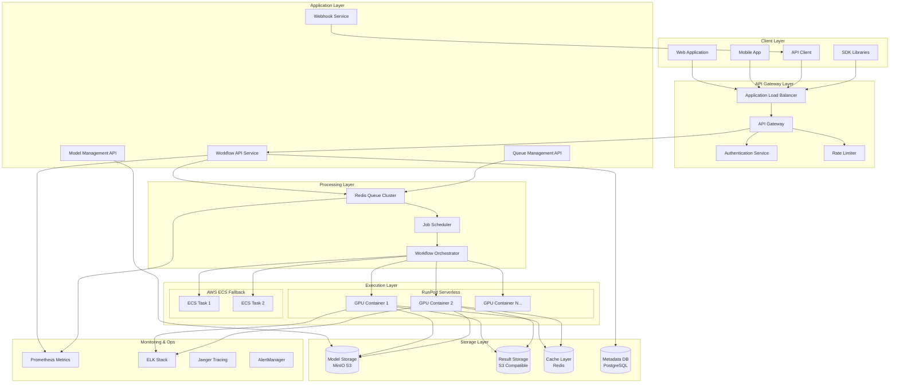
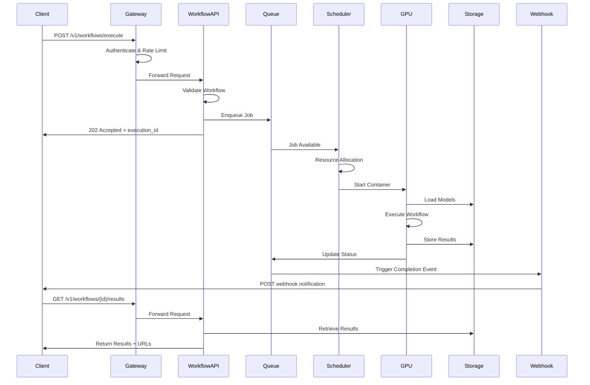
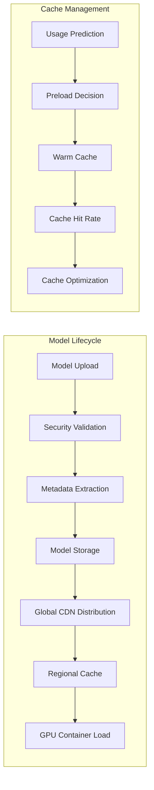
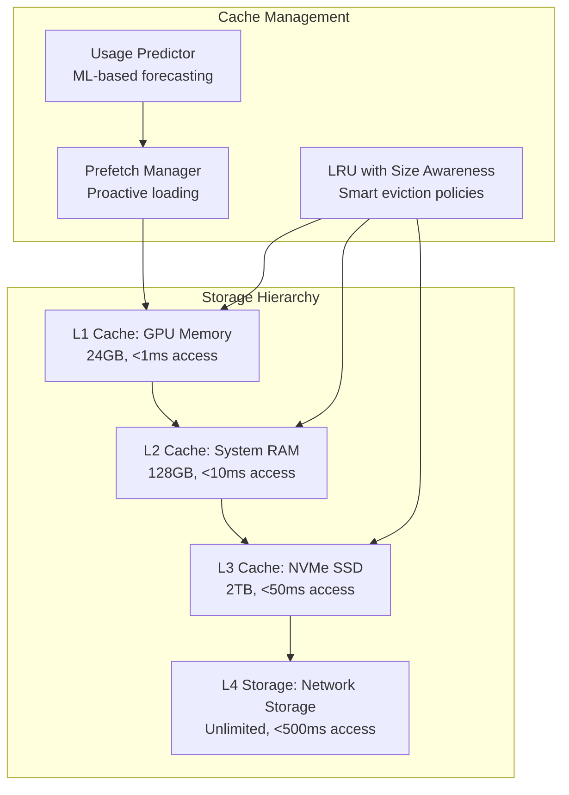
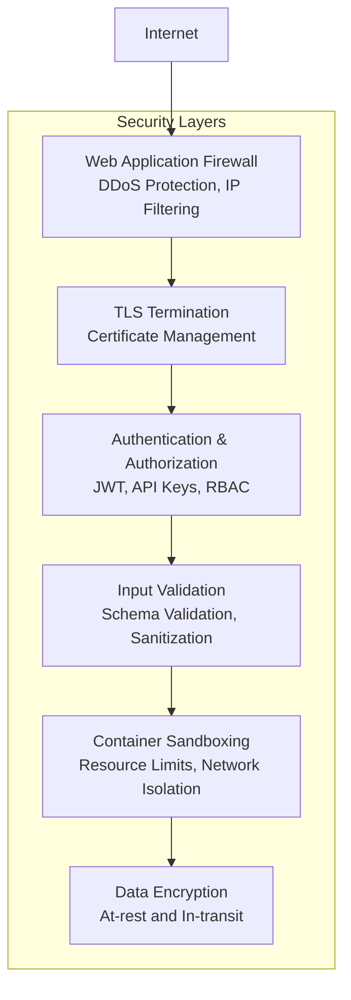
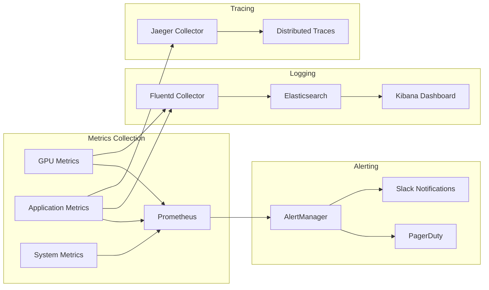
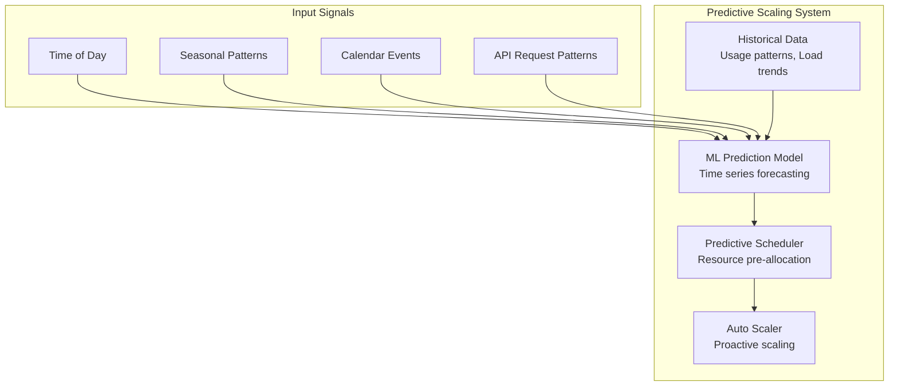

# ComfyUI Serverless System Architecture

## Overview

This document defines the complete system architecture for ComfyUI serverless deployment, including component interactions, data flow, service boundaries, and deployment patterns.

## 1. High-Level System Architecture

### 1.1 System Architecture Diagram



### 1.2 Component Responsibilities

#### API Gateway Layer
- **Application Load Balancer**: SSL termination, geographic routing
- **API Gateway**: Request routing, protocol translation, basic validation
- **Authentication Service**: JWT validation, API key management, OAuth2
- **Rate Limiter**: Request throttling, quota enforcement, abuse prevention

#### Application Layer
- **Workflow API Service**: Workflow validation, execution management, status tracking
- **Model Management API**: Model discovery, metadata management, availability tracking
- **Queue Management API**: Queue status, priority management, capacity monitoring
- **Webhook Service**: Event delivery, retry logic, signature generation

#### Processing Layer
- **Redis Queue Cluster**: Job queuing, priority management, distributed locking
- **Job Scheduler**: Resource allocation, execution planning, load balancing
- **Workflow Orchestrator**: Node execution coordination, dependency management

#### Execution Layer
- **GPU Containers**: ComfyUI execution environments with GPU acceleration
- **Container Management**: Auto-scaling, health monitoring, resource optimization

#### Storage Layer
- **Model Storage**: Centralized model repository with global CDN
- **Result Storage**: Output file storage with lifecycle management
- **Cache Layer**: Multi-level caching for models and intermediate results
- **Metadata Database**: Execution history, user data, system configuration

## 2. Data Flow Architecture

### 2.1 Workflow Execution Data Flow



### 2.2 Model Management Data Flow



## 3. Service Boundaries and Communication

### 3.1 Microservice Architecture

#### Service Definitions

**Core Services:**
```yaml
services:
  workflow-api:
    responsibility: Workflow management and execution coordination
    interfaces: [REST, gRPC]
    dependencies: [queue-service, model-service, storage-service]
    
  model-service:
    responsibility: Model discovery, metadata, and availability management
    interfaces: [REST, gRPC]
    dependencies: [storage-service, cache-service]
    
  queue-service:
    responsibility: Job queuing, priority management, resource allocation
    interfaces: [gRPC, Redis Protocol]
    dependencies: [scheduler-service, metrics-service]
    
  execution-service:
    responsibility: Container orchestration and workflow execution
    interfaces: [gRPC, Container Runtime]
    dependencies: [model-service, storage-service]
    
  webhook-service:
    responsibility: Event delivery and notification management
    interfaces: [REST, Event Streaming]
    dependencies: [queue-service]
    
  auth-service:
    responsibility: Authentication, authorization, and API key management
    interfaces: [REST, JWT]
    dependencies: [user-database]
```

### 3.2 Inter-Service Communication

#### Communication Patterns

**Synchronous Communication (gRPC):**
- Service-to-service real-time operations
- Model metadata queries
- Resource allocation requests
- Status updates

**Asynchronous Communication (Event Streaming):**
- Workflow state changes
- System events and notifications
- Metrics and monitoring data
- Audit trail events

**Database Communication:**
- PostgreSQL for transactional data
- Redis for caching and sessions
- Object storage for binary data

#### Message Schemas

**Workflow Execution Event:**
```protobuf
message WorkflowExecutionEvent {
  string execution_id = 1;
  string event_type = 2;
  google.protobuf.Timestamp timestamp = 3;
  WorkflowStatus status = 4;
  ExecutionMetrics metrics = 5;
  repeated string output_urls = 6;
  ErrorInfo error = 7;
}

message ExecutionMetrics {
  int32 execution_time_seconds = 1;
  float gpu_utilization = 2;
  int64 memory_used_bytes = 3;
  int32 queue_time_seconds = 4;
  float cost_usd = 5;
}
```

## 4. Container and Orchestration Architecture

### 4.1 Container Strategy

#### Multi-Stage Container Design

```dockerfile
# Stage 1: Base runtime environment
FROM nvidia/cuda:11.8-devel-ubuntu22.04 as base
RUN apt-get update && apt-get install -y \
    python3.10 python3-pip git wget

# Stage 2: ComfyUI installation
FROM base as comfyui-base
WORKDIR /app
COPY requirements.txt .
RUN pip install -r requirements.txt
COPY ComfyUI/ ./ComfyUI/

# Stage 3: Model cache layer (optional)
FROM comfyui-base as model-cache
COPY models/ ./ComfyUI/models/

# Stage 4: Production runtime
FROM comfyui-base as production
COPY src/ ./src/
COPY entrypoint.sh ./
EXPOSE 8080
CMD ["./entrypoint.sh"]
```

#### Container Variants

**Lightweight Runtime (2.5GB):**
- Base ComfyUI installation
- No pre-loaded models
- Dynamic model loading

**Common Models (8GB):**
- Includes SDXL, ControlNet, popular LoRAs
- 60% cache hit rate
- Faster cold starts for common workflows

**Specialized Containers (15GB):**
- Domain-specific model sets
- Video generation models
- Enterprise custom models

### 4.2 Orchestration Patterns

#### Auto-Scaling Configuration

```yaml
scaling_policy:
  metrics:
    - queue_depth:
        target: 5
        scale_up_threshold: 10
        scale_down_threshold: 2
    - gpu_utilization:
        target: 0.8
        scale_up_threshold: 0.9
        scale_down_threshold: 0.6
    - avg_wait_time:
        target: 30
        scale_up_threshold: 60
        scale_down_threshold: 15

  scaling_behavior:
    scale_up:
      stabilization_window: 60s
      policies:
        - period: 60s
          value: 2
          type: pods
    scale_down:
      stabilization_window: 300s
      policies:
        - period: 300s
          value: 1
          type: pods

  container_lifecycle:
    warm_pool_size: 3
    max_idle_time: 600s
    preemption_grace: 30s
    health_check_interval: 30s
```

## 5. Storage and Caching Architecture

### 5.1 Storage Hierarchy



### 5.2 Model Storage Strategy

**Primary Model Storage (MinIO):**
```yaml
model_storage:
  provider: minio
  configuration:
    endpoint: https://models.comfyui-api.com
    access_key: MINIO_ACCESS_KEY
    secret_key: MINIO_SECRET_KEY
    bucket_strategy:
      checkpoints: comfyui-checkpoints
      loras: comfyui-loras
      controlnets: comfyui-controlnets
      vaes: comfyui-vaes
    performance:
      multipart_threshold: 64MB
      max_concurrency: 10
      connection_pool_size: 20
    security:
      encryption: AES-256
      versioning: enabled
      access_logs: enabled
```

**CDN Distribution:**
```yaml
cdn_configuration:
  provider: cloudflare
  edge_locations: global
  cache_behaviors:
    models:
      ttl: 86400  # 24 hours
      compress: true
      cache_key_query_strings: ["version", "format"]
    results:
      ttl: 3600   # 1 hour  
      compress: true
      signed_urls: true
```

## 6. Security Architecture

### 6.1 Security Layers



### 6.2 Security Policies

**Container Security:**
```yaml
container_security:
  runtime:
    read_only_root: true
    non_root_user: true
    no_new_privileges: true
    drop_capabilities: ["ALL"]
    add_capabilities: ["CHOWN", "SETUID", "SETGID"]
  
  network:
    egress_allowed:
      - huggingface.co:443
      - civitai.com:443
      - storage.googleapis.com:443
    ingress_denied: true
    
  resources:
    memory_limit: 24GB
    cpu_limit: 8
    gpu_limit: 1
    disk_quota: 100GB
    
  monitoring:
    syscall_auditing: true
    file_access_monitoring: true
    network_monitoring: true
```

## 7. Monitoring and Observability

### 7.1 Observability Stack



### 7.2 Key Metrics and Alerts

**Performance Metrics:**
```yaml
metrics:
  api_performance:
    - api_request_duration_seconds
    - api_requests_total
    - api_errors_total
    - rate_limit_violations_total
    
  execution_performance:
    - workflow_execution_duration_seconds
    - workflow_queue_time_seconds
    - gpu_utilization_percent
    - memory_usage_bytes
    
  system_health:
    - container_restarts_total
    - queue_depth
    - cache_hit_rate
    - model_load_time_seconds

alert_rules:
  critical:
    - api_error_rate > 0.05 for 5m
    - avg_queue_wait_time > 300s for 10m
    - gpu_utilization < 0.3 for 15m
    - cache_hit_rate < 0.5 for 10m
    
  warning:
    - api_latency > 100ms for 5m
    - queue_depth > 50 for 10m
    - container_restart_rate > 0.1 for 5m
```

## 8. Disaster Recovery and High Availability

### 8.1 High Availability Design

**Multi-Region Deployment:**
```yaml
regions:
  primary: us-east-1
  secondary: eu-west-1
  dr: us-west-2

failover_strategy:
  automatic_failover: true
  rpo_target: 15m  # Recovery Point Objective
  rto_target: 5m   # Recovery Time Objective
  
  health_checks:
    api_endpoint: 30s
    gpu_containers: 60s
    database_connections: 30s
    
  backup_strategy:
    metadata_db:
      frequency: 4h
      retention: 30d
      encryption: true
    model_storage:
      replication: 3x
      geo_distribution: true
    cache_data:
      persistence: disabled
      rebuild_strategy: warm_cache
```

### 8.2 Circuit Breaker Pattern

```python
class CircuitBreaker:
    def __init__(self, failure_threshold=5, recovery_timeout=60):
        self.failure_threshold = failure_threshold
        self.recovery_timeout = recovery_timeout
        self.failure_count = 0
        self.last_failure_time = None
        self.state = "CLOSED"  # CLOSED, OPEN, HALF_OPEN
    
    async def call(self, func, *args, **kwargs):
        if self.state == "OPEN":
            if time.time() - self.last_failure_time > self.recovery_timeout:
                self.state = "HALF_OPEN"
            else:
                raise CircuitBreakerOpenException()
        
        try:
            result = await func(*args, **kwargs)
            if self.state == "HALF_OPEN":
                self.state = "CLOSED"
                self.failure_count = 0
            return result
        except Exception as e:
            self.failure_count += 1
            self.last_failure_time = time.time()
            
            if self.failure_count >= self.failure_threshold:
                self.state = "OPEN"
            
            raise e
```

## 9. Performance Optimization Architecture

### 9.1 Predictive Scaling



### 9.2 Smart Resource Allocation

**GPU Assignment Algorithm:**
```python
class GPUResourceManager:
    def __init__(self):
        self.gpu_nodes = {}
        self.allocation_strategy = "memory_aware_first_fit"
    
    async def allocate_gpu(self, workflow_requirements):
        """Intelligent GPU allocation based on workflow analysis"""
        
        # Analyze workflow memory requirements
        memory_estimate = await self.estimate_memory_usage(workflow_requirements)
        execution_time_estimate = await self.estimate_execution_time(workflow_requirements)
        
        # Find optimal GPU based on multiple factors
        optimal_gpu = await self.find_optimal_gpu(
            memory_required=memory_estimate,
            execution_time=execution_time_estimate,
            model_cache_state=await self.get_cache_state(),
            current_load=await self.get_current_load()
        )
        
        return optimal_gpu
    
    async def find_optimal_gpu(self, memory_required, execution_time, model_cache_state, current_load):
        """Multi-factor GPU selection algorithm"""
        
        scoring_factors = {
            "memory_availability": 0.4,
            "cache_hit_rate": 0.3,
            "current_load": 0.2,
            "execution_time_fit": 0.1
        }
        
        best_score = 0
        best_gpu = None
        
        for gpu_id, gpu_info in self.gpu_nodes.items():
            score = self.calculate_gpu_score(
                gpu_info, memory_required, execution_time, 
                model_cache_state, current_load, scoring_factors
            )
            
            if score > best_score:
                best_score = score
                best_gpu = gpu_id
                
        return best_gpu
```

## 10. Cost Optimization Architecture

### 10.1 Cost Monitoring and Control

```yaml
cost_management:
  monitoring:
    granularity: per_execution
    tracking_dimensions:
      - user_id
      - model_type
      - execution_time
      - gpu_type
      - region
    
  budgets:
    user_quotas:
      basic: $10/month
      pro: $100/month
      enterprise: custom
    
    system_budgets:
      gpu_compute: $5000/month
      storage: $500/month
      bandwidth: $200/month
    
  optimization:
    spot_instances:
      enabled: true
      max_interruption_rate: 0.05
      fallback_strategy: on_demand
    
    model_caching:
      cost_per_cache_miss: $0.02
      cache_efficiency_target: 0.8
      preload_cost_threshold: $0.01
```

### 10.2 Dynamic Pricing Model

**Usage-Based Pricing:**
```python
class DynamicPricing:
    def calculate_execution_cost(self, workflow_metadata, execution_metrics):
        """Calculate cost based on actual resource usage"""
        
        base_costs = {
            "gpu_time": 0.0002,  # per second
            "memory": 0.00001,   # per GB-second
            "storage": 0.000001, # per GB-hour
            "bandwidth": 0.0001  # per GB
        }
        
        # Dynamic multipliers based on demand
        demand_multiplier = self.get_demand_multiplier()
        gpu_type_multiplier = self.get_gpu_type_multiplier(execution_metrics.gpu_type)
        
        total_cost = (
            base_costs["gpu_time"] * execution_metrics.gpu_seconds * gpu_type_multiplier +
            base_costs["memory"] * execution_metrics.memory_gb_seconds +
            base_costs["storage"] * execution_metrics.storage_gb_hours +
            base_costs["bandwidth"] * execution_metrics.bandwidth_gb
        ) * demand_multiplier
        
        return round(total_cost, 4)
```

This architecture provides a robust, scalable, and cost-effective foundation for ComfyUI serverless deployment with comprehensive monitoring, security, and optimization capabilities.