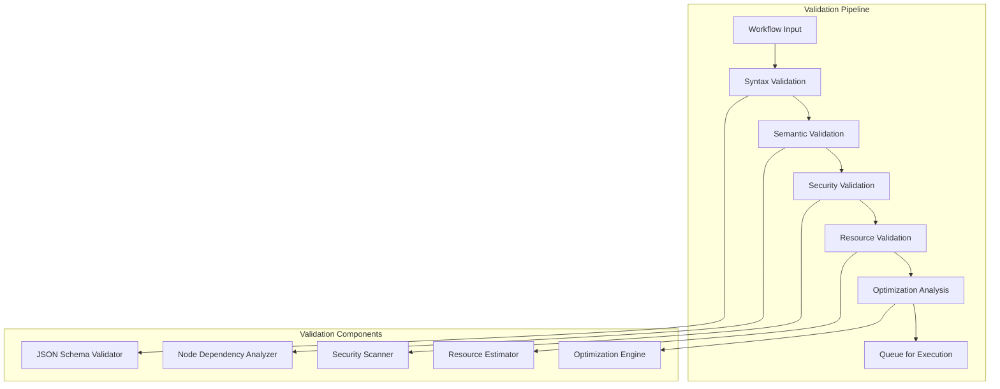
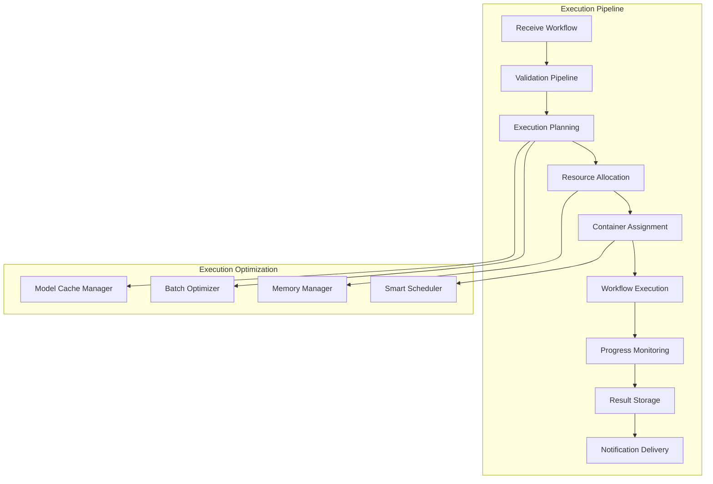
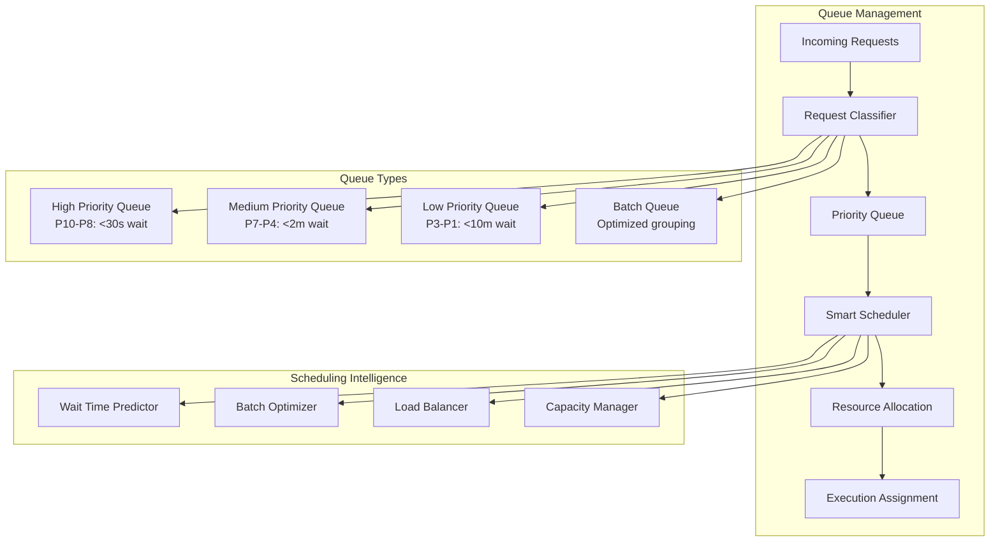
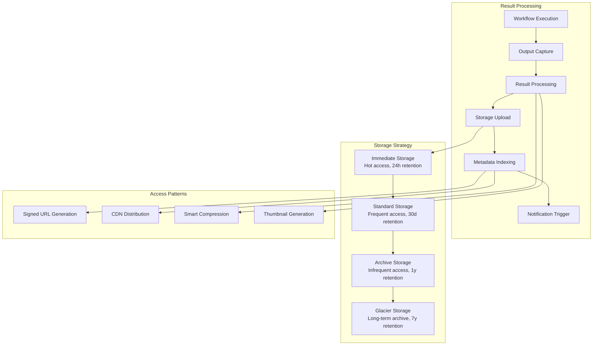
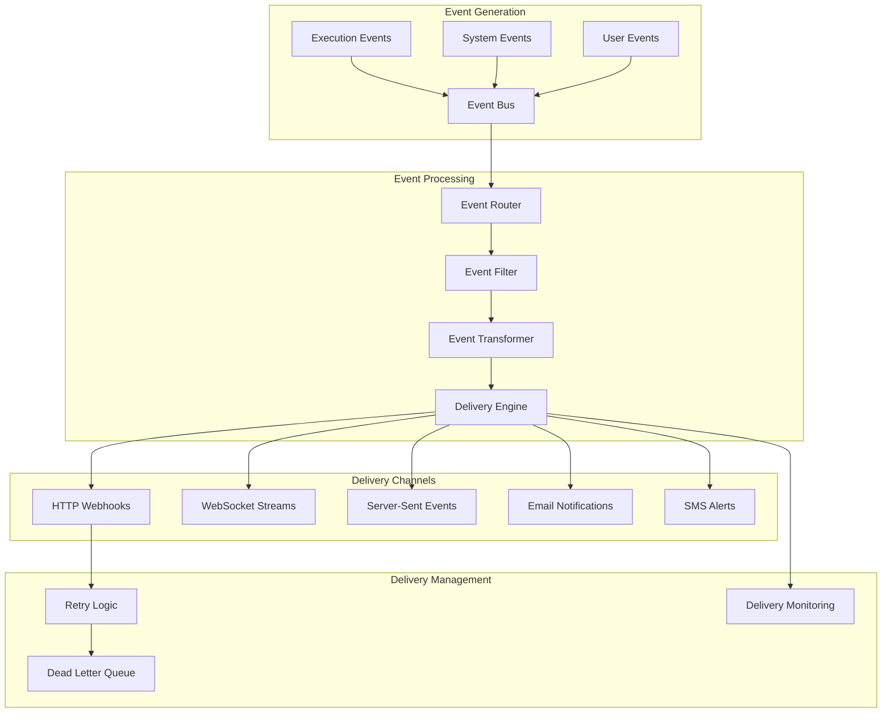
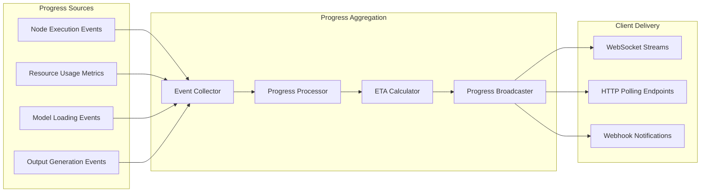

# ComfyUI Workflow Management Architecture

## Overview

This document defines the comprehensive workflow management system for ComfyUI serverless deployment, covering validation, execution pipeline, queue management, and result handling.

## 1. Workflow Validation Pipeline

### 1.1 Multi-Stage Validation Architecture



### 1.2 Validation Rules Engine

**Syntax Validation:**
```python
from jsonschema import validate, ValidationError
from typing import Dict, List, Any

class WorkflowValidator:
    def __init__(self):
        self.node_schema = self.load_node_schemas()
        self.workflow_schema = self.load_workflow_schema()
    
    async def validate_syntax(self, workflow: Dict[str, Any]) -> ValidationResult:
        """Validate workflow JSON structure and node schemas"""
        
        try:
            # Validate overall workflow structure
            validate(instance=workflow, schema=self.workflow_schema)
            
            # Validate each node against its specific schema
            for node_id, node_data in workflow.get("nodes", {}).items():
                node_type = node_data.get("class_type")
                if node_type in self.node_schema:
                    validate(instance=node_data, schema=self.node_schema[node_type])
                else:
                    return ValidationResult(
                        valid=False,
                        error_code="UNKNOWN_NODE_TYPE",
                        message=f"Unknown node type: {node_type}",
                        node_id=node_id
                    )
            
            return ValidationResult(valid=True)
            
        except ValidationError as e:
            return ValidationResult(
                valid=False,
                error_code="SCHEMA_VALIDATION_ERROR",
                message=str(e),
                path=list(e.absolute_path)
            )
```

**Semantic Validation:**
```python
class SemanticValidator:
    def __init__(self):
        self.node_registry = NodeRegistry()
    
    async def validate_dependencies(self, workflow: Dict[str, Any]) -> ValidationResult:
        """Validate node connections and dependencies"""
        
        nodes = workflow.get("nodes", {})
        connections = self.extract_connections(workflow)
        
        # Build dependency graph
        graph = DependencyGraph()
        for node_id, node_data in nodes.items():
            graph.add_node(node_id, node_data)
        
        for connection in connections:
            graph.add_edge(connection["from"], connection["to"], connection["type"])
        
        # Validate graph properties
        validation_checks = [
            self.check_circular_dependencies(graph),
            self.check_type_compatibility(graph),
            self.check_required_inputs(graph),
            self.check_resource_requirements(graph)
        ]
        
        for check in validation_checks:
            if not check.valid:
                return check
        
        return ValidationResult(valid=True)
    
    def check_type_compatibility(self, graph: DependencyGraph) -> ValidationResult:
        """Ensure input/output types match between connected nodes"""
        
        for edge in graph.edges:
            from_node = graph.nodes[edge.from_node]
            to_node = graph.nodes[edge.to_node]
            
            output_type = self.get_output_type(from_node, edge.output_slot)
            input_type = self.get_input_type(to_node, edge.input_slot)
            
            if not self.types_compatible(output_type, input_type):
                return ValidationResult(
                    valid=False,
                    error_code="TYPE_MISMATCH",
                    message=f"Type mismatch: {output_type} -> {input_type}",
                    node_id=edge.to_node,
                    details={
                        "from_node": edge.from_node,
                        "expected_type": input_type,
                        "actual_type": output_type
                    }
                )
        
        return ValidationResult(valid=True)
```

### 1.3 Security Validation

**Security Scanner:**
```python
class SecurityValidator:
    def __init__(self):
        self.malicious_patterns = self.load_malicious_patterns()
        self.allowed_domains = self.load_allowed_domains()
    
    async def validate_security(self, workflow: Dict[str, Any]) -> ValidationResult:
        """Comprehensive security validation"""
        
        security_checks = [
            await self.check_external_urls(workflow),
            await self.check_file_operations(workflow),
            await self.check_code_injection(workflow),
            await self.check_resource_limits(workflow),
            await self.check_custom_nodes(workflow)
        ]
        
        for check in security_checks:
            if not check.valid:
                return check
        
        return ValidationResult(valid=True)
    
    async def check_external_urls(self, workflow: Dict[str, Any]) -> ValidationResult:
        """Validate external URL references"""
        
        urls = self.extract_urls(workflow)
        
        for url in urls:
            # Check domain whitelist
            domain = self.extract_domain(url)
            if domain not in self.allowed_domains:
                return ValidationResult(
                    valid=False,
                    error_code="UNAUTHORIZED_DOMAIN",
                    message=f"Domain not allowed: {domain}",
                    details={"url": url, "allowed_domains": self.allowed_domains}
                )
            
            # Check URL accessibility and content type
            try:
                response = await self.head_request(url)
                if response.status_code != 200:
                    return ValidationResult(
                        valid=False,
                        error_code="URL_NOT_ACCESSIBLE",
                        message=f"URL not accessible: {url}",
                        details={"status_code": response.status_code}
                    )
                
                content_type = response.headers.get("content-type", "")
                if not self.is_allowed_content_type(content_type):
                    return ValidationResult(
                        valid=False,
                        error_code="INVALID_CONTENT_TYPE",
                        message=f"Content type not allowed: {content_type}",
                        details={"url": url, "content_type": content_type}
                    )
                    
            except Exception as e:
                return ValidationResult(
                    valid=False,
                    error_code="URL_VALIDATION_ERROR",
                    message=f"Error validating URL: {str(e)}",
                    details={"url": url}
                )
        
        return ValidationResult(valid=True)
```

## 2. Execution Pipeline Architecture

### 2.1 Workflow Execution Engine



### 2.2 Execution Planning Engine

**Smart Execution Planner:**
```python
class ExecutionPlanner:
    def __init__(self):
        self.resource_estimator = ResourceEstimator()
        self.optimization_engine = OptimizationEngine()
        self.cache_manager = CacheManager()
    
    async def create_execution_plan(self, workflow: Dict[str, Any]) -> ExecutionPlan:
        """Create optimized execution plan for workflow"""
        
        # Analyze workflow requirements
        analysis = await self.analyze_workflow(workflow)
        
        # Estimate resource requirements
        resources = await self.resource_estimator.estimate(workflow, analysis)
        
        # Generate execution steps
        execution_steps = await self.generate_execution_steps(workflow, analysis)
        
        # Optimize execution order
        optimized_steps = await self.optimization_engine.optimize(execution_steps)
        
        # Plan model loading strategy
        model_plan = await self.cache_manager.plan_model_loading(workflow, analysis)
        
        return ExecutionPlan(
            workflow_id=analysis.workflow_id,
            estimated_duration=resources.estimated_duration,
            memory_requirements=resources.memory_requirements,
            gpu_requirements=resources.gpu_requirements,
            execution_steps=optimized_steps,
            model_loading_plan=model_plan,
            optimization_metadata=analysis.optimizations
        )
    
    async def analyze_workflow(self, workflow: Dict[str, Any]) -> WorkflowAnalysis:
        """Deep analysis of workflow structure and requirements"""
        
        nodes = workflow.get("nodes", {})
        
        # Extract model requirements
        models = self.extract_model_requirements(nodes)
        
        # Analyze computational complexity
        complexity = self.calculate_complexity(nodes)
        
        # Identify optimization opportunities
        optimizations = self.identify_optimizations(nodes)
        
        # Estimate resource usage
        resource_profile = self.create_resource_profile(nodes, models, complexity)
        
        return WorkflowAnalysis(
            workflow_id=self.generate_workflow_id(workflow),
            node_count=len(nodes),
            models_required=models,
            complexity_score=complexity,
            optimization_opportunities=optimizations,
            resource_profile=resource_profile,
            estimated_execution_time=self.estimate_execution_time(complexity, models)
        )
```

### 2.3 Node Execution Coordinator

**Parallel Execution Management:**
```python
class NodeExecutionCoordinator:
    def __init__(self):
        self.dependency_resolver = DependencyResolver()
        self.resource_monitor = ResourceMonitor()
        self.progress_tracker = ProgressTracker()
    
    async def execute_workflow(self, execution_plan: ExecutionPlan) -> ExecutionResult:
        """Execute workflow with optimal parallelization"""
        
        # Initialize execution context
        context = ExecutionContext(
            execution_id=execution_plan.execution_id,
            gpu_allocation=execution_plan.gpu_allocation,
            model_cache=await self.prepare_model_cache(execution_plan.model_plan)
        )
        
        # Create execution graph
        execution_graph = await self.dependency_resolver.create_execution_graph(
            execution_plan.execution_steps
        )
        
        # Execute nodes in parallel where possible
        async with asyncio.TaskGroup() as group:
            node_tasks = {}
            
            for batch in execution_graph.get_parallel_batches():
                for node in batch:
                    if self.can_execute_node(node, context):
                        task = group.create_task(
                            self.execute_node(node, context)
                        )
                        node_tasks[node.id] = task
                
                # Wait for batch completion before next batch
                await self.wait_for_batch_completion(node_tasks, batch)
                
                # Update execution context with results
                context = await self.update_context_with_results(context, node_tasks)
                
                # Report progress
                await self.progress_tracker.update_progress(
                    execution_plan.execution_id,
                    self.calculate_progress(execution_graph, context)
                )
        
        return await self.finalize_execution(context)
    
    async def execute_node(self, node: ExecutionNode, context: ExecutionContext) -> NodeResult:
        """Execute individual node with monitoring"""
        
        start_time = time.time()
        
        try:
            # Pre-execution hooks
            await self.pre_execution_hooks(node, context)
            
            # Load required models
            await self.ensure_models_loaded(node.model_requirements, context)
            
            # Execute node
            with self.resource_monitor.track_node_execution(node.id):
                result = await self.run_node_computation(node, context)
            
            # Post-execution hooks
            await self.post_execution_hooks(node, context, result)
            
            execution_time = time.time() - start_time
            
            return NodeResult(
                node_id=node.id,
                status="completed",
                execution_time=execution_time,
                outputs=result.outputs,
                metadata=result.metadata
            )
            
        except Exception as e:
            execution_time = time.time() - start_time
            
            return NodeResult(
                node_id=node.id,
                status="failed",
                execution_time=execution_time,
                error=str(e),
                error_type=type(e).__name__
            )
```

## 3. Queue Management System

### 3.1 Intelligent Queue Architecture



### 3.2 Priority-Based Scheduling

**Priority Classification:**
```python
class PriorityClassifier:
    def __init__(self):
        self.priority_rules = self.load_priority_rules()
        self.user_tiers = self.load_user_tiers()
    
    def calculate_priority(self, request: WorkflowRequest, user_metadata: UserMetadata) -> int:
        """Calculate request priority (1-10, higher = more urgent)"""
        
        base_priority = request.priority or 5
        
        # User tier adjustments
        tier_multiplier = {
            "basic": 1.0,
            "pro": 1.5,
            "enterprise": 2.0
        }.get(user_metadata.tier, 1.0)
        
        # Request characteristics
        urgency_factors = {
            "execution_time_estimate": self.get_time_factor(request),
            "resource_requirements": self.get_resource_factor(request),
            "cache_availability": self.get_cache_factor(request),
            "user_quota_remaining": self.get_quota_factor(user_metadata)
        }
        
        # Calculate final priority
        priority_score = base_priority * tier_multiplier
        
        for factor, weight in urgency_factors.items():
            priority_score *= (1 + weight * 0.2)  # Max 20% adjustment per factor
        
        return min(10, max(1, int(priority_score)))
    
    def get_time_factor(self, request: WorkflowRequest) -> float:
        """Adjust priority based on estimated execution time"""
        estimated_time = self.estimate_execution_time(request.workflow)
        
        if estimated_time < 30:
            return 0.3  # Quick jobs get slight priority boost
        elif estimated_time > 300:
            return -0.2  # Long jobs get slight penalty
        else:
            return 0.0
```

### 3.3 Batch Optimization Engine

**Intelligent Batching:**
```python
class BatchOptimizer:
    def __init__(self):
        self.similarity_analyzer = WorkflowSimilarityAnalyzer()
        self.resource_optimizer = ResourceOptimizer()
    
    async def optimize_batch(self, queue_items: List[QueueItem]) -> List[ExecutionBatch]:
        """Group compatible workflows for efficient batch execution"""
        
        # Analyze workflow similarities
        similarity_matrix = await self.similarity_analyzer.analyze(queue_items)
        
        # Group similar workflows
        workflow_groups = self.group_by_similarity(queue_items, similarity_matrix)
        
        # Optimize resource allocation for each group
        optimized_batches = []
        for group in workflow_groups:
            batch = await self.create_optimal_batch(group)
            optimized_batches.append(batch)
        
        return optimized_batches
    
    async def create_optimal_batch(self, workflow_group: List[QueueItem]) -> ExecutionBatch:
        """Create optimized execution batch"""
        
        # Analyze shared resources
        shared_models = self.find_shared_models(workflow_group)
        shared_settings = self.find_shared_settings(workflow_group)
        
        # Calculate optimal batch size
        optimal_size = self.calculate_optimal_batch_size(
            workflow_group,
            shared_models,
            self.get_current_gpu_memory()
        )
        
        # Create batch execution plan
        return ExecutionBatch(
            batch_id=self.generate_batch_id(),
            workflows=workflow_group[:optimal_size],
            shared_models=shared_models,
            shared_settings=shared_settings,
            estimated_execution_time=self.estimate_batch_time(workflow_group[:optimal_size]),
            resource_requirements=self.calculate_batch_resources(workflow_group[:optimal_size])
        )
```

## 4. Result Storage and Retrieval

### 4.1 Result Management Architecture



### 4.2 Result Processing Pipeline

**Output Handler:**
```python
class ResultProcessor:
    def __init__(self):
        self.storage_client = StorageClient()
        self.compression_engine = CompressionEngine()
        self.thumbnail_generator = ThumbnailGenerator()
        self.metadata_extractor = MetadataExtractor()
    
    async def process_execution_results(self, execution_context: ExecutionContext) -> ProcessedResults:
        """Process and store workflow execution results"""
        
        raw_outputs = execution_context.outputs
        processed_results = []
        
        for output in raw_outputs:
            # Generate metadata
            metadata = await self.metadata_extractor.extract(output)
            
            # Process based on output type
            if output.type == "IMAGE":
                processed = await self.process_image_output(output, metadata)
            elif output.type == "VIDEO":
                processed = await self.process_video_output(output, metadata)
            elif output.type == "AUDIO":
                processed = await self.process_audio_output(output, metadata)
            else:
                processed = await self.process_generic_output(output, metadata)
            
            processed_results.append(processed)
        
        # Store results with lifecycle policies
        storage_results = await self.store_results(processed_results, execution_context)
        
        # Update execution metadata
        await self.update_execution_metadata(execution_context.execution_id, storage_results)
        
        return ProcessedResults(
            execution_id=execution_context.execution_id,
            outputs=storage_results,
            total_size=sum(r.size_bytes for r in storage_results),
            processing_time=execution_context.processing_time
        )
    
    async def process_image_output(self, output: RawOutput, metadata: OutputMetadata) -> ProcessedOutput:
        """Process image outputs with optimization and variants"""
        
        # Generate thumbnails
        thumbnails = await self.thumbnail_generator.generate_variants(
            output.data,
            sizes=[(256, 256), (512, 512), (1024, 1024)]
        )
        
        # Optimize compression
        optimized = await self.compression_engine.optimize_image(
            output.data,
            target_quality=metadata.quality_setting,
            format=metadata.output_format
        )
        
        # Upload to storage with lifecycle policies
        storage_urls = await self.storage_client.upload_with_variants(
            primary_data=optimized,
            thumbnails=thumbnails,
            metadata=metadata,
            lifecycle_policy="standard_with_archival"
        )
        
        return ProcessedOutput(
            output_id=output.id,
            type="IMAGE",
            primary_url=storage_urls.primary,
            thumbnail_urls=storage_urls.thumbnails,
            metadata=metadata,
            size_bytes=len(optimized),
            storage_class="STANDARD"
        )
```

## 5. Webhook and Notification System

### 5.1 Event-Driven Notification Architecture



### 5.2 Webhook Delivery Engine

**Reliable Delivery System:**
```python
class WebhookDeliveryEngine:
    def __init__(self):
        self.http_client = AsyncHTTPClient()
        self.retry_policy = ExponentialBackoffRetry()
        self.signature_generator = WebhookSignatureGenerator()
        self.delivery_tracker = DeliveryTracker()
    
    async def deliver_webhook(self, event: WebhookEvent, endpoint: WebhookEndpoint) -> DeliveryResult:
        """Deliver webhook with retry logic and monitoring"""
        
        # Generate delivery payload
        payload = await self.generate_payload(event, endpoint)
        
        # Sign payload
        signature = await self.signature_generator.sign(payload, endpoint.secret)
        
        # Prepare headers
        headers = {
            "Content-Type": "application/json",
            "X-Webhook-Event": event.event_type,
            "X-Webhook-ID": event.event_id,
            "X-Webhook-Signature": signature,
            "X-Webhook-Timestamp": str(int(event.timestamp.timestamp())),
            "User-Agent": "ComfyUI-Webhooks/1.0"
        }
        
        # Attempt delivery with retries
        for attempt in range(1, endpoint.max_retries + 1):
            try:
                delivery_start = time.time()
                
                response = await self.http_client.post(
                    url=endpoint.url,
                    json=payload,
                    headers=headers,
                    timeout=endpoint.timeout or 30
                )
                
                delivery_time = time.time() - delivery_start
                
                if response.status_code == 200:
                    # Successful delivery
                    await self.delivery_tracker.record_success(
                        event.event_id,
                        endpoint.url,
                        attempt,
                        delivery_time,
                        response.status_code
                    )
                    
                    return DeliveryResult(
                        success=True,
                        attempts=attempt,
                        delivery_time=delivery_time,
                        status_code=response.status_code
                    )
                else:
                    # HTTP error, retry if retryable
                    if self.is_retryable_status(response.status_code) and attempt < endpoint.max_retries:
                        await self.retry_policy.wait(attempt)
                        continue
                    else:
                        # Non-retryable error or max retries exceeded
                        await self.delivery_tracker.record_failure(
                            event.event_id,
                            endpoint.url,
                            attempt,
                            delivery_time,
                            response.status_code,
                            "HTTP_ERROR"
                        )
                        break
                        
            except asyncio.TimeoutError:
                if attempt < endpoint.max_retries:
                    await self.retry_policy.wait(attempt)
                    continue
                else:
                    await self.delivery_tracker.record_failure(
                        event.event_id,
                        endpoint.url,
                        attempt,
                        time.time() - delivery_start,
                        0,
                        "TIMEOUT"
                    )
                    break
                    
            except Exception as e:
                if attempt < endpoint.max_retries:
                    await self.retry_policy.wait(attempt)
                    continue
                else:
                    await self.delivery_tracker.record_failure(
                        event.event_id,
                        endpoint.url,
                        attempt,
                        time.time() - delivery_start,
                        0,
                        str(e)
                    )
                    break
        
        # All delivery attempts failed
        await self.send_to_dead_letter_queue(event, endpoint)
        
        return DeliveryResult(
            success=False,
            attempts=endpoint.max_retries,
            final_error="MAX_RETRIES_EXCEEDED"
        )
```

## 6. Job Scheduling and Resource Management

### 6.1 Smart Job Scheduler

**Resource-Aware Scheduling:**
```python
class SmartJobScheduler:
    def __init__(self):
        self.resource_monitor = ResourceMonitor()
        self.capacity_predictor = CapacityPredictor()
        self.cost_optimizer = CostOptimizer()
    
    async def schedule_jobs(self) -> List[ScheduledJob]:
        """Intelligent job scheduling with resource optimization"""
        
        # Get current system state
        current_capacity = await self.resource_monitor.get_current_capacity()
        pending_jobs = await self.get_pending_jobs()
        
        # Predict capacity needs
        capacity_forecast = await self.capacity_predictor.forecast_capacity(
            pending_jobs,
            time_horizon=timedelta(hours=1)
        )
        
        # Optimize job assignment
        scheduled_jobs = []
        
        for job in pending_jobs:
            # Find optimal resource allocation
            allocation = await self.find_optimal_allocation(job, current_capacity)
            
            if allocation:
                scheduled_job = ScheduledJob(
                    job_id=job.id,
                    resource_allocation=allocation,
                    scheduled_start=self.calculate_start_time(job, allocation),
                    estimated_completion=self.calculate_completion_time(job, allocation),
                    cost_estimate=await self.cost_optimizer.estimate_cost(job, allocation)
                )
                
                scheduled_jobs.append(scheduled_job)
                current_capacity = self.update_capacity(current_capacity, allocation)
            else:
                # Schedule for later when resources become available
                await self.schedule_for_later(job, capacity_forecast)
        
        return scheduled_jobs
    
    async def find_optimal_allocation(self, job: QueueJob, capacity: SystemCapacity) -> Optional[ResourceAllocation]:
        """Find optimal resource allocation for job"""
        
        job_requirements = job.resource_requirements
        
        # Score each available GPU
        gpu_scores = []
        for gpu_id, gpu_info in capacity.available_gpus.items():
            score = self.calculate_gpu_score(job_requirements, gpu_info)
            gpu_scores.append((gpu_id, score, gpu_info))
        
        # Sort by score (highest first)
        gpu_scores.sort(key=lambda x: x[1], reverse=True)
        
        for gpu_id, score, gpu_info in gpu_scores:
            if self.can_allocate_gpu(job_requirements, gpu_info):
                return ResourceAllocation(
                    gpu_id=gpu_id,
                    gpu_memory=job_requirements.memory_required,
                    cpu_cores=job_requirements.cpu_cores,
                    estimated_duration=job.estimated_duration,
                    allocation_score=score
                )
        
        return None
    
    def calculate_gpu_score(self, requirements: ResourceRequirements, gpu_info: GPUInfo) -> float:
        """Score GPU suitability for job requirements"""
        
        # Memory utilization score
        memory_utilization = requirements.memory_required / gpu_info.total_memory
        memory_score = 1.0 - abs(0.8 - memory_utilization)  # Optimal at 80% utilization
        
        # Cache hit rate score
        cache_score = self.calculate_cache_score(requirements.models, gpu_info.cached_models)
        
        # Load balancing score
        load_score = 1.0 - (gpu_info.current_load / gpu_info.max_load)
        
        # Combined score with weights
        total_score = (
            memory_score * 0.4 +
            cache_score * 0.35 +
            load_score * 0.25
        )
        
        return total_score
```

## 7. Real-Time Progress Tracking

### 7.1 Progress Monitoring System



### 7.2 Progress Calculation Engine

**Intelligent Progress Estimation:**
```python
class ProgressCalculator:
    def __init__(self):
        self.historical_data = HistoricalDataManager()
        self.eta_predictor = ETAPredictor()
    
    async def calculate_progress(self, execution_context: ExecutionContext) -> ProgressInfo:
        """Calculate accurate progress with ETA prediction"""
        
        workflow = execution_context.workflow
        completed_nodes = execution_context.completed_nodes
        current_node = execution_context.current_node
        
        # Calculate node-based progress
        node_progress = len(completed_nodes) / len(workflow.nodes)
        
        # Weight progress by computational complexity
        complexity_weights = await self.calculate_complexity_weights(workflow)
        weighted_progress = self.calculate_weighted_progress(completed_nodes, complexity_weights)
        
        # Factor in current node progress
        if current_node:
            current_node_progress = await self.get_current_node_progress(
                current_node, execution_context
            )
            weighted_progress += current_node_progress * complexity_weights[current_node.id]
        
        # Predict remaining time
        remaining_time = await self.eta_predictor.predict_remaining_time(
            workflow,
            completed_nodes,
            current_node,
            execution_context.start_time
        )
        
        return ProgressInfo(
            execution_id=execution_context.execution_id,
            overall_progress=min(0.99, weighted_progress),  # Never show 100% until complete
            node_progress=node_progress,
            current_node=current_node.id if current_node else None,
            estimated_remaining_seconds=remaining_time,
            completed_nodes=len(completed_nodes),
            total_nodes=len(workflow.nodes),
            detailed_progress=self.generate_detailed_progress(execution_context)
        )
    
    async def predict_remaining_time(self, workflow, completed_nodes, current_node, start_time):
        """ML-based ETA prediction using historical data"""
        
        # Get similar historical executions
        similar_executions = await self.historical_data.find_similar_executions(
            workflow_signature=self.generate_workflow_signature(workflow),
            model_list=self.extract_models(workflow),
            complexity_range=(0.8, 1.2)  # ±20% complexity similarity
        )
        
        if len(similar_executions) < 5:
            # Fallback to heuristic estimation
            return self.heuristic_eta_calculation(workflow, completed_nodes, current_node)
        
        # Use ML model for prediction
        features = self.extract_prediction_features(
            workflow, completed_nodes, current_node, start_time
        )
        
        prediction = await self.eta_predictor.predict(features)
        
        # Adjust prediction based on current system load
        load_factor = await self.get_system_load_factor()
        adjusted_prediction = prediction * load_factor
        
        return max(5, int(adjusted_prediction))  # Minimum 5 seconds remaining
```

This workflow management architecture provides intelligent execution planning, robust queue management, reliable result processing, and real-time progress tracking optimized for ComfyUI serverless deployment.